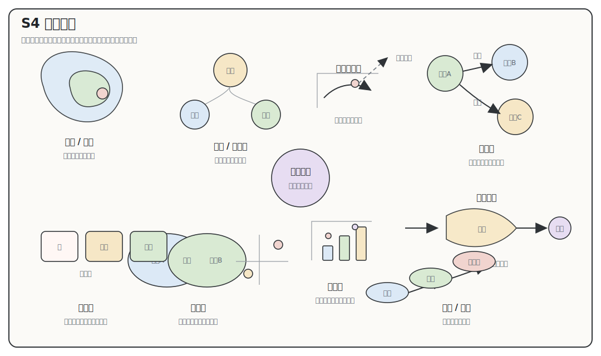
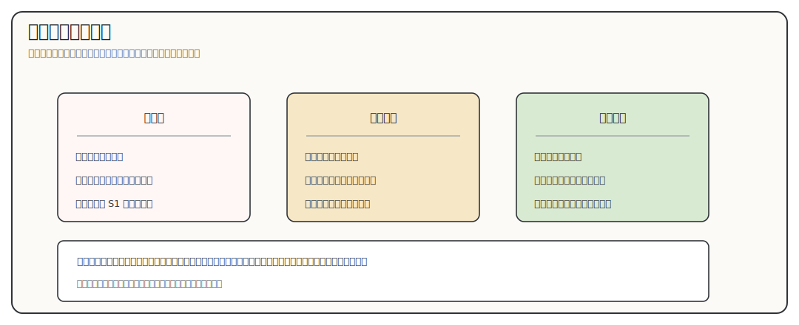
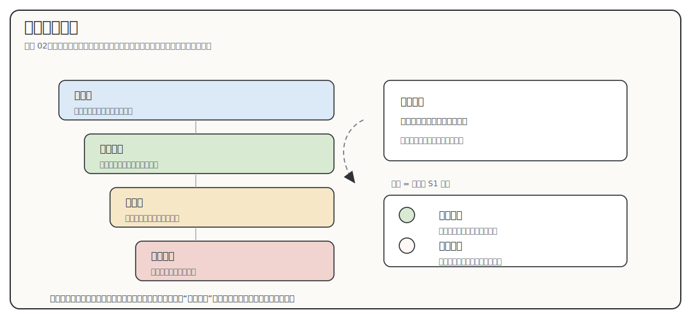
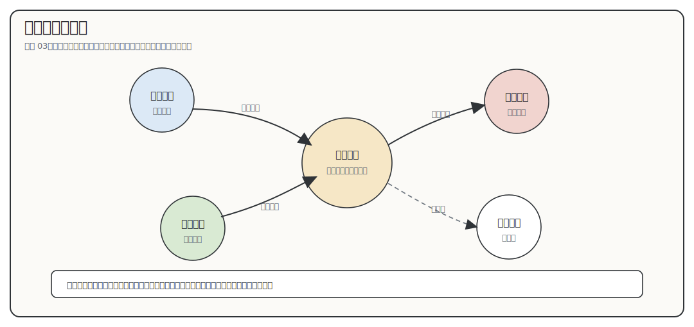
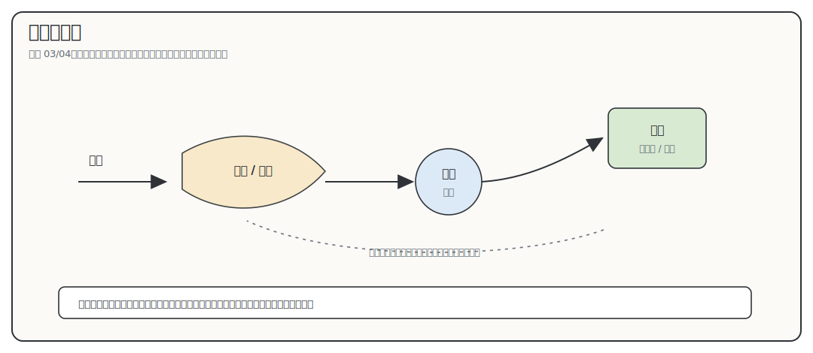
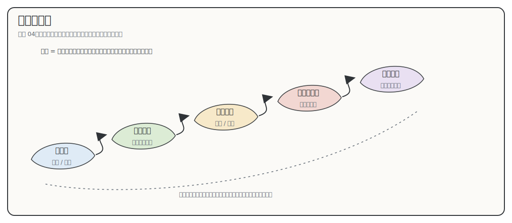
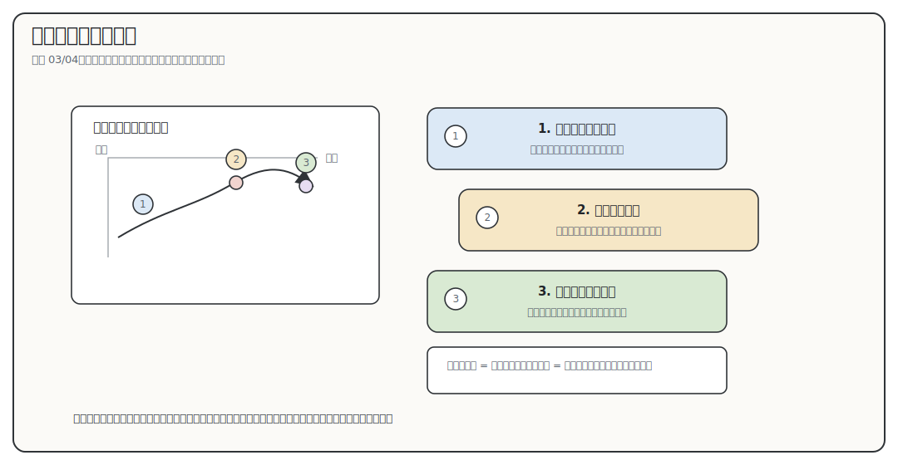
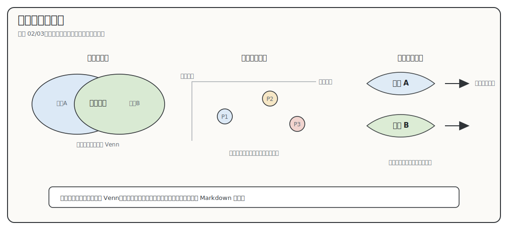

# S4 可视化与理解：把关系画到学生能用

状态：工作台重构稿。用于规定 `00-04` 怎样尽可能用好图、表、卡片、矩阵和路线图，让学生把本来要在脑子里硬扛的关系看见、说出、核查并带到下一份材料。

S4 只回答一个问题：

```text
学生为了完成当前输出，哪段关系最应该被画出来；这段关系应该用哪种可视化形式，才能让他看完会用？
```

这份方法的默认姿态不是省图，而是主动寻找可以外部化的关系。范围、角色、顺序、机制、证据强弱、学习依赖和回看路径，只要学生需要同时处理多个对象，就优先考虑用可视化支撑。正文负责解释概念和证据边界，图表负责把关系放到纸面上。

限制只有三条：输出不清不画，证据不够不画强关系，正文不消费不让图进正文。除此之外，S4 应鼓励多用图，并把图用到能降低理解负担，而不是把“少画图”当成质量。

新人读这份方法时，先记住三句话：

```text
有关系负担，就主动找可视化支撑。
图要帮助学生完成一个输出，而不只是总结正文。
证据边界和正文消费不过关，图要重画、拆开或退回上游。
```

## 目录

- [这份方法拦住什么失败](#s4-failure)
- [S4 的入口和出口](#s4-entry-exit)
- [调研资料怎样改变本方法](#s4-source-to-judgment)
- [哪些图像形式真的帮助理解](#s4-visual-forms)
- [七步选型链](#s4-chain)
- [主决策表：什么情况下用什么形式](#s4-decision-table)
- [证据怎样限制视觉语义](#s4-evidence-encoding)
- [图文消费：图怎样进入正文](#s4-text-consumption)
- [六个完整选型示范](#s4-examples)
- [落到 `00-04` 的方式](#s4-doc-roles)
- [统一风格 SVG 资产怎么生成](#s4-assets)
- [视觉支撑规格卡](#s4-spec)
- [质量检查和停写条件](#s4-quality-check)
- [参考资料](#s4-references)

<a id="s4-failure"></a>

## 这份方法拦住什么失败

S4 要拦住的失败，不是“图太多”，而是图没有承担理解工作。旧稿容易把可视化写成原则库和图库：先说认知负荷、再列图形种类、再补几张示意图。新人读完知道“图要服务理解”，但真到 `02_领域地图.md`、`03_论文路线.md`、`04_学习向导.md` 时，仍然会问：“这里到底该画哪种图？图要让学生看见什么？”

项目里反复出现的坏结果有六类：

- 字段被画成图。身份、机构、年份、论文题名、来源 URL 本来适合表格扫描，画成 SVG 后更难查。
- 箭头语义混乱。履历时间、论文推进、实验机制和学习依赖都画成流程图，学生分不清箭头表示先后、因果、输入输出还是前置能力。
- 论文角色和证据边界混画。论文角色图应帮助学生看论文怎样分工；证据卡应帮助学生看判断靠什么站住。两者混成节点网络，会把研究内容关系和来源强弱搅在一起。
- 弱证据被图形放大。中心位置、粗线、深色、面积和精确坐标都会暗示重要性、强弱、数量或因果；S1 没有证据支撑时，图会把弱线索画得像结论。
- 内部审查图跑进学生正文。执行者的检索覆盖、缺口面板、审稿流程，多数只服务作者，不该让学生承担。
- 图放完后正文不使用。图前没有提出卡点，图下没有读法，图后没有拿走图里的结果继续推进。

所以 S4 的第一贡献不是少画图，而是把图画到关系上。它要让执行者形成这些判断：

```text
这不是图的问题，回 S1 补证据。
这不是图的问题，回 S2 定学生输出。
这不是图的问题，回 S3 重写段落。
这是字段扫描，用表格或矩阵可视化。
这是关系负担，要主动设计图、卡片或路线。
```

<a id="s4-entry-exit"></a>

## S4 的入口和出口

S4 不从空白页开始，也不从“想画个什么”开始。它只在 S1、S2、S3 已经给出足够输入后才工作。

| 上游 | 交给 S4 的东西 | S4 用它做什么 |
|:---|:---|:---|
| S1 信息检索与筛查 | 判断的证据等级、弱线索、冲突、复核点 | 限制图能表达多强：位置、箭头、颜色、中心性、粗细都不能越过证据 |
| S2 学习与认知原则 | 学生入口、当前输出、输出失败回哪里 | 判断学生是否需要把某段关系放到纸面上，避免在脑中硬扛 |
| S3 文稿设计 | 段落卡点、图前图后位置、后文要消费什么 | 判断视觉支撑放在哪一段，图怎样被正文使用 |

如果拿不到这三类输入，S4 的正确动作不是补一张图，而是退回上游。

S4 自己只交出六个产物：

```text
学生卡住的关系；
最合适的可视化形式；
证据允许的视觉语义；
图文消费位置；
学生看完要输出什么；
不通过时重画、拆图或退回哪里。
```

这六个产物比“图形类型清单”更重要。它们是规格卡要收住的结果，不是另一套流程。新人先按七步选型链走，最后用规格卡把这六个结果写清。

<a id="s4-source-to-judgment"></a>

## 调研资料怎样改变本方法

S4 需要外部研究，但引用不能只放在文末。下面只保留会改变本项目动作的判断。

| 来源 | 资料实际支撑什么 | 本项目吸收成什么动作 | 边界 |
|:---|:---|:---|:---|
| Mayer 的多媒体学习研究 | 图文组合有效的前提是服务同一学习任务，减少无关处理，并让文字和图形互相对齐。 | 每个图先写学生输出；图前提出问题，图下教读，图后使用图的结果。 | 不推出“多放图就能降低认知负荷”。 |
| Sweller 等认知负荷研究 | 新手工作记忆有限，元素过多或组织不当会压垮理解。 | 一张视觉支撑只外部化一段主要关系；节点、箭头、颜色和标签都要克制。 | 控制负荷不是删掉必要学术内容，而是调整进入顺序和形式。 |
| Ainsworth 的 DeFT 框架 | 多重表征要有分工：补充信息、约束误解，或帮助学生构造新关系。 | 正文、表格、证据卡和图必须各有任务；只重复正文的图删掉。 | 不按“视觉型学生”选图，只按任务和关系选形式。 |
| Larkin 与 Simon 的图形推理研究 | 图有时有效，是因为空间组织降低搜索和推理成本。 | 只有学生需要在多个对象之间反复找位置、分工、先后或依赖时，才把关系画出来。 | 两个对象的简单关系，用一句正文更稳。 |
| Hegarty 的视觉空间显示研究 | 空间显示能否帮助理解，取决于任务、表征方式和读者读图能力。 | 新手容易误读的线条、颜色、位置和箭头必须写清语义。 | 图不能替代概念解释和证据说明。 |
| Munzner 的嵌套模型 | 可视化设计要先刻画领域问题和任务，再抽象数据与关系，最后才选编码。 | S4 的规格从学生输出和关系负担开始，不从 SVG、Mermaid 或图形家族开始。 | 本项目不做可视化系统，只迁移“任务先行、逐层验证”。 |
| Brehmer 与 Munzner 的任务分类 | 看图要区分为什么看、看什么、怎样看。 | 图下读法要写清：为什么看、先看哪段关系、看完怎样输出。 | 不把任务分类搬成新的术语体系。 |
| Rougier 等科学图规则 | 图要明确读者、信息和媒介，避免过度装饰。 | 每个视觉支撑都要说明读者、核心关系、Markdown/PDF 可读性和输出任务。 | 科研论文图规则只作底线，不替代本项目的学生路径。 |
| Crameri 等配色研究 | 颜色会误导顺序、强弱和类别，也会影响色觉可读性。 | 颜色只能表达已经说明的语义；强弱、风险和类别必须配文字标签或线型。 | 没有数据来源时，颜色深浅不能暗示数量、可信度或重要性。 |
| Tversky 的图形认知原则 | 好图利用空间关系表达概念关系，但图形相似不等于语义相同。 | S4 不把所有图画成矩形流程；范围、机制、比较、概念关系要用不同图像语法。 | 不能因为图看起来像地图、网络或流程，就让学生自动理解。 |
| Novak 与 Cañas 的概念图方法 | 概念图靠节点和带词语的连接表达命题关系，能帮助组织知识。 | `03` 的论文角色和 `02` 的概念关系可以用概念图，但边必须写动词关系。 | 只连节点不写关系词，会退化成装饰网络。 |
| Scaife 与 Rogers 的外部认知研究 | 图形表示之所以有用，是因为它改变了外部搜索、比较、记忆和推理任务。 | S4 要写清这张图让学生少做哪一步脑内操作：找位置、比关系、追流转、看证据还是回看路径。 | 不能把“图存在”当成“认知任务已经变轻”。 |
| Bertin 的视觉变量思想 | 位置、大小、形状、明度、颜色、方向等都会传达信息。 | S1 证据边界要约束每种视觉变量，尤其是位置、面积、颜色深浅和线条粗细。 | 本项目不做数据制图理论综述，只迁移视觉变量会被读成语义这一点。 |
| Ainsworth、Prain 与 Tytler 的科学绘图学习观点 | 学生通过画图、改图和解释图，能暴露自己是否真的理解了科学关系。 | S4 的学生输出不只可以是口头复述，也可以是“重画一张简图”“给论文图加三处标注”“删掉一条无证据箭头并说明原因”。 | 不把画图作业变成美术要求；检查的是关系和证据语义。 |

这些资料共同改变 S4 的主轴：先问学生要完成什么，再问哪段关系最值得画出来，再问证据允许表达到什么程度，最后选择能让学生最快看懂关系的形式。

<a id="s4-visual-forms"></a>

## 哪些图像形式真的帮助理解

表格是视觉支撑，但表格的任务是扫描字段、承载矩阵和辅助比较，不应该被画成 SVG 来冒充“有图”。真正的 S4 要先分清图像语法：地图解决范围，层级图解决上下位，概念图解决命题关系，机制示意解决部件和流转，路线解决时间或前置依赖，比较图解决差异和交集，证据图解决不确定性，真实论文图的标注解决“这张图该怎么看”，数据图只在有真实数据时表达趋势、分布或相关性。把这些全部画成矩形流程图，是可视化失败。



| 图像语法 | 最适合帮助学生理解什么 | 可以采用的具体形式 | 在本项目里常用在哪里 | 容易画坏成什么 |
|:---|:---|:---|:---|:---|
| 地图 / 区域图 | 范围、包含、相邻、阅读位置 | 非比例区域图、阅读地图、相邻方向草图 | `02_领域地图.md` 的大领域、问题域、相邻方向、导师入口 | 精确坐标、面积比例、中心位置暗示证据没有支撑的结论 |
| 层级图 / 分类树 | 上下位、集合拆分、概念层级 | 层级树、缩进树、嵌套集合图 | `02` 把大领域、子领域、问题域分层；`04` 拆概念先修 | 把相邻方向硬写成上下级，或把分类树画成时间流程 |
| 概念图 / 语义网络 | 概念之间、论文之间、问题之间的命题关系 | 带动词边的概念图、问题链图、论文角色图 | `02` 的概念关系，`03` 的论文角色和问题链 | 节点乱连，边上没有动词关系，变成漂亮网络 |
| 科学机制示意图 | 部件、输入、处理、测量、输出、反馈 | 实验机制草图、平台链、模型输入输出图 | `03` 的平台或方法链，`04` 的目标论文图读法 | 把名词相邻画成机制，或把时间箭头伪装成因果 |
| 时间线 / 路线 / 阶梯 | 时间先后、学习前置能力、阶段产物 | 时间线、学习阶梯、阅读路线、回看路径图 | `01` 的履历阶段，`04` 的基础课到论文图桥接，`00` 的卡住回看 | 把课程清单画成路线，箭头语义混杂 |
| 比较图 | 差异、交集、二维判断、多个对象的相对位置 | 对照图、二维象限、Venn、并列剖面、差异标注 | 相邻方向比较、方法差异、论文角色 × 证据强度 | 没有真实交集却画 Venn，没有连续维度却画坐标 |
| 证据 / 不确定性图 | 判断强弱、来源组合、复核点、边界 | 证据边界卡、不确定性带、虚线复核标注 | 身份锁定、领域定位、论文角色、目标论文选择 | 用颜色深浅假装可信度，或把来源画成研究内容关系 |
| 真实图 / 标注图 | 论文核心图、实验图、模型图的读法 | 论文图局部标注、读图顺序箭头、局部放大框 | `03` 选目标论文，`04` 训练学生读核心图 | 复制图而不讲读法，或越过版权和来源边界 |
| 数据图 | 数量、趋势、分布、相关性、流量变化 | 折线、柱状、散点、热力图、堆叠图、桑基图 | 只有拿到真实数据时，才用于论文数量、时间趋势、主题分布 | 没有数据却画趋势线、热力图或桑基图 |

这张表的用法很简单：先看学生卡的是哪种理解任务，再选对应图像语法。不要先问“要不要来张流程图”。也不要把 Markdown 表格截图或重画成 SVG；表格已经是合适的扫描工具，只有出现范围、机制、角色、依赖、证据或真实图读法时，才需要换成图像。

<a id="s4-chain"></a>

## 七步选型链

新人第一次使用 S4，不要先沿用旧图，也不要凭感觉塞图。按下面七步走，走到第 4 步时主动生成可视化方案。

```text
1. 写学生输出
2. 找关系负担
3. 排除非可视化问题
4. 选择可视化形式
5. 限制视觉语义
6. 嵌回正文
7. 用学生输出回放
```

### 1. 写学生输出

先写一句话：

```text
学生看完这一段，要能说出、比较、判断、回看或提出什么？
```

合格输出要可检查。例如：

```text
用一句话说出导师方向先放在哪片领域读。
指出这句领域定位哪部分稳，哪部分只是线索。
用 3 到 5 句话复述论文群怎样分工推进问题。
说出从基础课到目标论文核心图，先补哪段，再读哪张图。
```

不合格输出是：

```text
了解导师方向。
熟悉论文脉络。
掌握学习路径。
看懂图。
```

输出写不清，回 S2。

### 2. 找关系负担

再写一句话：

```text
如果没有支撑，学生需要在脑子里同时抓住哪几个对象和哪种关系？
```

这里的对象可以是论文、概念、来源、课程模块、图表、领域词、阶段、方法环节。关系可以是范围、角色、顺序、机制、证据强弱或学习依赖。

如果学生只是“不认识术语”，先用正文解释概念；如果学生要查很多字段，表格本身就是可视化支撑；如果事实还没查清，回 S1。只要学生需要同时处理多个对象之间的关系，S4 就应该继续，把这段关系外部化。

### 3. 排除非可视化问题

很多卡点不是图能解决的。

| 卡点 | 先回哪里 | 为什么 |
|:---|:---|:---|
| 论文归属、身份、领域判断证据不稳 | S1 | 图不能给弱资料补资格 |
| 学生读完要输出什么说不清 | S2 | 没有输出，图只是在展示 |
| 段落没有承接和后续消费 | S3 | 图没有正文位置 |
| 术语陌生 | S3 或正文解释 | 图会增加新符号，不会自动解释概念 |
| 字段多但关系简单 | 表格 | 不需要图形编码 |
| 执行者想展示检索覆盖或工作量 | 内部审查 | 学生正文只保留会改变理解和行动的内容 |

这一步的目的不是拖慢写作，而是防止图替上游补洞。

### 4. 选择可视化形式

形式不是从“少画”排到“多画”，而是从关系类型出发。字段扫描用表格；范围感用地图；上下位用层级树；命题关系用概念图；部件和流转用机制示意；先后和前置能力用路线；差异和交集用比较图；判断强弱用证据图；目标论文核心图要用标注图。只有数据真实存在时，才画折线、柱状、散点、热力图或桑基图。

可以用下面这条快速判断线：

```text
字段 -> 表格 / 矩阵
范围 -> 地图 / 区域图
上下位 -> 层级树
命题关系 -> 概念图
部件流转 -> 机制示意图
时间或前置能力 -> 路线 / 阶梯
差异交集 -> 比较图
证据强弱 -> 证据边界图
论文核心图读法 -> 标注图
真实数量模式 -> 数据图
```

正文和清单只适合很小的关系；字段多时直接用表格；两个判断维度共同起作用时用矩阵。范围、角色、机制、学习依赖、回看路径和核心图读法需要学生反复看时，就应该画图。越复杂的图越要拆清楚语义，而不是因为怕复杂就不画。

### 5. 限制视觉语义

选了形式以后，先给视觉语义上锁：

```text
位置能不能表示接近、上下位或中心？
箭头能不能表示因果、机制、时间或学习依赖？
颜色能不能表示类别、风险或证据强弱？
大小和粗细能不能表示重要性、规模或可信度？
虚线是否明确写成弱线索或需复核？
```

只要 S1 证据不支持，就不用这个语义。不要指望读者“知道这只是示意”。如果图会让学生读出证据没有支撑的结论，要么改成证据边界卡，要么重画成更弱的示意。

### 6. 嵌回正文

视觉支撑必须被正文消费。合格顺序是：

```text
图前：正文提出学生卡点。
图中：只外部化这一段关系。
图下：说明先看哪里、符号表示什么、哪里证据弱。
图后：正文拿走图里的结果，继续解释、比较、收束或交接。
输出：学生用一句话、三到五句话或小清单复述。
```

图后正文不用这张图，图就没有正文资格。

### 7. 用学生输出回放

最后把图遮住一半、或让读者不看正文，只根据图下读法回答：

```text
这张图回答了哪个问题？
哪条线或颜色是什么意思？
哪里只是弱线索？
看完以后我应该能说什么？
答不上时回哪一份文档、哪一张表或哪段证据？
```

答不上，先改 S4 规格或重画图。不要先美化图。

<a id="s4-decision-table"></a>

## 主决策表：什么情况下用什么形式

这一节直接回答“什么情况下应该出什么样的图、表、卡或路线”。执行时先在第一列找到学生卡法，再沿同一行走完；不要在关系类型、形式类型和文档落点之间来回拼规则。

| 关系负担 | 学生的卡法 | 先承载字段或局部关系 | 必须图像外部化的信号 | 推荐可视化 | 图中语义限制 | 正文消费和失败处理 |
|:---|:---|:---|:---|:---|:---|:---|
| 字段扫描 | 要比较多篇论文、多条来源或多个课程模块，来回找字段 | 两三个差异用短清单；多条记录用 Markdown 表格 | 两个维度共同决定后续判断，少任一维都会误判 | 矩阵 | 行列必须是判断维度；不把字段画成节点网络 | 表后正文要拿走一个差异用于身份、论文角色或学习顺序；拿不走就重画列或收窄字段 |
| 范围关系 | 看到大领域、方法入口、问题域、相邻方向，不知道先放在哪里读 | 分层正文和相邻方向表 | S1 已能支持“粗略阅读位置”，且没有位置感会影响后续概念或论文阅读 | 非比例范围粗定位 | 不用坐标、面积、距离、重叠、中心表达真实结构；阅读入口层次不等于学科上下位；弱线索或待复核方向不得画定位图 | 图后把粗位置、相邻方向和复核点交给概念入口或 `03` 阅读假设；证据只到弱线索时，改成证据边界卡 |
| 层级关系 | 大领域、子领域、问题域、概念缺口混在一起，不知道谁包含谁 | 缩进清单或分层正文 | 上下位关系会影响后续概念学习或论文分组，纯文字容易让层级塌成一排名词 | 层级树或嵌套集合图 | 只有证据支持包含关系时才画父子；相邻方向不能硬画成上下级；不能用范围地图代替分类树 | 图后让学生说出“哪个包含哪个、哪个只是相邻或入口”；说不出就重写层级或退回 S1 |
| 角色关系 | 看到论文列表，不知道入口、方法、平台、目标、旁支怎样分工 | 论文角色表 | 角色表已经显示多篇论文之间有支撑、平台、方法、目标或旁支关系，且表格难以显示分工 | 论文结构图 | 中心写共同问题；每条线写语义并能回到摘要、方法、图表、正文或互引证据；题名相似不能连线 | 图后解释为什么某篇论文是目标、为什么某条关系需复核；回不了源就删线或退回角色表重判 |
| 顺序关系 | 看到履历、论文年份、阶段安排，不知道先后怎样影响阅读 | 时间表或短清单 | 学生需要反复回看先后顺序，且顺序会影响后续理解 | 时间线或顺序路线 | 箭头只表示时间先后，不表示因果、机制或学习依赖 | 图后说明这个先后怎样影响阅读选择；如果只是年份事实，就做紧凑时间表 |
| 机制关系 | 看到实验平台、计算流程或方法链，不知道输入、处理、测量、输出怎样相连 | 分步正文或短清单 | S1 证据足以支撑流转关系，且正文会让学生跳步 | 机制路线图 | 箭头只表示输入、处理、测量、输出的流转；不把名词相邻画成机制 | 图后用路线解释方法链中的关键环节；证据不足时改成“名词关系候选 + 复核点” |
| 证据关系 | 看到正文判断，不知道靠官网、论文、综述、新闻还是数据库标签支撑 | 判断附近的限定语 | 判断会影响后续阅读路径，且学生容易把弱线索当结论 | 证据边界卡 | 不画来源网络；不靠颜色深浅表示可信度；来源必须写“支撑什么” | 卡后让学生说出哪里稳、哪里要复核；卡片只列 URL 时重写为“来源-支撑内容-边界” |
| 学习依赖 | 看到基础课、概念缺口、方法缺口、目标论文图，不知道前置能力怎样接过去 | 两三步用短清单；多个模块用学习块表或“课程模块 × 论文图读法”表 | 学生需要反复回看前置能力，且每一步都有阶段输出 | 学习路线图 | 箭头只表示前置能力；不表示时间、因果或论文贡献；不塞完整课程表 | 图后落到下一阶段输出，例如读懂某张图或复述某个方法链；过长时拆成多张学习路线 |
| 论文核心图读法 | 看到目标论文的图，分不清先看对象、方法、坐标、信号还是结论 | 图前正文先讲图解决的问题 | 目标论文图会成为 `03/04` 的阅读入口，学生需要拿它训练读图顺序 | 真实图局部标注或重绘的读图草图 | 不篡改原图含义；标注必须区分原图信息、作者解释、本文读法和学生读图顺序；写清来源、图号或面板、引用 / 局部截取 / 重绘方式 | 图后让学生按标注顺序复述图的读法；如果只能看懂标签，回到机制图或概念解释 |
| 数据模式 | 有真实论文数、年份、主题、引用或实验数据，需要看趋势、分布或相关性 | 小表或文字描述 | 真实数据量足够，且图能让模式比表格更快被看见 | 折线、柱状、散点、热力图、堆叠图或桑基图 | 没有真实数据不画；坐标、比例、颜色和尺度必须说明；不画伪趋势 | 图后说明这个模式怎样改变阅读路径；如果只是装饰性统计，保留表格或删掉 |
| 回看关系 | 学生卡住后不知道回 `01`、`02`、`03` 还是 `04` | 两个以内条件用短清单 | 回看路径有多层分支，纯文字会绕晕学生 | 阅读决策图 | 只画学生决策：卡住表现、回看位置、再读出口；不画执行者检索覆盖 | 图后让学生说出卡住时回哪里；展示工作量或内部审稿树时移出学生正文 |

如果某个卡点走不到这张表里的任何一行，通常说明它不是 S4 问题：事实不稳回 S1，输出不清回 S2，正文接不上回 S3。

选型后再问一句：

```text
如果没有这张图、表或卡片，学生完成输出会具体少掉什么？
```

答不出来，就重画、拆图，或退回 S1/S2/S3 补输入。

矩阵的最小用法可以先这样落地：当 `论文 × 角色 / 证据等级` 同时决定目标论文选择时，用 Markdown 表格；行写论文，列写角色、可回源证据、复核点和后文动作。表后必须拿走一个判断，例如“因此先读 P3，P2 只作为方法来源，P4 留作复核”。如果这句话写不出，矩阵只是字段堆积，回去删列或收窄问题。

<a id="s4-evidence-encoding"></a>

## 证据怎样限制视觉语义

视觉元素会替作者说话。学生会把它们读成关系、强弱和结论。S1 的证据边界必须约束每个编码。

| 视觉语义 | 学生会读成什么 | 证据不足时怎样处理 |
|:---|:---|:---|
| 位置 | 接近、相邻、上下位、中心边缘 | 改成文字说明“可先放在……附近阅读”，不要画精确坐标 |
| 大小 | 规模、重要性、覆盖范围 | 不用面积表达；必要时写“示意，不代表比例” |
| 粗细 | 强弱、主次、可信度 | 用文字标签写证据等级，不靠线粗暗示 |
| 箭头 | 时间、因果、机制、依赖、推进 | 只支持先后就只写时间；不画成因果或机制 |
| 颜色 | 类别、风险、阶段、强弱 | 每种颜色配文字标签；不靠红绿或深浅单独表达 |
| 中心位置 | 核心、入口、目标、主问题 | 论文内容分析不足时，不把某论文放中心 |
| 虚线 | 弱线索、待复核、可能关系 | 虚线旁写“弱线索”或“需复核”，不能让学生猜 |

审稿时只问一句：

```text
这张图有没有用视觉方式说出证据说不出来的话？
```

有，就重画成更弱的视觉语义，或改成证据边界卡。

图前卡点：当执行者想把“官网提到某方向”“论文题名相近”“数据库标签相似”画成定位、中心或论文关系时，先停下来判断这类资料到底能支撑什么。弱线索只说明要补查，不能直接进入范围图、角色图或机制图。



图下读法：三张卡不是从弱到强的升级流程。先看当前判断落在哪张卡，再读这一卡的三行：它能支撑什么，不能支撑什么，下一步要复核什么。卡片同尺寸、无推进箭头，就是为了避免把“证据更多”画成“结论自动成立”。

图后消费：如果判断只能落在“弱线索”，正文不要写成领域定位或论文角色，只把它放进复核清单。只有进入“交叉证据”或“直接证据”后，才允许进一步选择粗定位图、论文角色图或机制图，并且仍要把边界写在图下读法里。

<a id="s4-text-consumption"></a>

## 图文消费：图怎样进入正文

视觉支撑进入正文时，必须有五个位置。图中也要审；不能只看图前图后写得是否像样。

| 位置 | 要写什么 | 坏信号 |
|:---|:---|:---|
| 图前 | 学生为什么在这里需要支撑，他正在卡哪段关系 | 直接扔图，前文没有问题 |
| 图中 | 只外部化这一段关系，节点、箭头、颜色和标签都服务同一输出 | 同一张图混进范围、证据、机制、学习依赖等多段关系 |
| 图下 | 先看哪里、符号表示什么、哪些关系证据弱 | 只有图题，没有读法 |
| 图后 | 正文拿走图里的结果，继续解释、比较、收束或交给下一节 | 图后转去讲别的资料 |
| 输出 | 学生看完要复述、判断、回看或提问什么 | 学生只能说“这张图总结了上面内容” |

图文消费可以写得很短，但不能省。

合格写法接近这样：

```text
图前：这几篇论文的题名相近，但它们在问题链里的角色不同。先用角色表看每篇论文处理什么，再看下图中的分工。
图下：实线表示论文正文或摘要能支撑的关系；虚线表示已有内容线索但仍需复核。箭头只表示“提供方法给后续论文”，不表示时间先后。
图后：因此，后文选择 P3 作为目标论文，不是因为它年份最新，而是因为它接住 P1 的问题并使用 P2 的方法。
输出：合上图，用 3 到 5 句话说出 P1、P2、P3 怎样分工；说不出时回到角色表。
```

这段话比图本身更重要。没有它，图只是孤岛。

<a id="s4-examples"></a>

## 六个完整选型示范

下面六个示范只覆盖当前 `00-04` 最常见、也最容易画坏的关系：范围、论文角色、机制、学习依赖、论文核心图读法和相邻方向比较。层级图和数据图本轮不单独做示范图：层级图先在主决策表里处理上下位关系，数据图只有在拿到真实数据且图能改变阅读判断时才出现。后续真实标准或样本反复遇到这两类关系，再补独立示范和 SVG 资产。

### 示例一：`02_领域地图.md` 的范围关系

学生输出：

```text
用一句话说出导师方向先放在哪片领域里读，旁边哪些方向容易混用。
```

关系负担：

```text
学生同时看到大领域、方法入口、问题域、相邻方向和导师入口，先要分清自己卡在“阅读位置”还是“上下位包含”。前者适合范围图，后者要用层级树或缩进层级，不能混用。
```

基础可视化：

```text
先写三层正文：大领域是什么，方法入口是什么，问题域是什么；再列相邻方向。
```

进一步画图：

```text
如果后文要让学生带着位置感进入论文阅读，且 S1 已能支持粗略阅读位置，就用非比例粗定位；如果问题是“谁包含谁”，不要用这张图，转到层级树。
```

视觉限制：

```text
不画坐标、面积、距离、重叠或中心；标签写“阅读位置”，不写“真实结构”。
```

图文消费：

```text
图前：学生已经知道几个领域词，但分不清大领域、方法入口、问题域和导师入口是不是同一层。
图下：这张图只能读出阅读入口层次、相邻方向和复核点；不能读出精确坐标、面积、距离、中心性或真实学科上下位。
图后：把粗阅读位置交给 `03` 的论文阅读假设；把相邻方向放进复核清单，不让它伪装成已确认领域边界。
```



### 示例二：`03_论文路线.md` 的论文角色关系

学生输出：

```text
用 3 到 5 句话复述论文群怎样分工推进问题，并指出哪条关系还要复核。
```

关系负担：

```text
学生看到论文列表，不知道哪些是入口、方法、平台、目标或旁支。
```

基础可视化：

```text
先做角色表：论文、自己处理的问题、对象、方法、关键图、和其他论文的关系、证据等级。
```

进一步画图：

```text
角色表已经显示多篇论文之间存在支撑、方法、平台或目标关系，表格难以让学生一眼看到分工。
```

视觉限制：

```text
题名相似、关键词相近、同年发表不能画线。每条线要能回到摘要、方法、图表、正文或互引证据。
```

图文消费：

```text
图前：学生已经看过角色表，但仍说不出几篇论文怎样分工推进共同问题。
图下：先看中心共同问题，再沿带动词的边读“提出问题 / 提供方法 / 验证对象 / 需复核”；题名相似、关键词相近不能画线。
图后：解释为什么某篇进入目标论文，为什么某条旁支只留复核；回不了摘要、方法、图表、正文或互引证据的边要删掉。
```



### 示例三：`03/04` 的机制关系

学生输出：

```text
说出这个平台或方法链从什么输入开始，经过什么处理或测量，最后产出什么结果。
```

关系负担：

```text
学生看到一串平台、实验、模型或算法名，不知道部件之间怎样流转。
```

基础可视化：

```text
先用四步拆开：输入、处理、测量、输出。
```

进一步画图：

```text
当论文图、方法段或综述证据足以支持流转关系，且学生需要反复回看时，画机制示意图。
```

视觉限制：

```text
箭头只表示输入、处理、测量、输出的流转。只有名词相邻时，不画机制箭头。
```

图文消费：

```text
图前：学生看到一串平台、实验或模型名，已经能读出名词，却说不清输入、处理、测量、输出怎样流转。
图下：箭头只表示输入到输出的流转；灰色回看线表示读不懂时回到四个环节逐个解释，不表示弱证据或弱因果。
图后：让学生用这条机制去读目标论文图，并指出自己卡在输入、测量、分析还是结论连接。
```



### 示例四：`04_学习向导.md` 的学习依赖关系

学生输出：

```text
说出自己先补哪段基础，再读哪张目标论文图，卡住时回哪里。
```

关系负担：

```text
课程模块、领域概念、方法缺口、目标论文图混在一起，学生不知道前置能力怎样接到论文阅读。
```

基础可视化：

```text
两三步用短清单；多个模块先用“课程模块 × 论文图读法”表格。
```

进一步画图：

```text
学生需要反复回看前置能力，且每一步都有明确阶段输出时，用学习路线图。
```

视觉限制：

```text
箭头只表示前置能力，不表示时间、因果或论文贡献。路线图不能塞完整学期计划和所有资源。
```

图文消费：

```text
图前：学生有基础课和课程名，但不知道这些基础怎样接到目标论文图和进组问题。
图下：箭头只表示前置能力；灰色回看线表示输出答不上时回到缺口处；每一站都要有阶段输出，不能把整学期课程表、资源清单和论文贡献塞进同一张图。
图后：落到下一阶段的可检查任务，例如读懂某张核心图、复述一个方法链，或整理一组进组前问题。
```



### 示例五：`03/04` 的目标论文核心图标注

学生输出：

```text
拿到目标论文的一张核心图后，能按“对象、测量、信号、结论、限制”说出这张图该怎么看。
```

关系负担：

```text
学生看到论文图里的坐标、颜色、面板、箭头和术语，不知道哪一部分先读，哪一部分支撑论文结论。
```

基础可视化：

```text
正文先说明这张图回答的论文问题，再列出图中必须识别的对象、测量量和结论。
```

进一步画图：

```text
当这张核心图会成为 `03` 的目标论文入口或 `04` 的学习训练对象时，用局部标注图或读图草图。
```

视觉限制：

```text
标注必须区分原图信息、本文解释和学生读图顺序。进入正文前写清原图来源、图号或面板，以及使用方式是引用、局部截取还是重绘读图草图。不能复制原图后只加装饰箭头，也不能越过论文来源和版权边界。
```

图文消费：

```text
图前：这张核心图会成为 `03` 的目标论文入口或 `04` 的训练对象，学生需要知道先看对象、测量、信号还是结论。
图下：标注区分原图信息、本文解释、学生读图顺序和需回正文核查处；读法顺序是对象和测量量、信号变化、论文结论和限制。
图后：让学生遮住正文，只看标注顺序复述这张图测了什么、看到什么、支持什么结论、哪里还要回论文正文。
```



### 示例六：相邻方向或方法差异的比较图

学生输出：

```text
说出两个相邻方向或两种方法到底差在哪里，哪些地方只是词相近，哪些地方会影响论文阅读。
```

关系负担：

```text
学生把相邻方向、相似技术名或不同方法平台混成一个词云，无法判断后面论文为什么分成不同角色。
```

基础可视化：

```text
两个对象用对照段；多个对象先用“比较维度 × 对象”的 Markdown 表格。
```

进一步画图：

```text
当差异来自两个连续维度，或者交集和边界比字段更重要时，用比较图、二维象限或并列剖面。
```

视觉限制：

```text
没有真实交集不画 Venn；没有连续维度不画坐标；比较维度必须写在图里，不能让学生猜。
```

图文消费：

```text
图前：学生把相邻方向、相似技术名或不同平台混成一个词云，无法判断后面论文为什么分成不同角色。
图下：先读比较维度，再看交集、二维位置或并列剖面；没有真实交集不画 Venn，没有连续维度不画坐标。
图后：把比较结果交给 `02` 的相邻方向边界，或交给 `03` 的论文角色分工；如果只是字段差异，退回 Markdown 表格。
```



<a id="s4-doc-roles"></a>

## 落到 `00-04` 的方式

五份成品使用 S4 的方式不同。差别来自学生输出，不来自图形配额。

| 文档 | 学生输出 | 常见关系负担 | 默认形式 | 允许升级 |
|:---|:---|:---|:---|:---|
| `00_材料导读.md` | 说出五份材料怎样读，卡住时回哪里 | 阅读顺序、回看位置 | 短清单 | 回看路径超过两层时，用小决策图 |
| `01_基础画像.md` | 说出老师是谁，论文集合哪里稳、哪里需复核 | 身份、履历、论文集合、风险并列出现 | 表格和限定语 | 关键判断影响后续阅读时，用证据边界卡 |
| `02_领域地图.md` | 说出导师方向先放在哪片领域读，旁边哪些方向容易混用 | 大领域、方法入口、问题域、相邻方向混在一起 | 分层正文和相邻方向表 | 学生仍需要位置感时，用非比例粗定位；相邻方向容易混淆时，用比较图 |
| `03_论文路线.md` | 复述论文群怎样分工推进当前方向 | 论文多，角色和问题链看不出来；目标论文图读法不清 | 论文角色表 | 关系证据足够且表格难以显示分工时，用结构图或机制路线；核心图是入口时，用标注图 |
| `04_学习向导.md` | 列出从基础课到目标论文和核心图的学习桥 | 课程、概念、方法、论文图之间断开 | 学习块表或短清单 | 前置关系清楚且需要反复回看时，用学习路线；读目标论文图时，用标注图或机制图 |

`03` 要特别谨慎。`02` 给的是领域位置和阅读假设，不能替 `03` 选好论文路线。论文结构图只有在相关论文集合经过内容分析后才有资格出现。只靠题名、关键词或 `02` 的方向判断，最多能做候选表和复核清单。

<a id="s4-assets"></a>

## 统一风格 SVG 资产怎么生成

`quality-workbench/支撑方法/_assets/visualization-guide/generate_assets.py` 是 S4 当前的统一矢量图生成入口。新增或重画方法图时，优先改这个脚本里的数据表和样式 token，再批量生成 SVG；不要手工散改成不同字体、色板、圆角、箭头和卡片风格。

当前主线引用八张图：

| 资产 | 作用 | 读者拿走什么 |
|:---|:---|:---|
| `s4-visual-vocabulary.svg` | 图形谱系 | 地图、概念图、机制图、路线、比较图、证据图各自服务什么理解任务 |
| `s4-field-map.svg` | 领域范围地图 | 大领域、方法入口、问题域、导师入口和相邻方向怎样放在一张阅读地图里 |
| `s4-paper-role-map.svg` | 论文角色概念图 | 论文之间的动词关系，而不是论文题名网络 |
| `s4-mechanism-sketch.svg` | 机制示意图 | 输入、处理、测量、输出怎样流转 |
| `s4-learning-bridge.svg` | 学习桥接图 | 从基础课到目标论文图的前置能力桥 |
| `s4-evidence-uncertainty.svg` | 证据与不确定性图 | 弱线索、交叉证据、直接证据能画到什么程度 |
| `s4-annotated-paper-figure.svg` | 目标论文核心图标注 | 学生按对象、测量、信号、结论和限制读论文图 |
| `s4-comparison-diagram.svg` | 相邻方向比较图 | 差异、交集和比较维度怎样影响领域边界或论文角色 |

生成命令：

```powershell
python quality-workbench/支撑方法/_assets/visualization-guide/generate_assets.py
```

这套脚本不是让 S4 少画图，而是让 S4 能稳定多画好图。后续如果发现某类关系反复出现，例如“层级图边界”“数据图边界”“论文角色 + 学习依赖的组合图”“实验平台剖面图”，应先把它加进生成脚本，再在正文里说明使用条件。没有真实需求时，不为了补齐图谱而新增示范图。

<a id="s4-spec"></a>

## 视觉支撑规格卡

每个视觉支撑进入正文前，先写这张卡。它是 S4 的最小交付物。

```text
文档位置：
学生输出：
学生卡住的关系：
关系中的对象：
基础可视化出口：
为什么需要进一步画图：
选择的可视化形式：
真实论文图来源、图号或面板（如适用）：
使用方式：引用 / 局部截取 / 重绘读图草图（如适用）：
标注层类型：原图信息 / 本文解释 / 学生读图顺序 / 需回正文核查（如适用）：
S1 证据允许的视觉语义：
禁止使用的视觉语义：
图前正文怎样提出卡点：
图中只保留哪一段关系：
图下怎样教读和标证据边界：
图后正文怎样消费结果：
学生看完要复述什么：
答不上时回哪里：
重画、拆图或退回方案：
```

规格卡不是额外文书。它强迫执行者把图画在关系上。写不出来时，不是默认放弃可视化，而是先回到学生输出、证据边界或正文位置，把图重新设计到能被学生使用。

一个填写后的最小例子：

```text
文档位置：03_论文路线.md，目标论文选择前。
学生输出：用 3 到 5 句话复述论文群怎样分工推进共同问题，并指出哪条关系还要复核。
学生卡住的关系：论文角色和证据边界混在一起；题名相似被误当成研究链条。
关系中的对象：P1 问题入口、P2 方法来源、P3 目标论文、P4 旁支复核。
基础可视化出口：先做论文角色表，列出每篇论文的研究问题、方法、关键图表、可回源段落和证据强度。
为什么需要进一步画图：角色表能说明单篇论文字段，但学生仍说不出 P1、P2、P3 之间怎样分工。
选择的可视化形式：带动词边的论文角色概念图。
真实论文图来源、图号或面板（如适用）：不适用；本图画论文之间的角色关系，不复制论文原图。
使用方式：不适用。
标注层类型：不适用。
S1 证据允许的视觉语义：摘要、方法、图表、正文段落或互引能支撑的“提出问题 / 提供方法 / 验证对象 / 仍需复核”。
禁止使用的视觉语义：题名相似直接连线；用节点大小表示重要性；用中心位置暗示导师最重视；把弱线索画成已确认链条。
图前正文怎样提出卡点：学生已经看过角色表，但仍说不出几篇论文怎样分工推进共同问题。
图中只保留哪一段关系：共同问题下的论文分工和需复核边，不要同时画时间线、学习路径或证据来源网络。
图下怎样教读和标证据边界：先看中心共同问题，再沿带动词的边读；实线表示能回到论文正文或互引，虚线表示仍需复核。
图后正文怎样消费结果：解释为什么 P3 进入目标论文，为什么 P4 只留作旁支复核；回不了源的边删掉。
学生看完要复述什么：P1 解决什么入口问题，P2 给 P3 提供什么方法，P3 为什么承担目标论文角色。
答不上时回哪里：回论文角色表；必要时回 S1 补摘要、方法、图表或互引证据。
重画、拆图或退回方案：如果边超过 6 条，先拆成“入口 / 方法 / 目标”三张小图；如果证据只剩题名相似，退回证据边界卡。
```

<a id="s4-quality-check"></a>

## 质量检查和停写条件

使用或重构 S4 后，用下面的问题审查。

| 检查 | 合格表现 |
|:---|:---|
| 学生输出 | 能写成可检查动作，不是“了解”“熟悉”“看懂”。 |
| 关系负担 | 能说清学生要少背哪段范围、角色、顺序、机制、证据或依赖关系。 |
| 上游承接 | S1 证据边界、S2 学生输出、S3 正文位置都被使用。 |
| 可视化形式 | 已经按关系负担选择正文、清单、表格、矩阵、证据卡、结构图或路线图。 |
| 视觉语义 | 位置、箭头、颜色、大小、粗细、中心和虚线没有越过证据。 |
| 图文消费 | 图前提出问题，图中只保留一段关系，图下给读法，图后使用结果。 |
| 新手可读 | 标签、节点、颜色、线型数量受控；图不要求学生猜符号。 |
| 输出倒查 | 学生答不上时能回到 S1、S2、S3 或当前视觉规格。 |

最低停写条件：

```text
学生输出说不清，回 S2。
证据边界说不清，回 S1。
章节和段落没有图前图后位置，回 S3。
学生只是查字段，用表格或矩阵承载关系。
学生只是术语陌生，用正文解释。
字段或清单任务不要伪装成图；真正的范围、角色、机制、依赖、证据或论文图读法要主动画出来。
视觉语义会放大弱线索，重画成证据边界卡或限定表达。
图只展示执行者工作量，移出学生正文。
图后正文不消费，重写图文位置或移出正文。
```

机械检查只能证明 Markdown、链接和 SVG 文件没有明显格式问题。它不能证明图真的帮助学生理解。这个判断要靠具体段落里的学生输出回放。

<a id="s4-references"></a>

## 参考资料

| 编号 | 资料 | 本文采用的要点 | 链接 |
|:---|:---|:---|:---|
| [V1] | Richard E. Mayer, *Multimedia Learning* | 图文要服务同一学习任务，并减少无关负担。 | https://api.crossref.org/works/10.1017/CBO9781139164603 |
| [V2] | Sweller, van Merrienboer & Paas, *Cognitive Architecture and Instructional Design: 20 Years Later* | 新手受工作记忆限制，材料进入顺序和元素数量要控制。 | https://doi.org/10.1007/s10648-019-09465-5 |
| [V3] | Shaaron Ainsworth, *DeFT: A conceptual framework for considering learning with multiple representations* | 多重表征要有分工，形式要匹配学习任务。 | https://doi.org/10.1016/j.learninstruc.2006.03.001 |
| [V4] | Larkin & Simon, *Why a Diagram is Sometimes Worth Ten Thousand Words* | 图能通过空间组织降低搜索和推理成本。 | https://digitalcollections.library.cmu.edu/node/35554 |
| [V5] | Mary Hegarty, *The Cognitive Science of Visual-Spatial Displays* | 空间显示的帮助取决于任务、表征方式和读图能力。 | https://pubmed.ncbi.nlm.nih.gov/25164399/ |
| [V6] | Tamara Munzner, *A Nested Model for Visualization Design and Validation* | 可视化先刻画任务和数据关系，再选择视觉编码。 | https://www.cs.ubc.ca/labs/imager/tr/2009/NestedModel/NestedModel.pdf |
| [V7] | Brehmer & Munzner, *A Multi-Level Typology of Abstract Visualization Tasks* | 读图任务要区分为什么看、看什么、怎样看。 | https://pubmed.ncbi.nlm.nih.gov/24051804/ |
| [V8] | Rougier, Droettboom & Bourne, *Ten Simple Rules for Better Figures* | 科研图要明确读者、信息和展示媒介。 | https://journals.plos.org/ploscompbiol/article?id=10.1371/journal.pcbi.1003833 |
| [V9] | Crameri, Shephard & Heron, *The misuse of colour in science communication* | 颜色要避免误导强弱、顺序和色觉可读性。 | https://doi.org/10.1038/s41467-020-19160-7 |
| [V10] | Barbara Tversky, *The Cognitive Design of Tools of Thought* | 图像用空间、路径、接近、分组等方式外化思考；不同空间组织表达不同关系。 | https://doi.org/10.1007/s13164-014-0214-3 |
| [V11] | Novak & Cañas, *The Theory Underlying Concept Maps and How to Construct and Use Them* | 概念图用概念节点和连接词表达命题关系。 | https://cmap.ihmc.us/publications/researchpapers/theoryunderlyingconceptmaps.pdf |
| [V12] | Scaife & Rogers, *External cognition: how do graphical representations work?* | 图形表示需要说明它怎样改变外部认知任务，不能假设图天然有效。 | https://doi.org/10.1006/ijhc.1996.0048 |
| [V13] | Jacques Bertin, *Semiology of Graphics* | 位置、大小、形状、颜色、明度、方向等视觉变量会被读成信息。 | https://monoskop.org/images/2/2b/Bertin_Jacques_Semiology_of_Graphics_1983.pdf |
| [V14] | Ainsworth, Prain & Tytler, *Drawing to Learn in Science* | 学生通过画图、改图和解释图暴露并修正科学理解。 | https://doi.org/10.1126/science.1204153 |
