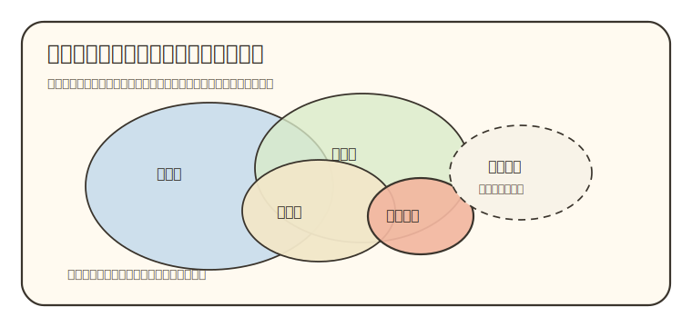
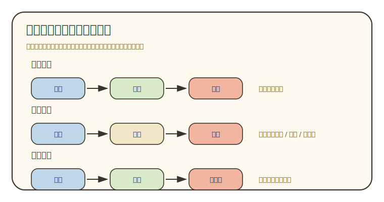
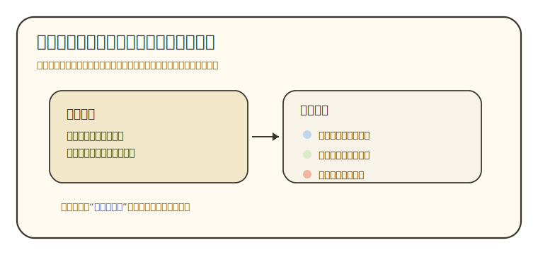

# S4 可视化与理解：让学生少背关系

状态：工作台重构稿。用于规定 `00-04` 五份导师材料中哪里需要图、哪里该用正文或表格、图怎样被正文提出和消费。

S4 只管一个问题：

```text
学生必须看见哪段关系，才能完成当前输出？
```

答不上这句话，图就先停下。图、表、矩阵、证据卡、路线图都只是局部支撑。它们不能替代 S1 的证据判断、S2 的学生出口，也不能替代 S3 的章节推进。

## 目录

- [这份方法拦住什么失败](#s4-failure)
- [调研资料怎样改变本方法](#s4-source-to-judgment)
- [S4 从 S1、S2、S3 接什么](#s4-input)
- [图文决策链](#s4-decision-chain)
- [什么时候不用图](#s4-no-visual)
- [五种理解构件怎样选择](#s4-components)
- [视觉语义和证据边界](#s4-encoding-boundary)
- [放进 `00-04` 的方式](#s4-doc-roles)
- [图源规格](#s4-spec)
- [质量检查](#s4-quality-check)
- [参考资料](#s4-references)

<a id="s4-failure"></a>

## 这份方法拦住什么失败

本项目的可视化问题，核心不在图少，也不在图不够漂亮。旧稿和样本反复出错的地方，是图没有替学生减少关系负担。

几种失败最伤阅读：

- 把表格包装成可视化。论文字段、来源字段、课程字段本来适合并排扫，却被画成 SVG，维护成本更高，信息更难查。
- 把不同关系画成同一种流程图。平台链路、时间变化、学习依赖都用了箭头，但箭头没有说明表示时间、机制、输入输出还是前置能力。
- 把论文角色和证据边界都画成节点连线。论文角色图应该帮助学生理解研究内容怎样分工；证据边界卡应该帮助学生判断一句正文靠什么站住。两者画法混在一起，学生就分不清“内容关系”和“证据强弱”。
- 把内部审查内容硬塞给学生。覆盖缺口、资料采集面、执行者阅读决策，多数时候属于工作区。学生正文只需要看见会影响理解和复核的部分。
- 图出现后正文不使用它。图前没有提出学生卡点，图下没有读法，图后没有拿走图的结果继续推进。这样的图只会打断阅读。
- 证据弱，视觉语气却很强。粗线、中心节点、精确坐标、面积比例、颜色深浅，都会暗示重要性、因果或精度；如果 S1 没有证据支撑，就不能画出来。

S4 的出口是：

```text
每个可视化决定都能说清：学生卡住的关系是什么，证据允许表达到什么程度，为什么正文和表格不够，图旁怎样教读，学生看完要输出什么，图不合格时降级成什么。
```

<a id="s4-source-to-judgment"></a>

## 调研资料怎样改变本方法

S4 不写可视化综述，只吸收能改变 `00-04` 写法的判断。

| 来源方向 | 可迁移判断 | 本项目吸收成什么动作 | 边界 |
|:---|:---|:---|:---|
| 多媒体学习和认知负荷研究 | 图文配合有用的前提，是同一理解任务下减少无关负担，并控制新手同时处理的元素数量。 | 只在学生需要外部化一段关系时用图；图下必须给读法，正文必须继续使用图的结果。 | 图多不会自动降低负担。标签、颜色、箭头过多会反向增加负担。 |
| 多重表征研究 | 不同表征要分工：文字解释判断，表格支持扫描，图支持关系或空间组织。 | 每个支撑形式先写自己的任务。图如果只重复正文或表格，就删掉或降级。 | 本项目不按“视觉型学生”选图，按学生任务和证据关系选形式。 |
| 图形推理和空间显示研究 | 图能通过空间组织降低搜索和推理成本，但读者也需要知道从哪里看、怎样读。 | 范围定位、结构关系和路线图只在关系本身难以用文字保留时使用；图旁写先看哪里、再看哪里。 | 图不能替代概念解释。新手看不懂图时，要补读法或改回文字。 |
| Munzner 的嵌套模型和任务分类 | 可视化设计要先刻画领域问题和任务，再抽象关系，再选视觉编码。 | 图源规格按 `学生问题 -> 关系 -> 证据 -> 编码 -> 输出` 写；禁止先选 Mermaid、SVG 或版式。 | 这些模型来自可视化系统设计，本项目只迁移任务先行和验证层级。 |
| 科学图写作规则 | 好图要知道读者是谁、信息是什么、媒介在哪里展示。 | 每张图写明学生读者、核心信息、Markdown/PDF/网页里的可读性，并控制标签密度。 | 不能把论文图规则机械套到导师材料；学生理解出口优先。 |
| 科学配色研究 | 颜色会暗示顺序、类别、强弱和风险，也会受色觉差异影响。 | 颜色只表达已说明的语义；证据强弱不靠单一颜色区分，必要时加文字标签和线型。 | 没有数据来源时，颜色深浅不能暗示数量、强度或重要性。 |

这些资料共同给出一个方法判断：图形选择要从学生任务和证据边界开始，不能从图形样式开始。

<a id="s4-input"></a>

## S4 从 S1、S2、S3 接什么

S4 不独立决定“画什么”。它接住前三份方法已经形成的产物。

| 上游方法 | 交给 S4 的内容 | S4 使用方式 |
|:---|:---|:---|
| S1 信息检索与筛查 | 哪些关系有证据支撑，哪些只是弱线索，哪些需要人工复核。 | 决定位置、大小、线条、箭头、颜色和中心节点能不能画。 |
| S2 学习与认知原则 | 学生这一段要完成的输出，学生脑子里最难同时保留的关系。 | 判断是否需要把关系外部化成图、表、矩阵或证据卡。 |
| S3 文稿设计 | 正文在哪里提出卡点，图之后哪一段会消费图的结果。 | 决定图的入口句、图下读法、后文接力和删图条件。 |

S4 交回去的产物也要有限：

```text
支撑形式；
视觉语义；
证据边界；
图旁读法；
学生输出；
降级方案。
```

它不负责重新判定论文归属，不负责设计学习路径，也不负责把章节写顺。遇到这些问题，要退回 S1、S2 或 S3。

<a id="s4-decision-chain"></a>

## 图文决策链

可视化决策按这条链推进：

```text
学生输出
  -> 卡住的关系
  -> S1 证据边界
  -> 最轻形式
  -> 视觉语义
  -> 正文嵌入
  -> 学生复述
  -> 降级或删除
```

| 关口 | 要回答的问题 | 合格产物 | 不合格时怎样处理 |
|:---|:---|:---|:---|
| 学生输出 | 学生看完这一段要说出、画出或判断什么？ | 一句可检查输出。 | 回到 S2，别画。 |
| 卡住的关系 | 学生同时装不下哪段关系？ | 范围、结构、路线、证据边界或二维判断。 | 只是字段多，就用表格。 |
| S1 证据边界 | 证据能支撑位置、方向、强弱、先后或因果吗？ | 视觉语义的证据依据。 | 证据不足就改成限定文字或复核点。 |
| 最轻形式 | 正文、清单、表格能不能解决？ | 保留成本最低的形式。 | 轻形式够用时不画图。 |
| 视觉语义 | 节点、线条、颜色、箭头各表示什么？ | 可读的编码说明。 | 语义说不清就删掉或重画。 |
| 正文嵌入 | 图前提出什么问题，图后拿走什么结果？ | 图前问题、图下读法、图后消费。 | 图漂浮就移除。 |
| 学生复述 | 学生看完能否完成输出？ | 一句话、三到五句话、小清单或回看判断。 | 输出失败就回到对应关口。 |

这条链的重点是停写。可视化的动作不能停在“加一张图”，还要持续判断这张图有没有资格进入学生正文。

<a id="s4-no-visual"></a>

## 什么时候不用图

很多地方用正文、表格或短清单更稳。S4 要主动保护文档不被图形挤满。

| 情况 | 更合适的形式 | 原因 |
|:---|:---|:---|
| 只是列姓名、机构、年份、论文题名、来源 URL。 | Markdown 表格。 | 读者需要扫描字段，图会降低可查性。 |
| 只有两个对象之间的简单关系。 | 一两句话。 | 图形成本高于理解收益。 |
| 只是提醒学生“读不懂回哪里”。 | 短清单。 | 分支很少，决策图会显得重。 |
| 证据只能支持粗线索。 | 限定性正文或证据边界卡。 | 图会把弱线索画得过于确定。 |
| 覆盖缺口只给执行者看。 | 内部审查记录。 | 学生正文不需要看采集面板。 |
| 图放完后后文用不上。 | 删除图，或把必要信息并入正文。 | 图没有进入章节接力。 |

判断“用不用图”时，先删一遍。如果删掉后学生仍能完成输出，图就没有进入正文的资格。

<a id="s4-components"></a>

## 五种理解构件怎样选择

当前只保留五种常见构件。它们是选择入口，不能当图形目录。

### 范围定位图

范围定位图回答：

```text
导师方向在一片较大的专业范围里靠哪儿，旁边哪些方向容易混淆？
```

它主要服务 `02_领域地图.md`。`02` 先从综述、教材、课程、近期论文和官网方向建立领域全局，再把导师方向放到一个粗位置上。图的任务是给学生范围感，帮助他区分大领域、方法入口、问题域和相邻方向。



使用边界：

- S1 只支撑粗定位时，图里只能写“附近”“相邻”“可能入口”，不能写精确坐标或比例。
- S2 的学生输出应接近：“这个方向适合先放在哪片领域里读，旁边哪些词先别混用。”
- S3 要在图前先提出范围混乱，图后把范围结果交给概念入口或 `03` 的论文阅读假设。
- 证据不足时，降级成限定性正文和相邻方向清单。

### 结构关系图

结构关系图回答：

```text
几个对象在同一个问题下怎样分工？
```

它主要服务 `03_论文路线.md`。`03` 必须先回到相关履历阶段的论文集合，尽量理解论文题名、摘要、方法、对象、图表、平台和互相引用，再判断论文角色。结构关系图只能画分析后的关系，不能用来替代论文阅读。

合格的结构关系图要说清：

```text
中心问题是什么；
节点是什么：论文、概念、平台组件还是方法；
连线是什么：提供方法、验证对象、支撑背景、延伸旁支、共享平台；
哪些关系只是弱线索；
学生看完要怎样复述论文群分工。
```

如果只是比较论文字段，用表格。如果证据只够说明论文主题相近，写成“主题相邻”，不要画成问题链。

### 路线图

路线图回答：

```text
从哪里走到哪里，中间的箭头表示什么关系？
```

时间演化、平台链路和学习依赖都可能使用箭头，但读法完全不同。



三种箭头要分开：

| 箭头语义 | 节点表示什么 | 箭头表示什么 | 常见位置 |
|:---|:---|:---|:---|
| 时间先后 | 履历阶段、论文时期、研究转向。 | 先发生到后发生。 | `01` 履历阶段，`03` 问题演化。 |
| 机制流转 | 装置、方法、数据环节、平台组件。 | 输入、测量、处理、输出或物理过程。 | `03` 平台或方法链路。 |
| 学习依赖 | 基础课、概念缺口、论文图、目标任务。 | 前置能力关系。 | `04` 学习向导。 |

一张路线图只用一种主箭头语义。若必须混用，图下注释要逐条说明线型含义，并检查学生是否还能读懂。读不懂时，拆成多个学习块或改成表格。

### 证据边界卡

证据边界卡回答：

```text
这句正文判断靠哪些来源站住，强到什么程度，哪里要复核？
```

它放在关键判断旁边，不画成网络。



适合位置：

- `01` 的身份锁定、论文归属、同名风险。
- `02` 的领域定位、相邻方向和弱线索。
- `03` 的论文角色、问题链和旁支关系。
- `04` 的学习路径连接、目标论文选择和核心图读法。

证据边界卡的作用是让学生知道“这句话能信到什么程度”。如果一句话只需要一个限定语就能说明边界，用正文即可。只有判断会影响后续阅读，且学生容易把线索当结论时，才用卡。

### 表格 / 矩阵

表格就是表格。字段重复、适合并排扫描时，用 Markdown 表格，不要包装成图。

矩阵只在两个维度共同参与判断时使用。可以考虑这些组合：

```text
论文角色 × 证据强度；
课程模块 × 目标论文图读法；
资料来源 × 可支撑的判断类型；
概念缺口 × 学生输出任务。
```

矩阵的出口必须是一个判断或动作。学生看完矩阵，只能多看到字段，不能做出判断，就改回普通表格。

<a id="s4-encoding-boundary"></a>

## 视觉语义和证据边界

S1 的证据边界要限制视觉语义。图形元素不能比证据说得更确定。

| 视觉元素 | 容易暗示什么 | 使用边界 |
|:---|:---|:---|
| 位置 | 接近、相邻、上下位、中心边缘。 | 没有领域资料支撑时，不画精确位置；只写粗略区域或相邻关系。 |
| 面积和大小 | 规模、重要性、覆盖范围。 | 没有数据来源时，不用面积表达数量；必要时写“示意，不代表比例”。 |
| 线条 | 支撑、依赖、引用、流转、相似。 | 每种线型只表达一种关系；弱线索用虚线或限定语。 |
| 箭头 | 时间、因果、机制、学习前置。 | 箭头语义必须在图题或图下写出；证据只支撑先后时，不能画成因果。 |
| 颜色 | 类别、风险、强弱、阶段。 | 颜色旁加文字标签；不要只靠红绿区分；深浅不能暗示无来源强度。 |
| 中心节点 | 核心、入口、目标、主问题。 | 只有 S1 和 `03` 论文分析能支撑时，才把某论文或概念放在中心。 |

视觉语义不清时，学生会自己补关系。这个补出来的关系往往比文字幻觉更难发现，因为图看起来更确定。

<a id="s4-doc-roles"></a>

## 放进 `00-04` 的方式

五份成品不需要平均分配图。每份只放能推动当前出口的支撑。

| 文档 | 学生最容易卡住的关系 | 可考虑的支撑 | 常见降级 |
|:---|:---|:---|:---|
| `00_材料导读.md` | 五份材料怎样读，卡住时回哪里。 | 阅读顺序小图；证据符号说明；自检清单。 | 多数情况用清单和短段，不画决策图。 |
| `01_基础画像.md` | 身份、履历、论文集合和风险怎样分开看。 | 来源表；履历时间线；证据边界卡。 | 字段多用表格，身份风险用短卡，不画作者网络。 |
| `02_领域地图.md` | 大领域、方法入口、问题域和相邻方向怎样区分。 | 范围定位图；概念收束图；相邻方向表。 | 证据不足时写成限定性正文和复核点。 |
| `03_论文路线.md` | 论文群怎样形成问题链和角色分工。 | 结构关系图；论文角色 × 证据强度矩阵；必要的平台路线图。 | 只做字段对比时用表格；证据弱时保留为旁支线索。 |
| `04_学习向导.md` | 基础课、概念缺口、核心图和目标论文怎样接上。 | 学习依赖路线；课程模块 × 论文图读法矩阵；核心图读法标注。 | 路线过长时拆学习块；资源接不到论文时不进主线。 |

每张图都要服从 S3 的嵌入顺序：

```text
正文提出学生卡点
  -> 图回答卡点
  -> 图下给读法和证据边界
  -> 后文使用图的结果
  -> 学生完成输出或回看
```

缺少其中一环，图就先降级。

<a id="s4-spec"></a>

## 图源规格

图进入成品前，先写一份短规格。规格写给执行 AI 和审稿人，不一定完整进入学生正文。

```text
reader_question：学生看完要少迷糊哪段关系？
student_output：学生看完要能复述、判断或回看的结果是什么？
component：范围定位 / 结构关系 / 路线 / 证据边界 / 表格或矩阵。
evidence_basis：位置、大小、颜色、线条、箭头分别由哪些来源支撑？
encoding：形状、颜色、线型、箭头、位置各表示什么？
text_before：图前哪句话提出学生卡点？
caption：图下怎样教学生先看哪里、再看哪里？
text_after：后文怎样使用图的结果？
fallback：证据或可读性不足时，降级成哪种正文、表格或清单？
```

规格写不出来，图暂停。规格写完后发现正文、表格或清单已经能完成任务，就采用更轻的形式。

<a id="s4-quality-check"></a>

## 质量检查

使用或重构 S4 后，用这组问题审查。答不上时停在图文支撑层，别继续润色图形。

| 检查 | 合格表现 |
|:---|:---|
| 学生问题 | 图回答一个具体卡点，删掉后学生输出会变差。 |
| 上游承接 | 图明确接住 S1 证据边界、S2 学生输出和 S3 正文位置。 |
| 最轻形式 | 已经比较正文、清单、表格和图，保留成本最低的形式。 |
| 关系明确 | 图里每个节点、线条、颜色、箭头都有语义。 |
| 证据克制 | 位置、大小、粗细、中心性不暗示无来源精度。 |
| 图文接力 | 图前有问题，图下有读法，图后正文使用图的结果。 |
| 新手可读 | 标签、节点、颜色数量不会压垮读者。 |
| 输出检查 | 学生看完能说出一句判断、三到五句关系，或完成一个小任务。 |
| 渲染稳定 | Markdown 预览、HTML 或 PDF 中能看清文字和线条。 |

最低停写条件：

```text
学生输出说不清，回到 S2。
证据边界说不清，回到 S1。
图前图后接不上，回到 S3。
箭头语义说不清，删路线图。
节点连线没有明确关系，删结构图。
表格能解决的问题，不画图。
图只服务执行者审查，不放进学生正文。
图渲染不稳，不进入成品。
```

机械检查只能证明图片链接、Markdown 格式和禁用表达没有明显问题。它不能证明某张图真的帮助学生理解；这个判断必须放回具体 `00-04` 段落里人工审查。

<a id="s4-references"></a>

## 参考资料

| 编号 | 资料 | 本文采用的要点 | 链接 |
|:---|:---|:---|:---|
| [V1] | Richard E. Mayer, *Multimedia Learning* | 图文要服务同一理解任务，并减少无关负担。 | https://search.worldcat.org/title/Multimedia-learning/oclc/45618544 |
| [V2] | Sweller, van Merrienboer & Paas, *Cognitive Architecture and Instructional Design: 20 Years Later* | 新手受工作记忆限制，材料进入顺序和元素数量要控制。 | https://doi.org/10.1007/s10648-019-09465-5 |
| [V3] | Shaaron Ainsworth, *DeFT: A conceptual framework for considering learning with multiple representations* | 多重表征需要分工，形式要匹配任务。 | https://doi.org/10.1016/j.learninstruc.2006.03.001 |
| [V4] | Larkin & Simon, *Why a Diagram is Sometimes Worth Ten Thousand Words* | 图能通过空间组织降低搜索和推理成本。 | https://digitalcollections.library.cmu.edu/node/35554 |
| [V5] | Mary Hegarty, *The Cognitive Science of Visual-Spatial Displays* | 空间显示的帮助取决于任务、读图能力和表征方式。 | https://pubmed.ncbi.nlm.nih.gov/25164399/ |
| [V6] | Tamara Munzner, *A Nested Model for Visualization Design and Validation* | 可视化先刻画任务和数据，再选择视觉编码和实现。 | https://www.cs.ubc.ca/labs/imager/tr/2009/NestedModel/NestedModel.pdf |
| [V7] | Brehmer & Munzner, *A Multi-Level Typology of Abstract Visualization Tasks* | 可视化任务要区分为什么看、看什么、怎样看。 | https://pubmed.ncbi.nlm.nih.gov/24051804/ |
| [V8] | Rougier, Droettboom & Bourne, *Ten Simple Rules for Better Figures* | 科研图要明确读者、信息和展示媒介。 | https://journals.plos.org/ploscompbiol/article?id=10.1371/journal.pcbi.1003833 |
| [V9] | Crameri, Shephard & Heron, *The misuse of colour in science communication* | 颜色要避免误导强弱、顺序和色觉可读性。 | https://doi.org/10.1038/s41467-020-19160-7 |
