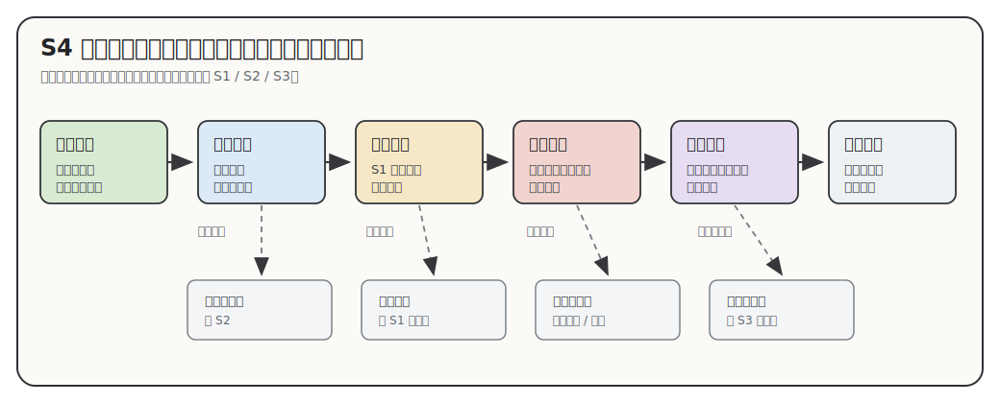

# S4 可视化与理解：诊断学生看不见的关系

状态：工作台重构稿。用于规定 `00-04` 五份导师材料怎样判断图、表、卡片、清单和正文的分工。

S4 只处理一个问题：

```text
学生为了完成当前输出，必须在脑子里同时抓住哪段关系？
```

如果这段关系靠正文已经能读懂，就用正文。如果字段需要扫描，就用表格。如果学生需要反复在脑中搜索对象、位置、先后、证据强弱或依赖关系，再考虑视觉支撑。视觉支撑的价值不在“页面上有图”，而在它把学生原本要硬记的一段关系放到纸面上，让他能看、能说、能核查。

下面这张图只表达 S4 的判断顺序。读图时从左到右看主线；遇到下方灰色出口，说明这一步没有通过，要降级、删图或回到上游方法。



这张图只供方法审稿使用；写具体导师材料时，仍要按当时的学生卡点、证据边界和正文位置重新决定形式。

## 目录

- [这份方法拦住什么失败](#s4-failure)
- [调研资料怎样改变本方法](#s4-source-to-judgment)
- [S4 从 S1、S2、S3 接什么](#s4-input)
- [关系负担诊断](#s4-diagnosis)
- [立项门：什么时候才允许做视觉支撑](#s4-gate)
- [证据怎样限制视觉语义](#s4-evidence-encoding)
- [图文消费协议](#s4-consumption)
- [关系负担到出口形式](#s4-forms)
- [落到 `00-04` 的方式](#s4-doc-roles)
- [视觉支撑规格](#s4-spec)
- [质量检查](#s4-quality-check)
- [参考资料](#s4-references)

<a id="s4-failure"></a>

## 这份方法拦住什么失败

本项目前几轮的可视化失败，表面上是图画得粗，根子是没有先诊断学生理解里缺哪段关系。执行者一旦先想“这里放什么图”，后面就会把资料塞进图形，学生仍然看不懂。

反复出现的坏结果有这些：

- 字段资料被画成图。姓名、机构、年份、论文题名、来源 URL 本来适合表格扫描，画成 SVG 后更难查。
- 不同关系都被画成流程。履历时间、平台机制、学习依赖、论文推进都用了箭头，箭头语义却没有写清。学生只能猜这条箭头表示先后、因果、输入输出，还是前置能力。
- 论文内容关系和证据可靠性混在一起。论文角色图要帮助学生看研究问题怎样被不同论文处理；证据边界卡要帮助学生看一句判断靠什么来源站住。两者混画成节点连线，会让“研究内容关系”和“来源强弱”互相污染。
- 内部审查图跑进学生正文。覆盖缺口、采集面板、执行者阅读决策，多数只服务写作者。学生正文只需要看到会影响理解、复述和复核的部分。
- 图放完后正文不再使用。图前没有提出学生卡点，图下没有读法，图后没有把图里的结果拿走继续推进。
- 证据弱，视觉语气很强。中心节点、粗线、深色、面积、精确坐标都会暗示重要性、强弱、数量或因果。S1 没有证据支撑时，图会把弱判断画得过稳。

S4 要把这些失败改成一个停写判断：

```text
如果说不清学生要少背哪段关系，视觉支撑暂停。
如果说不清证据允许表达哪种视觉语义，视觉支撑暂停。
如果图前、图下、图后没有正文消费，视觉支撑暂停。
```

<a id="s4-source-to-judgment"></a>

## 调研资料怎样改变本方法

S4 需要外部研究，但外部研究不能变成文末摆设。这里只保留能改变本项目动作的判断。

| 来源 | 资料给出的判断 | 本项目吸收成的动作 | 边界 |
|:---|:---|:---|:---|
| Mayer 的多媒体学习研究 | 图文组合只有在服务同一学习任务、减少无关处理时才有帮助。 | 每个视觉支撑先写学生输出和卡住的关系；图下必须教读，图后必须使用图的结果。 | 不把“多放图”当成降低认知负荷。 |
| 认知负荷研究 | 新手工作记忆有限，过多元素会压垮理解。 | 一张图只外部化一段主要关系；节点、颜色、箭头和标签数量要被限制。 | 控制负荷指调整进入顺序和形式，不能减少必要学术内容。 |
| Ainsworth 的多重表征框架 | 不同表征要有分工：补充、约束误解，或帮助学生构造新关系。 | 正文、表格、清单、证据卡和图先分工作；只重复正文的图删掉。 | 不按“视觉型学生”选图，按任务选形式。 |
| Larkin 与 Simon 的图形推理研究 | 图有时有效，是因为空间布局降低搜索和推理成本。 | 只有学生需要在多个对象之间反复找关系时，才把关系画出来。 | 两个对象的简单关系，用一句话更稳。 |
| Hegarty 的视觉空间显示研究 | 空间显示能否帮理解，取决于任务、表征方式和读者读图能力。 | 图前写卡点，图下写读法；新手可能读错的线条、颜色、位置必须标语义。 | 图不能替代概念解释和证据说明。 |
| Munzner 的嵌套模型 | 可视化要先刻画领域问题和任务，再抽象数据与关系，再选编码。 | S4 的规格从 `学生输出` 和 `要外部化的关系` 开始，不从 SVG、Mermaid、表格样式开始。 | 本项目不做可视化系统，只迁移任务先行和逐层验证。 |
| Brehmer 与 Munzner 的任务分类 | 看图要区分为什么看、看什么、怎样看。 | 图旁读法要写清：学生为什么看这张图、要看哪段关系、看完怎样输出。 | 不把任务分类搬成新的图形分类。 |
| Rougier 等科学图规则 | 图要明确读者、信息和展示媒介。 | 每个视觉支撑都写读者、核心关系、Markdown/PDF 可读性和输出任务。 | 科研论文图规则只作底线，不替代本项目的学生路径。 |
| Crameri 等配色研究 | 颜色会误导顺序、强弱和类别，也会影响色觉可读性。 | 颜色只能表达已说明的语义；强弱、风险和类别必须配文字标签或线型。 | 没有数据来源时，颜色深浅不能暗示数量或重要性。 |

这些资料共同改变 S4 的主轴：先诊断学生关系负担，再决定是否需要视觉支撑。范围定位、结构关系、路线、证据边界、表格或矩阵都只能作为诊断后的出口形式，不能当正文骨架。

<a id="s4-input"></a>

## S4 从 S1、S2、S3 接什么

S4 不能独立决定“该画什么”。它只能消费前三份方法给出的产物。

| 上游 | 交给 S4 的内容 | S4 拿来做什么 |
|:---|:---|:---|
| S1 信息检索与筛查 | 判断的证据等级、冲突、弱线索和复核点。 | 限制视觉语义：位置、大小、粗细、中心性、箭头、颜色能表达多强。 |
| S2 学习与认知原则 | 学生入口、本段输出、输出失败回哪里。 | 判断学生是否需要把某段关系外部化，避免让新手在脑中硬扛。 |
| S3 文稿设计 | 正文卡点、段落任务、图前图后接力。 | 判断视觉支撑放在哪里，图前怎样提出问题，图后怎样消费结果。 |

S4 的产物也有限：

```text
要外部化的关系；
最轻支撑形式；
视觉语义边界；
图文消费方式；
学生输出；
降级方案。
```

论文归属不稳，退回 S1。学生输出不清，退回 S2。图前图后接不上，退回 S3。

<a id="s4-diagnosis"></a>

## 关系负担诊断

视觉支撑从诊断开始。诊断卡很短，但必须先写。

```text
学生当前输出：
学生卡住的关系：
这段关系里有哪些对象：
学生如果只读正文，最可能怎样误解：
这段关系是否已有 S1 证据支撑：
正文、清单或表格是否已经足够：
需要外部化时，学生看完要能说什么：
```

常见关系负担如下。它们用于判断学生到底卡在哪里，不当图形类别使用。

| 关系负担 | 学生的典型卡法 | 先问什么 |
|:---|:---|:---|
| 范围关系 | 看到一串领域词，不知道大领域、方法、问题域和相邻方向怎样分层。 | 学生是否要先获得粗位置感，才能进入概念或论文？ |
| 角色关系 | 看到论文列表，不知道哪些论文提供入口、方法、平台、目标或旁支。 | 论文角色是否来自论文内容分析，而非题名相似？ |
| 顺序关系 | 看到履历、论文年份或学习步骤，不知道先后怎样影响理解。 | 箭头只表示时间，还是还暗示原因、依赖或推进？ |
| 机制关系 | 看到实验平台、计算流程或方法链，不知道输入、处理、测量、输出怎样相连。 | 证据是否足够支撑机制流转，而非只知道名词相邻？ |
| 证据关系 | 看到正文判断，不知道它靠官网、论文、综述、新闻还是弱线索支撑。 | 学生是否容易把线索当结论？ |
| 字段扫描 | 要比较多篇论文、多条来源或多个课程模块。 | 学生只是查字段，还是要用两个维度做判断？ |

诊断完成后，很多情况会回到正文或表格。S4 的价值包括删图。

<a id="s4-gate"></a>

## 立项门：什么时候才允许做视觉支撑

通过下面四道门，才继续设计视觉支撑。

| 门 | 问题 | 不通过时怎样处理 |
|:---|:---|:---|
| 输出门 | 学生看完这段后要完成什么输出？ | 回 S2 重定学习块。 |
| 关系门 | 学生卡的是关系，还是只是字段多、术语陌生、事实未查清？ | 字段多用表格；术语陌生用解释；事实未查清回 S1。 |
| 证据门 | S1 证据能支持这段关系被画出来吗？ | 证据弱就写限定语、证据卡或复核点。 |
| 消费门 | S3 正文会在图前提出问题、图下教读、图后使用结果吗？ | 接不上正文就删图或改段落。 |

立项通过后，仍然先选最轻形式：

```text
一句正文
  -> 短清单
  -> Markdown 表格
  -> 证据边界卡
  -> 小型关系图或路线图
```

越往后，越需要理由。视觉支撑越重，越容易制造误读和维护成本。

<a id="s4-evidence-encoding"></a>

## 证据怎样限制视觉语义

图形元素会说话。学生会把位置、大小、颜色、线条和箭头读成关系，所以 S1 的证据边界必须进入视觉编码。

| 视觉语义 | 学生会读成什么 | S1 证据不足时怎样降级 |
|:---|:---|:---|
| 位置 | 接近、相邻、上下位、中心边缘。 | 只写“可先放在……附近阅读”，不用精确坐标。 |
| 大小 | 规模、重要性、覆盖范围。 | 不用面积表达数量；必要时标“示意，不代表比例”。 |
| 粗细 | 强弱、主次、可信度。 | 用文字标签写证据等级，不靠线粗暗示。 |
| 箭头 | 时间、因果、机制、依赖、推进。 | 只支持先后时，只写时间箭头；不画成因果或机制链。 |
| 颜色 | 类别、风险、阶段、强弱。 | 每种颜色必须配文字标签；不靠红绿或深浅单独表达。 |
| 中心位置 | 核心、入口、目标、主问题。 | 论文内容分析不足时，不把某论文放在中心。 |
| 虚线 | 弱线索、待复核、可能关系。 | 虚线旁仍要写“弱线索”或“需复核”，不能让学生猜。 |

这一节的审稿问题很直接：

```text
这张图有没有用视觉方式说出证据说不出来的话？
```

如果有，就降级。

<a id="s4-consumption"></a>

## 图文消费协议

视觉支撑必须被正文消费。它不该独立漂在章节里。

合格顺序是：

```text
图前：正文提出学生卡点。
图中：只外部化这一段关系。
图下：说明先看哪里、再看哪里、哪些符号表示弱线索或复核。
图后：正文拿走图里的结果，继续解释、比较、收束或交接。
输出：学生用一句话、三到五句话或一个小清单复述这段关系。
```

每个位置都有自己的任务：

| 位置 | 要做什么 | 坏信号 |
|:---|:---|:---|
| 图前 | 告诉学生为什么需要这次视觉支撑。 | 直接扔图，前文没有卡点。 |
| 图中 | 只保留本段关系需要的对象和符号。 | 节点、箭头、颜色越来越多。 |
| 图下 | 写读法和证据边界。 | 只有图题，没有读法。 |
| 图后 | 使用图中结果推进下一段。 | 图后继续讲别的资料，图被遗忘。 |
| 输出 | 让学生复述、判断或回看。 | 学生只能说“看起来很复杂”。 |

图后正文不消费，图就没有正文资格。

<a id="s4-forms"></a>

## 关系负担到出口形式

这里才选择形式。形式是诊断后的出口，不能当写作起点。

| 诊断结果 | 先尝试 | 允许升级的条件 | 学生输出 |
|:---|:---|:---|:---|
| 字段多，需要查找。 | Markdown 表格。 | 两个维度共同决定判断时，改成矩阵。 | 指出关键差异，并回到正文判断。 |
| 证据强弱容易误读。 | 判断旁的限定语。 | 判断会影响后续阅读，且学生容易把线索当结论时，用证据边界卡。 | 说出哪些是直接证据、交叉证据、弱线索或需复核。 |
| 范围层级难想象。 | 分层正文或相邻方向表。 | 学生需要粗位置感才能进入 `02` 的概念入口时，用小型定位草图。 | 说出大领域、方法入口、问题域和相邻方向。 |
| 论文角色分不清。 | 论文角色表。 | 角色之间有支撑、平台、目标、旁支等关系，且论文内容分析足够时，用结构关系图。 | 用三到五句话复述论文群分工。 |
| 先后影响理解。 | 时间表或阶段短段。 | 阶段之间有清楚先后，且学生需要看到变化时，用时间路线。 | 说出从早期到当前发生了什么变化。 |
| 机制链条难保留。 | 分步清单。 | 输入、处理、测量、输出有证据支撑时，用机制路线。 | 说出每一步接住什么、交出什么。 |
| 学习依赖容易跳步。 | 学习块清单。 | 前置能力、概念缺口和目标论文图之间有明确依赖时，用学习路线。 | 说出先补哪段，再读哪张图或哪篇论文。 |

这张表只作审查入口。每一行都要回到具体导师、具体论文、具体学生输出里判断。

<a id="s4-doc-roles"></a>

## 落到 `00-04` 的方式

五份成品使用 S4 的方式不同。差别来自学生输出，不来自图形配额。

| 文档 | 学生输出 | 常见关系负担 | S4 的处理重点 |
|:---|:---|:---|:---|
| `00_材料导读.md` | 说出五份材料怎样读，卡住时回哪里。 | 阅读顺序和回看位置。 | 多数用短清单；只有分支复杂时才做小决策图。 |
| `01_基础画像.md` | 说出老师是谁，论文集合和资料边界哪里稳、哪里需复核。 | 身份、履历、论文集合、风险并列出现。 | 字段用表格；关键风险用证据边界卡；少画作者网络。 |
| `02_领域地图.md` | 说出导师方向适合先放在哪片领域里读，旁边哪些方向容易混淆。 | 大领域、方法入口、问题域、相邻方向混在一起。 | 先用正文建立层级；需要范围感时再做粗定位，不能画精确坐标。 |
| `03_论文路线.md` | 复述论文群怎样分工推进当前方向。 | 论文列表多，角色和问题链看不出来。 | 先做论文内容分析和角色表；关系足够复杂时再做结构图或机制路线。 |
| `04_学习向导.md` | 列出从基础课到目标论文和核心图的学习桥。 | 课程、概念、方法、论文图之间断开。 | 学习块先行；依赖清楚时用学习路线，过长时拆成多个块。 |

`03` 要特别谨慎。论文路线图只有在论文内容分析完成后才有资格出现。只靠 `02` 的领域判断和论文题名，最多能做候选表，不能画问题链。

<a id="s4-spec"></a>

## 视觉支撑规格

每个视觉支撑进入正文前，先写规格。规格不用长，但要让审稿人看见它怎样从学生卡点来。

```text
student_output：学生看完这一段要完成什么输出？
relationship_to_externalize：哪段关系需要被外部化？
objects_in_relation：关系里有哪些对象？
evidence_allowed_encoding：S1 证据允许哪些位置、线条、箭头、颜色、大小或中心性？
lightest_form_test：正文、清单、表格为什么不够；如果够，就不用图。
reader_path：图前哪句话提出卡点，图下怎样教读，图后哪段消费结果？
student_check：学生看完要说出什么，答不上回哪里？
fallback：证据不足、图太重或渲染不稳时降级成什么？
```

规格里的 `lightest_form_test` 很重要。它强迫执行者先证明轻形式不够，再上更重的视觉支撑。

<a id="s4-quality-check"></a>

## 质量检查

使用或重构 S4 后，用下面的问题审查。答不上时停在图文支撑层。

| 检查 | 合格表现 |
|:---|:---|
| 学生输出 | 图、表或卡片服务一个可检查输出。 |
| 关系诊断 | 写清学生卡住的是范围、角色、顺序、机制、证据还是字段扫描。 |
| 上游承接 | S1 证据边界、S2 学习输出、S3 图文位置都被使用。 |
| 最轻形式 | 已经比较正文、清单、表格、卡片和图。 |
| 视觉克制 | 图形元素没有暗示无证据的强弱、因果、比例或中心性。 |
| 图文消费 | 图前提出问题，图下给读法，图后使用结果。 |
| 新手可读 | 标签、节点、颜色、线型数量被控制。 |
| 输出倒查 | 学生答不上时能回到 S1、S2、S3 或当前视觉支撑规格。 |

最低停写条件：

```text
学生输出说不清，回 S2。
关系负担说不清，用正文。
证据边界说不清，回 S1。
图前图后接不上，回 S3。
表格能解决，保留表格。
视觉语义会放大弱线索，降级。
图只服务执行者审查，移出学生正文。
```

机械检查只能证明 Markdown、链接、禁用表达和引用路径没有明显问题。它不能证明视觉支撑真的帮助学生理解。这个判断要回到具体 `00-04` 段落里看学生能否复述。

<a id="s4-references"></a>

## 参考资料

| 编号 | 资料 | 本文采用的要点 | 链接 |
|:---|:---|:---|:---|
| [V1] | Richard E. Mayer, *Multimedia Learning* | 图文要服务同一学习任务，并减少无关负担。 | https://api.crossref.org/works/10.1017/CBO9781139164603 |
| [V2] | Sweller, van Merrienboer & Paas, *Cognitive Architecture and Instructional Design: 20 Years Later* | 新手受工作记忆限制，材料进入顺序和元素数量要控制。 | https://doi.org/10.1007/s10648-019-09465-5 |
| [V3] | Shaaron Ainsworth, *DeFT: A conceptual framework for considering learning with multiple representations* | 多重表征要有分工，形式要匹配学习任务。 | https://doi.org/10.1016/j.learninstruc.2006.03.001 |
| [V4] | Larkin & Simon, *Why a Diagram is Sometimes Worth Ten Thousand Words* | 图能通过空间组织降低搜索和推理成本。 | https://digitalcollections.library.cmu.edu/node/35554 |
| [V5] | Mary Hegarty, *The Cognitive Science of Visual-Spatial Displays* | 空间显示的帮助取决于任务、表征方式和读图能力。 | https://pubmed.ncbi.nlm.nih.gov/25164399/ |
| [V6] | Tamara Munzner, *A Nested Model for Visualization Design and Validation* | 可视化先刻画任务和数据关系，再选择视觉编码。 | https://www.cs.ubc.ca/labs/imager/tr/2009/NestedModel/NestedModel.pdf |
| [V7] | Brehmer & Munzner, *A Multi-Level Typology of Abstract Visualization Tasks* | 读图任务要区分为什么看、看什么、怎样看。 | https://pubmed.ncbi.nlm.nih.gov/24051804/ |
| [V8] | Rougier, Droettboom & Bourne, *Ten Simple Rules for Better Figures* | 科研图要明确读者、信息和展示媒介。 | https://journals.plos.org/ploscompbiol/article?id=10.1371/journal.pcbi.1003833 |
| [V9] | Crameri, Shephard & Heron, *The misuse of colour in science communication* | 颜色要避免误导强弱、顺序和色觉可读性。 | https://doi.org/10.1038/s41467-020-19160-7 |
