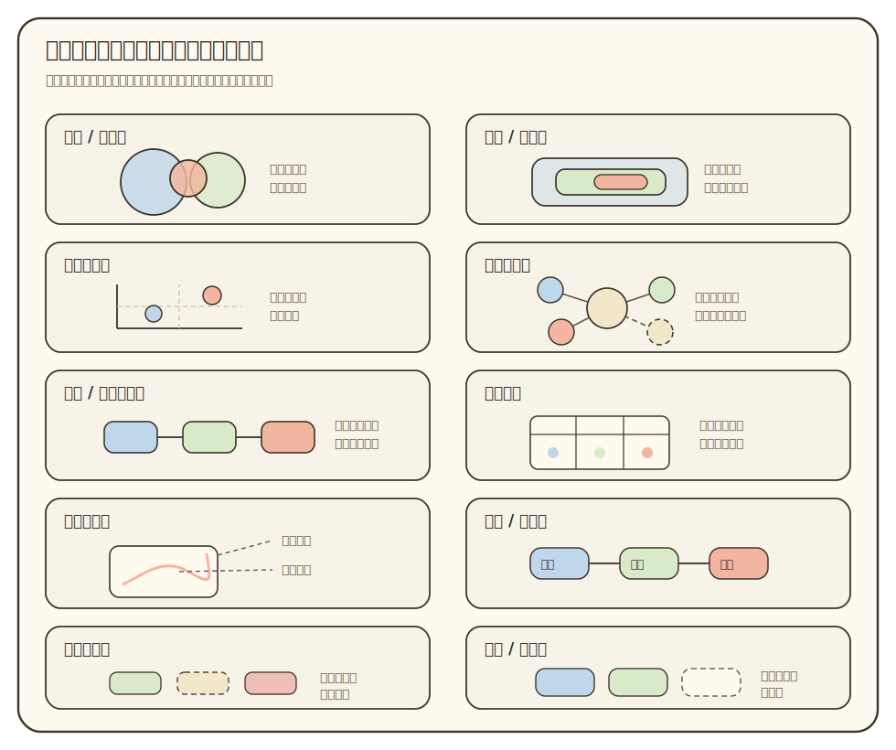
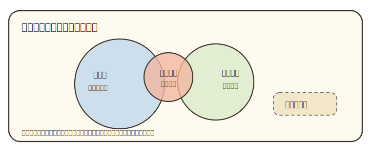
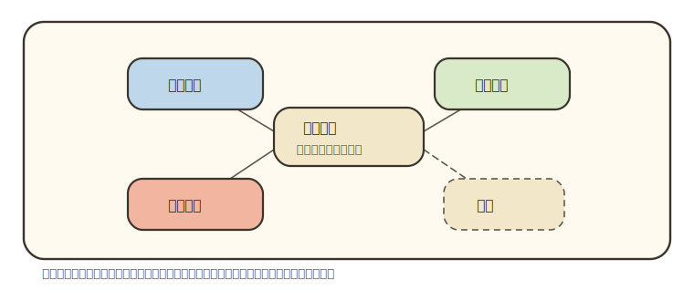
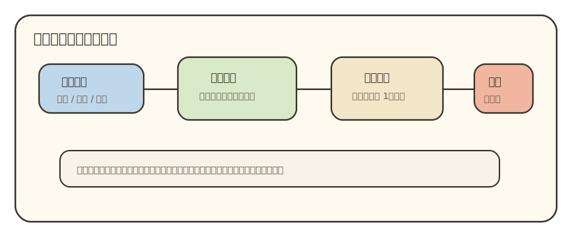

# 可视化与理解

状态：工作台标准稿。先服务 `00-04` 文档设计讨论，后续用真实导师成品继续校准。

## 目录

- [中心主线](#vis-mainline)
- [依据链](#vis-evidence-chain)
- [选图流程](#vis-selection-flow)
- [视觉词汇表](#vis-vocabulary)
- [SVG 风格规范](#vis-svg-style)
- [示例图组](#vis-examples)
- [五份文档如何选图](#vis-doc-selection)
- [Markdown 兼容写法](#vis-markdown-compat)
- [预览与导出](#vis-preview-export)
- [图源规格](#vis-figure-spec)
- [最低质量检查](#vis-quality-check)
- [待验证问题](#vis-open-issues)
- [回收位置](#vis-recycle)
- [参考文献与资料](#vis-references)

<a id="vis-mainline"></a>

## 中心主线

可视化只解决一个问题：把学生很难同时放在脑子里的关系放到页面上。

学生读导师材料时，容易卡在四类关系上：导师方向在大专业里的位置，论文之间的角色，课程知识到目标论文的桥，关键判断背后的证据强弱。文字能解释细节，图负责让这些关系先被看见。这个判断来自多媒体学习、认知负荷、多重表征和图式推理研究的共同结论：图文配合能降低搜索和对齐成本，但图必须服务同一个理解任务<sup><a href="#p1">[P1]</a></sup><sup><a href="#p2">[P2]</a></sup><sup><a href="#p3">[P3]</a></sup><sup><a href="#p4">[P4]</a></sup><sup><a href="#p5">[P5]</a></sup>。

本文件采用一条固定判断链：

```text
学生卡在哪里
  -> 他需要看见什么关系
  -> 证据能支持到什么精度
  -> 哪种图最轻、最清楚
  -> 图旁怎样说明读法和证据边界
  -> 学生看完能输出什么
```

这条链决定图形形式。流程图、SVG、表格、Mermaid 都只是工具。工具合适时使用，帮不上理解时删掉。

<a id="vis-evidence-chain"></a>

## 依据链

这份文档的观点不靠直觉堆出来。下面这张表把规则、来源和本项目用法放在一起，后续如果某条规则不好用，应先回到这张表判断是“依据不适合导师材料”，还是“实现方式没有跟上”。

| 规则 | 依据 | 在本项目里的用法 |
|:---|:---|:---|
| 先问读者任务，再选图 | 可视化任务分类和可视化设计方法强调先抽象任务、数据和视觉编码<sup><a href="#p6">[P6]</a></sup><sup><a href="#r1">[R1]</a></sup>；FT Visual Vocabulary 和 Data Visualization Catalogue 也按读者要看的关系组织图表<sup><a href="#r2">[R2]</a></sup><sup><a href="#r3">[R3]</a></sup> | 执行 AI 先写 `reader_question`，再选范围图、矩阵、路线图或证据图 |
| 一张图回答一个学生问题 | 多媒体学习和多重表征研究提醒图文要围绕同一理解动作协作<sup><a href="#p1">[P1]</a></sup><sup><a href="#p3">[P3]</a></sup>；认知负荷研究提醒复杂图会增加无关负担<sup><a href="#p2">[P2]</a></sup> | 不把多个目标塞进一张大图。`02` 看领域位置，`03` 看论文角色，`04` 看学习桥 |
| 空间关系优先用空间表达 | 图式推理研究说明，合适的空间组织能减少搜索和推理成本<sup><a href="#p4">[P4]</a></sup><sup><a href="#p5">[P5]</a></sup> | 领域范围、相邻方向、论文角色分布、学习缺口优先考虑 SVG 地图、定位图或矩阵 |
| 证据精度决定视觉精度 | 可视化编码会暗示数量、距离、排序和强弱<sup><a href="#r1">[R1]</a></sup><sup><a href="#b2">[B2]</a></sup> | 没有统计数据时不写百分比；只够粗略判断时，用“大 / 中 / 小”“主线 / 旁支 / 待复核” |
| 概念关系需要可读的连接 | 概念图理论强调节点关系需要清楚连接词，范围过大时会失控<sup><a href="#p7">[P7]</a></sup> | 网络图只放 4 到 8 个关键节点；线条必须说明“支撑、扩展、旁支、证据冲突”等含义 |
| SVG 适合本项目的地图型图 | Markdown 可嵌入图片，SVG 支持结构化图形和 presentation attributes<sup><a href="#b3">[B3]</a></sup><sup><a href="#b4">[B4]</a></sup><sup><a href="#b5">[B5]</a></sup> | `02` 范围图、`03` 论文问题地图、`04` 学习桥优先用 SVG；Mermaid 只承担轻量路线和依赖 |

<a id="vis-selection-flow"></a>

## 选图流程

### 1. 写出读者问题

每张图先用学生视角写一句话：

- 这个方向在大专业里处在哪一片？
- 这些论文分别承担什么角色？
- 我从高数、线代、普物出发，还缺哪些知识才能读目标论文？
- 这条判断由官网、论文、综述还是弱线索支撑？

如果只能写出“这里需要一个图”，这张图还没有任务。

### 2. 判断关系类型

关系类型决定图形。下面这张表是入口，真实选择还要看证据精度和文档位置。

| 学生需要看见 | 推荐形式 | 常见位置 | 易错点 |
|:---|:---|:---|:---|
| 整体由哪些部分组成，哪块更大 | 组成 / 范围图 | `02` 领域全景 | 面积暗示精确比例，来源却只够粗略判断 |
| 大类、小类、问题域怎样收束 | 层级 / 包含图 | `02` 范围定位 | 只画上下位，学生仍不知道它在大领域中占多大位置 |
| 两个维度同时判断 | 二维定位图 | `02/03` 方向或论文定位 | 轴含义含混，点的位置像凭感觉摆放 |
| 多个概念、论文、平台相互连接 | 关系网络图 | `02/03` 概念和论文关系 | 节点太多，线条没有含义 |
| 多个对象按相同字段比较 | 矩阵比较 | `01/03/04` | 表格太宽，读者看不出主线 |
| 论文核心图该先看哪里 | 标注解剖图 | `04` 核心图读法 | 只说“图很重要”，没有坐标、变量和结论句 |
| 确实存在先后、依赖或回退 | 时间 / 路线图 | `00/01/04` | 把普通并列关系画成流程 |
| 判断靠不靠谱 | 证据风险图 | `00-04` | 参考文献堆在文末，正文判断无法追溯 |

### 3. 判断证据精度

图里的面积、距离、颜色和线条都会暗示判断。生成前先问：证据能支撑到什么程度？

- 有可复核数据时，可以用数值图，例如柱状图、折线图、treemap 数值面积。
- 只有粗略范围感时，用“大 / 中 / 小”“主流 / 稳定 / 小众 / 新兴”这类标签。
- 只有定性关系时，用高亮、分组、边框、靠近或包含，不暗示精确比例。
- 弱线索用虚线、浅色或 `需人工复核` 标注。

多数导师领域图只能做到粗略范围感。没有检索式、统计来源或可复核分类时，不写百分比。

### 4. 选择最轻的有效形式

选择顺序可以这样用：

```text
需要空间感或范围感 -> SVG 范围图 / treemap / 气泡图
需要顺序或依赖 -> 竖向路线 / timeline / 小型流程图
需要多维比较 -> 矩阵表
需要少量概念关系 -> 小型概念图 / 网络图
需要字段和来源清单 -> 短表
```

表格适合重复字段、比较、来源和检查。主线解释被切成太多格子后，学生会失去阅读线索。

### 5. 给图写读法

图旁至少说明三件事：

- 先看哪里，再看哪里。
- 颜色、面积、边框、箭头或距离代表什么。
- 哪些判断有证据支撑，哪些只是粗略视觉权重或初步线索。

图和正文要相邻。图在前面，解释在很远的后文，会让学生来回找对应关系。

### 6. 设置输出检查

图看完后，学生应能完成一个小输出：

- 用一句话说出导师方向在领域里的位置。
- 选出两篇论文，说明它们在路线中分别承担什么角色。
- 指出从自己基础到目标论文之间最先要补的三个缺口。
- 说出某个判断由哪些来源支撑，哪里需要复核。

没有输出检查，图很容易只被看一眼。

<a id="vis-vocabulary"></a>

## 视觉词汇表

这张表用来防止执行 AI 只会画流程图。每类图都先绑定一个读者问题，再决定实现方式。

| 图形类型 | 解决的问题 | 适合实现 | 常见文档 |
|:---|:---|:---|:---|
| 组成 / 范围图 | 这个方向在大领域中靠近哪里，占粗略多大一块 | SVG、treemap、气泡图 | `02` |
| 层级 / 包含图 | 从大类到问题域怎样逐层收束 | SVG 套层、block、树形图 | `02` |
| 二维定位图 | 两个维度共同决定对象位置 | SVG 四象限、quadrantChart | `02/03` |
| 关系网络图 | 多个论文、概念或平台怎样连接 | SVG 网络、概念图、少量 mindmap | `02/03` |
| 系统 / 平台链路图 | 样品、装置、算法、测量和输出怎样连成实验链 | SVG 模块图、小型 flowchart | `03/04` |
| 矩阵比较 | 多个对象按同一组字段比较 | Markdown 表格、热度矩阵 | `01/03/04` |
| 标注解剖图 | 论文核心图该按什么顺序读 | SVG 标注、图片局部 + 标注 | `04` |
| 时间 / 路线图 | 存在阶段、依赖、回退或学习顺序 | 竖向 Mermaid、SVG 路线 | `00/01/04` |
| 证据风险图 | 哪些判断稳，哪些需要复核 | 风险矩阵、证据表、虚线标注 | `00-04` |
| 覆盖 / 空白图 | 资料覆盖了哪些部分，哪里仍缺证据 | SVG 覆盖图、检查矩阵 | `_internal` 或读后自检 |



这张总览图只负责让执行 AI 和人工审查者看到“可选图形不止流程图”。真正写成品时，仍要回到 `reader_question`、`relation_type`、`scale_precision` 和 `evidence_basis`，不能把总览图当成固定模板。

<a id="vis-svg-style"></a>

## SVG 风格规范

核心理解图默认用 SVG。Mermaid 可以保留给草稿、极短流程和低风险依赖图；读者真正需要看空间位置、范围、论文角色、学习桥和核心图标注时，优先做 SVG。

上一版把样式放到页面级 `<style>` 中，示例 SVG 只挂 `ra-line` 这类类名。这个方案维护起来轻，但 Markdown 预览器、PDF 导出器和安全过滤器可能不加载页面级样式。样式失效后，SVG 元素会回到默认值，矩形和圆形变成黑色填充，线条和文字也会错乱。成品图不能把稳定性赌在页面 CSS 上<sup><a href="#b3">[B3]</a></sup><sup><a href="#b6">[B6]</a></sup>。

新的规则是：**成品 Markdown 默认用图片引用加载独立 SVG 文件**。维护层面用一份 `style_profile` 记录颜色、线宽、字号和虚线；输出层面把这些令牌展开成 SVG 属性，例如 `fill="#fffaf0"`、`stroke="#3a342c"`、`stroke-width="2.4"`。这样批量生成时仍然只维护一套风格，VS Code、浏览器和 PDF 管线看到的是稳定的本地图片文件。

`sketch-note` 风格令牌先固定如下：

| 令牌 | 值 | 用途 |
|:---|:---|:---|
| `paper` | `#fffaf0` | 图底色 |
| `panel` | `#f8f3e8` | 图内说明框 |
| `ink` | `#2f2a24` | 标题和主要文字 |
| `line` | `#3a342c` | 主边框和主连线 |
| `muted` | `#5f5548` | 次要文字和辅助线 |
| `blue` | `#bfd7ea` | 稳定板块、底座信息 |
| `green` | `#d8eac8` | 相邻区域、方法或概念缺口 |
| `orange` | `#f2b6a0` | 当前高亮、目标论文或输出 |
| `cream` | `#f2e7c9` | 中心问题、待复核区、说明框 |
| `soft` | `0.78` | 色块透明度 |
| `main_stroke` | `2.4` | 主边框线宽 |
| `thin_stroke` | `1.6` | 辅助线线宽 |
| `dash` | `7 5` | 旁支和待复核虚线 |

风格使用规则：

- 颜色只表达分组、主线、旁支、风险。
- 同一张图内控制在 3 到 5 个主色。
- 主线用实线和较深色；弱证据、旁支、待复核用虚线或浅色。
- 文字字号按 PDF 可读性定，不能为了塞进图里无限缩小。
- 手工写图时可以直接展开属性；批量生成时由模板把 `style_profile` 展开成 SVG 属性。
- 成品文档用 `` 引用图。工作台内的支撑方法用 `_assets/` 存放示例图，避免污染根目录。

<a id="vis-examples"></a>

## 示例图组

示例只展示形态，正式成品要换成真实导师数据和真实证据。每张图都要在图旁写明读法。

### 示例 1：领域范围图

适合 `02_领域地图.md`。它回答“导师当前方向在大领域里靠近哪一片，旁边有哪些相邻区域”。面积只表达粗略范围感，不代表统计比例。



图旁自检：学生能否说出“导师方向大致落在哪片区域，靠近哪些相邻方向，哪些地方还要复核”。

### 示例 2：论文角色地图

适合 `03_论文路线.md`。它回答“几篇论文围绕同一个问题分别承担什么角色”。这类图比横向长流程更适合论文组，因为论文之间常常是底座、方法、目标、扩展的关系，不一定是单线推进。



图旁自检：学生能否把一篇论文归入“底座、方法、目标、扩展、旁支”之一，并说出依据。

### 示例 3：学习桥地图

适合 `04_学习向导.md`。它回答“学生从已有课程出发，怎样一步步接到论文任务”。这张图不追求像课程表那样完整，重点是把学习材料、能力缺口和论文阅读任务连起来。



图旁自检：学生能否说出“我现在会什么，下一步补什么，补完后能读论文里的哪一部分”。

### 示例 4：证据风险表

适合所有文档。它回答“这条判断靠什么证据支撑”。证据图不一定要画成复杂图，很多时候短表更清楚。

| 判断 | 支撑来源 | 证据等级 | 正文写法 |
|:---|:---|:---|:---|
| 身份与机构匹配 | 官网 + 作者档案 | 直接证据 | 可作为事实底座 |
| 当前方向判断 | 近年论文 + 个人主页 | 交叉证据 | 可进入主线，但要标来源 |
| 相邻领域重要性 | 综述 + 课程资料 | 弱推断 | 图中可出现，正文要写“粗略判断” |
| 论文归属存疑 | 数据库记录冲突 | 风险项 | 暂不写强结论，留待人工复核 |

图旁自检：学生能否指出一个结论的来源强弱，而非只看最终文字。

<a id="vis-doc-selection"></a>

## 五份文档如何选图

五份文档可以使用同一套选图原则，但不能强行使用同一种图。统一性来自判断链，差异来自每份文档的读者问题。

| 文档 | 核心读者问题 | 优先图形 | 少用或慎用 |
|:---|:---|:---|:---|
| `00_材料导读.md` | 这套材料怎样读，读完如何回看 | 小型阅读路线、引用符号表、证据风险表 | 长流程图、装饰性总览图 |
| `01_基础画像.md` | 老师是谁，资料是否可靠，履历和论文集合怎样看 | 履历时间线、论文矩阵、来源核查表 | 大面积领域图，避免越权到 `02` |
| `02_领域地图.md` | 老师当前方向处在哪个大领域和问题域 | 范围图、层级图、二维定位图、相邻关系图 | 只写套层图，导致学生看不出范围大小和邻近方向 |
| `03_论文路线.md` | 论文组围绕什么问题，论文之间怎样分工 | 论文角色地图、平台链路图、矩阵比较 | 横向很长的流程图 |
| `04_学习向导.md` | 学生如何从基础课程走到目标论文 | 学习桥地图、核心图标注、阶段输出清单 | 把 `03` 的论文路线改写成课程表 |

<a id="vis-markdown-compat"></a>

## Markdown 兼容写法

这类支撑方法文档要同时服务三种场景：在 VS Code 里审查源码和预览，在 Codex 对话里临时展示图，在后续导出 HTML 或 PDF 时保持版式稳定。三种场景的渲染器不同，不能把某一个工具的特殊表现当成通用标准。

先固定写法：

| 对象 | 文档内推荐写法 | 避免的写法 | 原因 |
|:---|:---|:---|:---|
| 目录跳转 | 目录链接到手写 ASCII 锚点，例如 `[中心主线](#vis-mainline)`，正文标题前放 `<a id="vis-mainline"></a>` | 只依赖中文标题自动生成的锚点 | 不同渲染器对中文标题、空格和标点的锚点生成规则可能不同 |
| 参考引用 | 正文用 `<sup><a href="#p1">[P1]</a></sup>`，文末用 `<a id="p1"></a>[P1]` | 为单篇文档临时新增其他字母编号 | 项目已有 `[O]` / `[P]` / `[R]` / `[B]` 四类来源符号，支撑方法也要沿用 |
| 图片 | Markdown 文件里用相对路径，例如 `` | 把本机绝对路径写进文档 | 相对路径便于仓库迁移、PDF 导出和后续批量生成 |
| Codex 临时展示 | 在聊天回复中使用图片的绝对路径 | 在聊天里直接复用文档的相对路径 | Codex 对话窗口显示本地图片时需要绝对路径，文档内部仍应保持相对路径 |
| SVG 样式 | 独立 SVG 文件内直接写 `fill`、`stroke`、`stroke-width` 等属性 | 让 SVG 依赖 Markdown 页面顶部的 `<style>` | VS Code、浏览器、PDF 管线和安全过滤器对页面级样式支持不一致 |
| PDF 路径 | 后续采用“Markdown -> HTML -> 浏览器 / 受控导出器 -> PDF”的固定路线 | 每次临时换一个编辑器导出 | HTML 预览和 PDF 导出共用同一套资源解析规则，问题更容易复现 |

Markdown 可以承载表格、Mermaid、SVG 和图片。选择时同时看理解效果、批量生成、版本管理和 PDF 导出。

**表格**适合字段、比较、来源、检查和矩阵。连续多张表会让文档表单化。超过 5 列要谨慎，超过 6 行前要给读法提示。

**Mermaid**适合轻量结构图。`flowchart` 用于真实流程和依赖；`timeline` 用于时间变化；`mindmap` 用于少量概念关系；`quadrantChart` 用于两个轴都清楚的定位；`treemap` 用于组成和粗略范围；`venn` 用于真实交叉；`block` 用于套层和模块。节点超过 9 个先考虑拆图，超过 12 个通常应改成总览图加局部图，或改用 SVG / 表格<sup><a href="#b1">[B1]</a></sup>。

**SVG**适合本项目最缺的地图型图。`02` 的领域范围图、`03` 的论文问题地图、`04` 的学习桥地图，都可以优先考虑 SVG。为保证 Markdown 和 PDF 稳定，成品 SVG 直接写 `fill`、`stroke`、`stroke-width` 等属性；批量化时由结构化字段和 `style_profile` 生成这些属性<sup><a href="#b4">[B4]</a></sup><sup><a href="#b5">[B5]</a></sup>。

**位图**只在确实需要真实照片、论文原图局部或无法用 SVG 表达时使用。使用时要保留来源，控制版权风险，并保证 PDF 清晰。

关于“能不能像网页一样在文档开头设置风格”：技术上可以，但不适合作为成品默认方案。Markdown 渲染器和导出工具对原始 HTML、页面级 `<style>` 的支持并不一致<sup><a href="#b3">[B3]</a></sup>。本项目把统一风格放在生成层维护，输出到 Markdown 的 SVG 必须单图自包含。

<a id="vis-preview-export"></a>

## 预览与导出

VS Code 适合写代码、改 Markdown 和做第一轮预览；最终阅读效果还要用固定导出链路复核。VS Code 官方文档说明 Markdown 预览通过 `Ctrl+Shift+V` 打开，也支持 Markdown 图片语法和 Mermaid 这类预览能力；安全策略、扩展和渲染设置会影响预览结果<sup><a href="#b6">[B6]</a></sup>。本项目把大段 `<svg>...</svg>` 从 Markdown 正文移出，SVG 保存成独立文件，再用标准图片语法引用：

```markdown

```

工作台示例图放在 `_assets/visualization-guide/`，成品导师目录的图放在 `_internal/figures/`。这样根目录仍保持干净，Markdown 也更接近普通文档的图片引用方式。

推荐的实际使用方式：

- 写作和审查代码：继续用 VS Code。
- 阅读渲染效果：优先用 VS Code Markdown 预览；如果 SVG 仍不显示，用浏览器打开导出的 HTML 预览。
- 最终 PDF：优先走 HTML / 浏览器打印 PDF 的路线，避免依赖某个 Markdown 编辑器对内联 HTML 的特殊支持。
- 如果必须在 VS Code 中预览，先确认打开的是 Markdown Preview，不是源码编辑区；同时检查工作区是否信任、Markdown 扩展是否干扰预览、安全设置是否拦截本地 SVG。
- 如果预览窗口右上角出现安全提示，运行 `Markdown: Change Preview Security Settings`，在确认当前工作区可信后再放宽设置。不要为了方便把不可信目录也放到低安全级别。

<a id="vis-figure-spec"></a>

## 图源规格

每个视觉构件进入成品前，先写一份轻量规格。它可以放进蓝图或图源数据。

| 字段 | 作用 |
|:---|:---|
| `visual_id` | 给图一个稳定编号 |
| `reader_question` | 写清图回答的学生问题 |
| `relation_type` | 标出范围、层级、推进、依赖、证据等关系 |
| `recommended_form` | 选择 SVG、Mermaid、表格或图片 |
| `data_items` | 列出图中的节点、论文、概念或阶段 |
| `scale_precision` | 标明精确数据、半定量或定性关系 |
| `evidence_basis` | 说明布局和高亮来自哪些来源 |
| `encoding` | 说明颜色、面积、箭头、边框代表什么 |
| `style_profile` | 标明采用的统一视觉风格，例如 `sketch-note` |
| `preview_target` | 标明预览和导出基准，例如 `VS Code Markdown + PDF` |
| `caption` | 写给学生的图下读法 |
| `self_check` | 图后的小输出 |
| `fallback` | 渲染失败时的替代表达 |

这些字段约束执行 AI 不凭感觉画图。图的样式可以变化，但读者问题、关系类型、证据依据和输出检查必须稳定。

<a id="vis-quality-check"></a>

## 最低质量检查

每张图进入成品前，至少过这组检查：

- 图回答了一个具体学生问题。
- 图表达的关系类型明确。
- 图形形式匹配关系类型。
- 大小、位置、颜色和高亮没有暗示无来源的精确判断。
- 图下说明了读法。
- 图和解释放在相邻位置。
- 节点、标签和颜色数量不会压垮新手。
- 同一份 Markdown 内的图使用统一视觉风格。
- 删掉图后，学生理解会明显受损。
- 学生看完图后能完成一个小输出。
- VS Code Markdown 预览和 PDF 中能看清标签、线条和图例。

如果一张图过不了这些检查，应删掉或重做。不要为了满足“有可视化”保留装饰图。

<a id="vis-open-issues"></a>

## 待验证问题

- 图片引用形式的 SVG 在 VS Code、浏览器和 PDF 导出中的字体、缩放和线宽需要继续用真实成品实测。
- `02` 的领域范围图默认用手写 SVG 还是数据生成 SVG，需要用真实成品导出 PDF 后判断。
- 论文问题地图能否在不同导师之间稳定复刻，还要通过 `03` 成品试写验证。
- `04` 的学习桥地图需要多细，才既能指导学习，又不把学生压垮。
- 图源字段应放在蓝图、成品 `_internal/figures/`，还是后续单独模板中，等正式 Harness 回收时再定。

<a id="vis-recycle"></a>

## 回收位置

这份文档稳定后，再统一回收：

- 图形选择流程进入 `research-advisor` 的图文 reference 或质量门。
- `00-04` 主视觉建议进入各自文档标准和模板。
- `style_profile: sketch-note` 进入图源数据或 SVG 生成模板。
- 图源规格进入蓝图或 `_internal/figures/`。
- 图质量检查进入 verifier 的机械 smoke 和人工审查清单。
- 设计原因进入 `docs/计划书.md`。

回收前不要把同一条规则复制到多个正式文件。先用张鹏举和至少一个非张鹏举导师试写，确认图真的降低理解成本。

<a id="vis-references"></a>

## 参考文献与资料

### 论文与专著

| 编号 | 文献或资料 | 支撑内容 | 链接 | 类型 |
|:---|:---|:---|:---|:---|
| <a id="p1"></a>[P1] | Richard E. Mayer, *Multimedia Learning* / Cambridge multimedia learning resources | 图文结合要减少无关负担，图和文字应围绕同一理解任务协作 | https://www.cambridge.org/core/books/multimedia-learning/7A0D0A0BFD6F3BD71D9DF6F4E94F6D7D | 论文/专著 |
| <a id="p2"></a>[P2] | Sweller, van Merrienboer & Paas, *Cognitive Architecture and Instructional Design: 20 Years Later* | 新手学习需要控制认知负荷，复杂图会增加无关负担 | https://doi.org/10.1007/s10648-019-09465-5 | 论文 |
| <a id="p3"></a>[P3] | Ainsworth, *DeFT: A conceptual framework for considering learning with multiple representations* | 多重表征需要分工，设计时要考虑功能、形式和任务 | https://doi.org/10.1016/S0959-4752(98)00018-5 | 论文 |
| <a id="p4"></a>[P4] | Larkin & Simon, *Why a Diagram is Sometimes Worth Ten Thousand Words* | 图能通过空间组织降低搜索和推理成本，但优势取决于任务 | https://doi.org/10.1207/s15516709cog1101_1 | 论文 |
| <a id="p5"></a>[P5] | Hegarty, *The Cognitive Science of Visual-Spatial Displays* | 可视空间显示能支持理解，但读图能力和任务设计会影响效果 | https://doi.org/10.1111/j.1756-8765.2011.01150.x | 论文 |
| <a id="p6"></a>[P6] | Brehmer & Munzner, *A Multi-Level Typology of Abstract Visualization Tasks* | 可视化设计应先抽象用户任务，再选择表达形式 | https://doi.org/10.1109/TVCG.2013.124 | 论文 |
| <a id="p7"></a>[P7] | Novak & Cañas, *The Theory Underlying Concept Maps and How to Construct and Use Them* | 概念图适合表达概念之间的命题关系，但需要清楚的连接词和范围控制 | https://cmap.ihmc.us/docs/theory-of-concept-maps | 论文/报告 |

### 综述、教程与可视化资料

| 编号 | 文献或资料 | 支撑内容 | 链接 | 类型 |
|:---|:---|:---|:---|:---|
| <a id="r1"></a>[R1] | Tamara Munzner, *Visualization Analysis and Design* | 图形设计要从数据类型、任务和视觉编码出发 | https://www.cs.ubc.ca/~tmm/vadbook/ | 教材/专著 |
| <a id="r2"></a>[R2] | Financial Times Visual Vocabulary | 按变化、相关、排名、分布、组成、流动、空间等任务选择图 | https://github.com/Financial-Times/chart-doctor/tree/main/visual-vocabulary | 可视化词汇表 |
| <a id="r3"></a>[R3] | The Data Visualization Catalogue | 提供不同图表类型、用途和适用数据关系的参考 | https://datavizcatalogue.com/ | 可视化资料 |

### 工具、语法与实现资料

| 编号 | 文献或资料 | 支撑内容 | 链接 | 类型 |
|:---|:---|:---|:---|:---|
| <a id="b1"></a>[B1] | Mermaid syntax reference | Markdown 中可用 flowchart、timeline、mindmap、quadrant、treemap、venn 等图形语法 | https://mermaid.js.org/intro/syntax-reference.html | 工具文档 |
| <a id="b2"></a>[B2] | Vega-Lite documentation | 结构化图形可由数据、mark 和 encoding 生成，适合后续批量化思路 | https://vega.github.io/vega-lite/docs/ | 工具文档 |
| <a id="b3"></a>[B3] | CommonMark Spec: HTML blocks | Markdown 可以承载原始 HTML，但具体渲染和安全策略取决于工具 | https://spec.commonmark.org/current/#html-blocks | 标准文档 |
| <a id="b4"></a>[B4] | W3C SVG 2: Styling | SVG 支持样式和 presentation attributes | https://www.w3.org/TR/SVG2/styling.html | 标准文档 |
| <a id="b5"></a>[B5] | MDN Web Docs: SVG attribute reference | SVG presentation attributes 可直接写在元素上，例如 `fill`、`stroke`、`stroke-width` | https://developer.mozilla.org/en-US/docs/Web/SVG/Reference/Attribute | 工具文档 |
| <a id="b6"></a>[B6] | Visual Studio Code Markdown documentation | VS Code Markdown 预览、图片、Mermaid、预览安全和样式配置会影响阅读效果 | https://code.visualstudio.com/docs/languages/markdown | 工具文档 |
