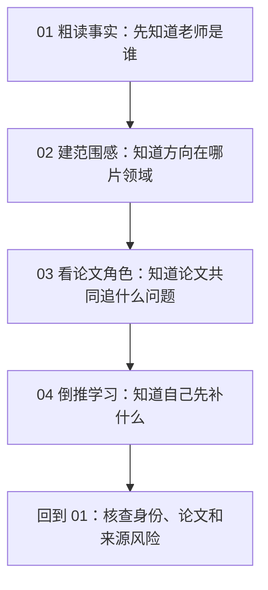
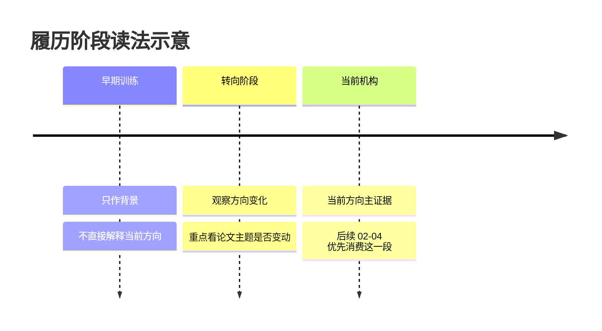
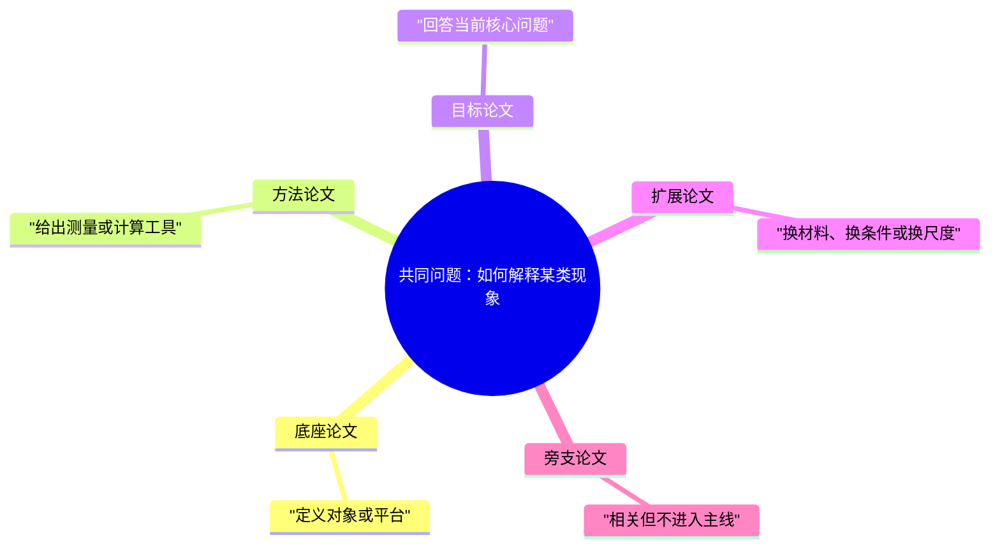
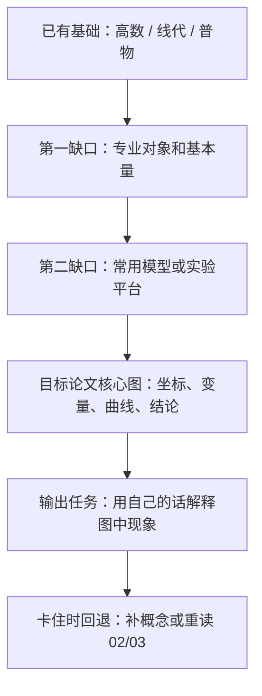

# 可视化与理解

状态：结构回归稿。先服务 `00-04` 文档标准讨论，后续用真实导师成品试写校准。

## 中心主线

可视化的作用，是把学生很难同时放在脑子里的关系放到页面上。

学生读导师材料时，核心困难常常来自关系看不见：导师方向在大专业里的位置看不见，论文之间的角色看不见，课程知识到目标论文的桥看不见，证据强弱也看不见。合适的图能把这些关系外部化，让学生先看见结构，再读文字解释。

本文件只保留一条判断链：

```text
学生卡在哪里
  -> 他需要看见什么关系
  -> 这个关系需要多精确
  -> 用什么图最轻、最清楚
  -> 图旁怎样解释证据和读法
  -> 学生看完能输出什么
```

这条链比“有哪些图可以用”更重要。图形形式要服从这套判断顺序。

## 读者困难

新手看长文时，工作记忆会被对象、层级、顺序、证据和术语同时占满。文字能解释细节，但很多关系靠文字表达会变成一长串句子，读者需要自己在脑子里拼图。

在本项目里，最容易出问题的关系有五类：

- **位置关系**：导师方向处在哪个大领域、小领域、问题域。
- **范围关系**：某个方向是大板块、稳定子领域、小问题域，还是交叉点。
- **推进关系**：几篇论文共同追什么问题，谁是底座，谁是扩展，谁是旁支。
- **依赖关系**：学生已有基础怎样接到目标论文、核心图和进组讨论。
- **证据关系**：哪些判断来自官网、论文、综述，哪些只是弱线索。

如果这些关系看不见，文档就算文字顺，也会把理解负担留给学生。学生读完可能知道“说了什么”，却说不清“这些东西怎样连起来”。

## 推进链

每张图进入成品前，先走六步。

### 1. 写出读者问题

先用学生视角写一句话：

- 这个方向在大专业里处在哪一片？
- 这些论文分别在研究路线中承担什么角色？
- 我从高数、线代、普物出发，还缺哪些知识才能看目标论文？
- 这条判断由官网、论文、综述还是弱线索支撑？

如果只能写出“这里需要一个图”“把这一段可视化”，说明图还没有任务。

### 2. 判断关系类型

图形选择从关系开始。

| 学生需要看见 | 更合适的形式 | 典型位置 |
|:---|:---|:---|
| 顺序和回看 | 阅读地图、闭环图、竖向路线 | `00` 阅读顺序 |
| 层级和包含 | 套层图、层级树、block | `02` 范围定位 |
| 范围和组成 | 范围地图、气泡图、treemap | `02` 领域全景 |
| 相邻和交叉 | 重叠圆、Venn、相邻区域图 | `02` 相邻方向 |
| 问题推进 | 问题链、论文角色地图 | `03` 论文路线 |
| 多维比较 | 矩阵表 | `03` 单篇定位、`04` 学习缺口 |
| 先修依赖 | 学习桥地图、依赖图 | `04` 学习向导 |
| 证据强弱 | 证据链、风险矩阵、短表 | `00/01/02` 来源核查 |

流程图只适合真实流程、依赖或平台链路。普通并列关系画成流程图，会让读者误以为存在先后或因果。

### 3. 判断证据精度

图里的面积、距离、颜色和线条都会暗示判断。生成前要先问：证据能支撑到什么程度？

- 有可复核数据时，可以用数值图，例如柱状图、折线图、treemap 数值面积。
- 只有粗略范围感时，用“大 / 中 / 小”“主流 / 稳定 / 小众 / 新兴”这类标签。
- 只有定性关系时，用高亮、分组、边框、靠近或包含，不暗示精确比例。
- 弱线索用虚线、浅色或 `需人工复核` 标注，不能画成主线。

多数导师领域图只能做到粗略范围感。没有检索式、统计来源或可复核分类时，不写百分比。

### 4. 选择最轻的有效形式

图要足够清楚，也要足够轻。能用一张小图解决，就不要做大图；能用图解决关系，就不要让学生在长段里自己拼。

选择顺序可以这样用：

```text
需要空间感或范围感 -> SVG / treemap / 气泡图 / 范围地图
需要顺序或依赖 -> 竖向路线 / timeline / 小型流程图
需要多维比较 -> 矩阵表
需要少量概念关系 -> 小型概念图 / mindmap
字段和来源清单 -> 短表
```

表格只适合重复字段、比较、来源和检查。主线解释如果被切成格子，读者会很难顺着一条线往下走。

### 5. 给图写读法

图旁必须说明三件事：

- 先看哪里，再看哪里。
- 颜色、面积、边框、箭头或距离代表什么。
- 哪些判断有证据支撑，哪些只是视觉权重或初步线索。

图和正文要相邻。图在前面，解释在很远的后文，会让学生来回找对应关系。

### 6. 设置输出检查

图看完后，学生应能完成一个小输出：

- 用一句话说出导师方向在领域里的位置。
- 选出两篇论文，说明它们在路线中分别承担什么角色。
- 指出从自己基础到目标论文之间最先要补的三个缺口。
- 说出某个判断由哪些来源支撑，哪里需要复核。

没有输出检查，图很容易只被看一眼。

## 研究结论怎样落地

前面的参考资料要落到可执行规则里。本项目先取四条：

- 先抽象任务，再选图形。Brehmer、Munzner 和信息可视化词表的共同启发是：先问学生要定位、比较、看组成、看变化、看依赖，还是核查证据；图名排在后面。
- 一张图回答一个学生问题。Mayer、多重表征和认知负荷研究都指向同一件事：图和文字要围绕同一个理解动作分工，节点过多、图例过重、读法太远都会增加负担。
- 空间关系优先用空间表达。领域范围、相邻方向、论文角色分布、学习缺口这些内容，靠长段文字会让学生在脑中拼图；合适的小图能减少搜索和对齐成本。
- 证据精度决定视觉精度。没有统计数据时，不用面积和百分比暗示精确比例；只能给粗略范围感时，就把“粗略”写在图注里。

执行 AI 的第一个问题应是：学生现在需要看见哪一种关系，证据能支持到什么精度。回答清楚后，再选最轻的实现形式。

## 视觉原型卡

先选视觉原型，再选实现方式。下面的示范都能直接放进 Markdown；真实成品要把示例词替换成导师证据里的具体内容。

### 1. 阅读路线图

**触发条件**：学生需要知道五份材料怎样读成一条路，读完后还要回到哪里复核。

**慎用场景**：单纯列五个文件名；每一步没有明确阅读动作。

**最低输入**：五份文档、每份文档的阅读动作、回看位置。



图旁读法：先顺着箭头读一轮，形成整体印象；再按自己真正想理解的导师方向，回到 `01` 核查论文和来源。学生读完应能说出每份文档在整条路线里的作用。

### 2. 事实阶段图

**触发条件**：导师履历或论文集合有多个阶段，学生容易把前史、转向和当前方向混在一起。

**慎用场景**：履历只有一个稳定阶段；阶段变化和研究方向没有关系。

**最低输入**：阶段名称、时间、机构或身份、当前相关度、证据来源。



图旁读法：先找“当前机构”或“当前职位”所在阶段，再回看前面的阶段是否解释了研究转向。学生读完应能说出哪些信息属于当前主线，哪些只作背景。

### 3. 范围定位图

**触发条件**：学生需要知道导师方向在大领域里的位置、相邻方向和粗略规模。

**慎用场景**：只有上下位名词，没有范围、相邻或组成线索；证据薄到无法判断相邻区域。

**最低输入**：大领域、主要子领域、导师相关方向、相邻方向、证据强弱。

<svg width="100%" viewBox="0 0 760 320" role="img" aria-label="领域范围定位图示意">
  <rect x="20" y="24" width="720" height="260" rx="18" fill="#f8fafc" stroke="#94a3b8" stroke-width="2"/>
  <text x="44" y="60" font-size="22" fill="#0f172a">大领域：物理学</text>
  <circle cx="250" cy="170" r="96" fill="#dbeafe" stroke="#3b82f6" stroke-width="2"/>
  <text x="188" y="150" font-size="18" fill="#1e3a8a">凝聚态</text>
  <text x="178" y="176" font-size="14" fill="#1e3a8a">稳定大方向</text>
  <circle cx="445" cy="166" r="82" fill="#dcfce7" stroke="#22c55e" stroke-width="2"/>
  <text x="392" y="150" font-size="18" fill="#166534">量子材料</text>
  <text x="382" y="176" font-size="14" fill="#166534">相邻/交叉区域</text>
  <circle cx="350" cy="156" r="52" fill="#fee2e2" stroke="#ef4444" stroke-width="3"/>
  <text x="313" y="150" font-size="16" fill="#991b1b">导师方向</text>
  <text x="303" y="174" font-size="13" fill="#991b1b">当前高亮</text>
  <rect x="560" y="190" width="130" height="46" rx="8" fill="#fff7ed" stroke="#fb923c" stroke-width="2" stroke-dasharray="6 4"/>
  <text x="583" y="218" font-size="15" fill="#9a3412">需复核邻域</text>
  <text x="44" y="262" font-size="13" fill="#475569">说明：面积只表达粗略范围感，不代表统计比例；虚线表示证据较弱。</text>
</svg>

图旁读法：先看最大边框，确认讨论没有离开大领域；再看高亮圈，确认导师方向和相邻区域；最后看虚线框，记录需要复核的邻域。学生读完应能说出“这个方向大致落在哪片区域，旁边靠近什么，哪些部分证据还弱”。

### 4. 问题角色图

**触发条件**：多篇论文围着同一个当前问题，但各自承担的角色不同。

**慎用场景**：论文之间仅是同一作者的时间列表；没有共同问题或角色分工。

**最低输入**：共同问题、目标论文、前史论文、方法论文、扩展论文、旁支论文、证据来源。



图旁读法：先读中心问题，再看每篇论文为什么放在某个角色下。学生读完应能拿两篇论文举例说明：一篇为什么是底座，另一篇为什么是目标或扩展。

论文超过 6 篇时，优先改成角色矩阵，避免 mindmap 变成论文名堆叠。

| 论文 | 回答的问题 | 在路线中的角色 | 证据强度 |
|:---|:---|:---|:---|
| 论文 A | 对象或平台是什么 | 底座 | 直接证据 |
| 论文 B | 方法怎样测量关键量 | 方法 | 直接证据 |
| 论文 C | 当前核心问题怎样解决 | 目标 | 直接证据 |
| 论文 D | 是否能推广到新条件 | 扩展 | 交叉证据 |

### 5. 学习桥地图

**触发条件**：学生知道自己学过高数、线代、普物等课程，但不知道这些基础怎样接到目标论文。

**慎用场景**：目标只是列课程清单；课程、概念、核心图和论文任务之间没有连接。

**最低输入**：学生起点、关键缺口、目标论文图、输出任务、回退位置。



图旁读法：先从自己的已学课程出发，不直接跳到论文；每过一个节点，都要能完成一个小输出。学生读完应能说出最先补哪三个缺口，以及卡住时回到哪一份材料。

### 6. 证据风险图

**触发条件**：同一判断同时来自官网、论文、数据库、综述或弱线索，学生需要判断它靠不靠谱。

**慎用场景**：单纯列参考文献；没有具体判断需要分级。

**最低输入**：判断、来源、证据类型、冲突情况、复核动作。

| 判断 | 支撑来源 | 证据等级 | 学生读法 |
|:---|:---|:---|:---|
| 身份与机构匹配 | 官网 + 作者档案 | 直接证据 | 可作为事实底座 |
| 当前方向判断 | 近年论文 + 个人主页 | 交叉证据 | 可用于 02-04 主线 |
| 某相邻领域重要性 | 综述 + 课程资料 | 弱推断 | 图中可出现，但要标复核 |
| 某论文归属存疑 | 数据库记录冲突 | 风险项 | 正文避免强结论 |

图旁读法：先看“判断”列，再看证据等级。学生读完应能说出哪些内容可以放心当事实，哪些内容只能作为线索。

## 原型到五份文档的默认入口

这张表只给默认入口。真实选择仍要回到读者问题和证据精度。

| 文档 | 默认先考虑的原型 | 何时换原型 |
|:---|:---|:---|
| `00` 材料导读 | 阅读路线图 | 如果学生主要卡在来源符号，就用证据风险图或短表 |
| `01` 基础画像 | 事实阶段图、证据风险图 | 如果履历很简单，阶段图可删，只保留读法提示 |
| `02` 领域地图 | 范围定位图 | 如果证据只够上下位分类，就先用层级小图，标明范围感不足 |
| `03` 论文路线 | 问题角色图 | 如果存在真实实验链路或平台链路，再用小流程图 |
| `04` 学习向导 | 学习桥地图 | 如果某一步是反复查字段或比较材料，就局部用矩阵表 |

## Markdown 实现边界

Markdown 可以承载表格、Mermaid、SVG 和图片。选择时同时看理解效果、批量生成、版本管理和 PDF 导出。

**表格**适合字段、比较、来源、检查和矩阵。连续多张表会让文档表单化。超过 5 列要谨慎，超过 6 行前要给读法提示。

**Mermaid**适合轻量结构图。`flowchart` 用于真实流程和依赖；`timeline` 用于时间变化；`mindmap` 用于少量概念关系；`quadrantChart` 用于两个轴都清楚的定位；`treemap` 用于组成和粗略范围；`venn` 用于真实交叉；`block` 用于套层和模块。节点超过 9 个先考虑拆图，超过 12 个通常应改成总览图加局部图，或改用 SVG / 表格。

**SVG**适合本项目最缺的地图型图。`02` 的领域范围图、`03` 的论文问题地图、`04` 的学习桥地图，都可以优先考虑 SVG。后续批量化时，图源应来自结构化字段，避免依赖一次性手工灵感。

**位图**只在确实需要真实照片、论文原图局部或无法用 SVG 表达时使用。使用时要保留来源，控制版权风险，并保证 PDF 清晰。

## 标准化字段

每个视觉构件进入成品前，先写一份轻量规格。它可以放进蓝图或图源数据。

| 字段 | 作用 |
|:---|:---|
| `visual_id` | 给图一个稳定编号 |
| `reader_question` | 写清图回答的学生问题 |
| `relation_type` | 标出范围、层级、推进、依赖、证据等关系 |
| `recommended_form` | 选择 SVG、Mermaid、表格或图片 |
| `data_items` | 列出图中的节点、论文、概念或阶段 |
| `scale_precision` | 标明精确数据、半定量或定性关系 |
| `evidence_basis` | 说明布局和高亮来自哪些来源 |
| `encoding` | 说明颜色、面积、箭头、边框代表什么 |
| `caption` | 写给学生的图下读法 |
| `self_check` | 图后的小输出 |
| `fallback` | 渲染失败时的替代表达 |

这些字段约束执行 AI 不凭感觉画图。图的样式可以变化，但读者问题、关系类型、证据依据和输出检查必须稳定。

## 最低质量检查

每张图进入成品前，至少过这十条：

- 图回答了一个具体学生问题。
- 图表达的关系类型明确。
- 图形形式匹配关系类型。
- 大小、位置、颜色和高亮没有暗示无来源的精确判断。
- 图下说明了读法。
- 图和解释放在相邻位置。
- 节点、标签和颜色数量不会压垮新手。
- 删掉图后，学生理解会明显受损。
- 学生看完图后能完成一个小输出。
- Markdown / PDF 中能看清标签、线条和图例。

如果一张图过不了这些检查，应删掉或重做。不要为了满足“有可视化”保留装饰图。

## 待验证问题

- `02` 的领域范围图默认用 SVG 还是 Mermaid `treemap`，需要用真实成品导出 PDF 后判断。
- 论文问题地图能否在不同导师之间稳定复刻，还要通过 `03` 成品试写验证。
- `04` 的学习桥地图需要多细，才既能指导学习，又不把学生压垮。
- 图源字段应放在蓝图、成品 `_internal/figures/`，还是后续单独模板中，等正式 Harness 回收时再定。

## 回收位置

这份文档稳定后，再统一回收：

- 图形选择流程进入 `research-advisor` 的图文 reference 或质量门。
- `00-04` 主视觉建议进入各自文档标准和模板。
- 标准化字段进入蓝图或图源数据模板。
- 图质量检查进入 verifier 的机械 smoke 和人工审查清单。
- 设计原因进入 `docs/计划书.md`。

回收前不要把同一条规则复制到多个正式文件。先用张鹏举和至少一个非张鹏举导师试写，确认图真的降低理解成本。

## 参考资料

| 编号 | 资料 | 本文采用的要点 | 链接 |
|:---|:---|:---|:---|
| [V1] | Richard E. Mayer, *Multimedia Learning* / Cambridge multimedia learning resources | 图文结合要减少无关负担，图和文字应围绕同一理解任务协作 | https://www.cambridge.org/core/books/multimedia-learning/7A0D0A0BFD6F3BD71D9DF6F4E94F6D7D |
| [V2] | Sweller, van Merrienboer & Paas, *Cognitive Architecture and Instructional Design: 20 Years Later* | 新手学习需要控制认知负荷，复杂图会增加无关负担 | https://doi.org/10.1007/s10648-019-09465-5 |
| [V3] | Ainsworth, *DeFT: A conceptual framework for considering learning with multiple representations* | 多重表征需要分工，设计时要考虑功能、形式和任务 | https://doi.org/10.1016/S0959-4752(98)00018-5 |
| [V4] | Larkin & Simon, *Why a Diagram is Sometimes Worth Ten Thousand Words* | 图能通过空间组织降低搜索和推理成本，但优势取决于任务 | https://doi.org/10.1207/s15516709cog1101_1 |
| [V5] | Hegarty, *The Cognitive Science of Visual-Spatial Displays* | 可视空间显示能支持理解，但读图能力和任务设计会影响效果 | https://doi.org/10.1111/j.1756-8765.2011.01150.x |
| [V6] | Brehmer & Munzner, *A Multi-Level Typology of Abstract Visualization Tasks* | 可视化设计应先抽象用户任务，再选择表达形式 | https://doi.org/10.1109/TVCG.2013.124 |
| [V7] | Tamara Munzner, *Visualization Analysis and Design* | 图形设计要从数据类型、任务和视觉编码出发 | https://www.cs.ubc.ca/~tmm/vadbook/ |
| [V8] | Financial Times Visual Vocabulary | 按变化、相关、排名、分布、组成、流动、空间等任务选择图 | https://github.com/Financial-Times/chart-doctor/tree/main/visual-vocabulary |
| [V9] | The Data Visualization Catalogue | 提供不同图表类型、用途和适用数据关系的参考 | https://datavizcatalogue.com/ |
| [V10] | Mermaid syntax reference | Markdown 中可用 flowchart、timeline、mindmap、quadrant、treemap、venn 等图形语法 | https://mermaid.js.org/intro/syntax-reference.html |
| [V11] | Vega-Lite documentation | 结构化图形可由数据、mark 和 encoding 生成，适合后续批量化思路 | https://vega.github.io/vega-lite/docs/ |
| [V12] | Novak & Cañas, *The Theory Underlying Concept Maps and How to Construct and Use Them* | 概念图适合表达概念之间的命题关系，但需要清楚的连接词和范围控制 | https://cmap.ihmc.us/docs/theory-of-concept-maps |
