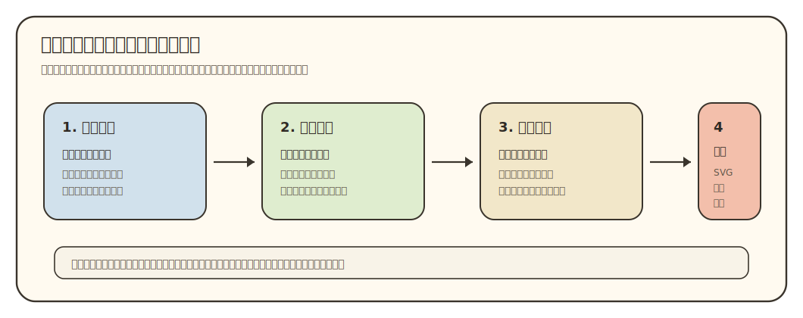
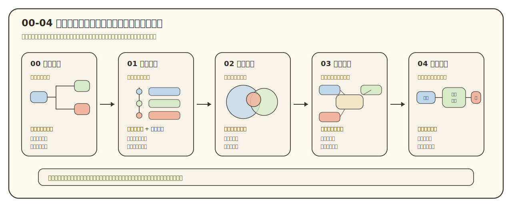

# 可视化与理解

状态：工作台标准稿。用于讨论 `00-04` 五份导师材料的图文设计，后续再回收进模板、蓝图和验证器。

## 目录

- [阅读基准](#vis-reading-baseline)
- [核心原则](#vis-main-principle)
- [设计四层](#vis-design-stack)
- [图形家族](#vis-visual-families)
- [文档分工](#vis-doc-roles)
- [制作规则](#vis-production-rules)
- [质量检查](#vis-quality-check)
- [参考文献与资料](#vis-references)

## 阅读基准

Codex 对话窗口不承担 Markdown 阅读器职责。它适合讨论、改文件、运行验证和临时展示截图；正式阅读效果以 VS Code Markdown Preview、HTML 预览和 PDF 导出为准。VS Code 的 Markdown 预览和安全设置会影响本地图片、Mermaid 和 HTML 的显示，CommonMark 也把原始 HTML 的渲染留给具体工具处理<a href="#b1">[B1]</a><a href="#b2">[B2]</a>。这个边界要写进项目规则，避免为了适配 Codex 聊天渲染，反过来破坏 Markdown 成品。

本项目采用三条写法：

| 场景 | 推荐写法 | 原因 |
|:---|:---|:---|
| Markdown 文档内图片 | `` 或 `` | 相对路径便于仓库移动、VS Code 预览和 PDF 导出 |
| Codex 对话里临时看图 | 使用图片绝对路径，或生成 HTML/PNG 截图后展示 | Codex 聊天窗口解析本地资源的规则和 Markdown 阅读器不同 |
| 最终导出 | Markdown -> HTML -> 浏览器或固定导出器 -> PDF | HTML 和 PDF 共用同一套资源路径，问题更容易复现 |

目录和参考引用也使用保守写法。目录链接到手写 ASCII 锚点，例如 `[核心原则](#vis-main-principle)`；参考引用沿用项目的 `[O] / [P] / [R] / [B]` 体系，例如 `<a href="#p1">[P1]</a>`。不为某份支撑方法临时新增其他字母编号。

## 核心原则

导师材料里的图只负责一件事：把学生需要理解的关系放到页面上。学生卡住时，问题通常在于几个关系同时挤在脑子里：研究方向在大领域里的位置、论文之间的分工、课程知识到前沿论文的桥、正文判断背后的证据强弱。

图文配合的依据来自几个方向。多媒体学习和认知负荷研究提醒我们，图和文字要服务同一个理解动作，复杂图会增加额外负担<a href="#p1">[P1]</a><a href="#p2">[P2]</a>。多重表征研究提醒我们，不同表达形式要分工，不能把同一段文字拆成几个漂亮盒子就算可视化<a href="#p3">[P3]</a>。图式推理研究说明，合适的空间组织能减少搜索和推理成本，但优势取决于任务本身<a href="#p4">[P4]</a><a href="#p5">[P5]</a>。

因此，图形选择从学生问题开始，不从工具开始。SVG、Mermaid、表格、Graphviz、D3 或手工绘图都只是实现手段。读者问题说不清，工具越强，越容易把文档做成装饰展板。

## 设计四层

可视化设计先走四层判断。这个顺序来自 Munzner 的嵌套模型：先刻画领域任务，再抽象成数据和操作，再设计视觉编码，最后选择实现方式<a href="#p6">[P6]</a>。Brehmer 和 Munzner 的任务类型研究也强调，要区分“为什么看”“看什么”“怎样看”，否则很容易把手段当成目标<a href="#p7">[P7]</a>。Munzner 的教材也把数据类型、任务和视觉编码放在同一套分析框架里<a href="#r1">[R1]</a>。

本项目把四层翻译成执行 AI 能用的检查句：

| 层级 | 先问什么 | 失败信号 |
|:---|:---|:---|
| 学生问题 | 学生看完这张图要少迷糊哪一件事？ | 只能说“这里需要一个图” |
| 关系结构 | 这里是范围、层级、定位、连接、机制、时间、证据，还是学习缺口？ | 多种关系塞进一张图，读者看不出主次 |
| 视觉编码 | 用位置、包含、面积、颜色、线条、箭头、标注分别表达什么？ | 面积、颜色、距离暗示了证据支撑不了的精度 |
| 实现与导出 | 用 SVG、表格、Mermaid、Graphviz、Vega-Lite 还是位图？ | 在某个编辑器里能看，换到 PDF 就失真或丢图 |

这四层中，上游错误会传到下游。比如学生问题其实是“这个方向在物理学里有多大、多主流”，却只画层级树，学生只能知道上下位关系，仍然不知道范围感。再比如论文组本来是“底座、方法、目标、旁支”的角色关系，却画成横向时间线，读者会误以为论文必须按单线推进。

## 图形家族

现在项目默认优先用 SVG 表达核心理解图，因为 SVG 能同时控制空间、线条、标注、分组和导出质量；SVG 的样式和元素属性也能写进独立文件，利于 VS Code、浏览器和 PDF 路线稳定渲染<a href="#b3">[B3]</a><a href="#b4">[B4]</a>。SVG 能画很多形态，但可选项不能无边界膨胀。下面这张图把导师材料最常用的视觉任务分成 12 类，每一类都对应一个不同的关系语义。这个分法吸收了 FT Visual Vocabulary 和 Data Visualization Catalogue 按任务选图的思路，但改成导师材料更常遇到的关系类型<a href="#r2">[R2]</a><a href="#r3">[R3]</a>。

### 1. 领域地形图

用途：回答“导师方向在大领域里靠近哪里，周围有哪些相邻板块，粗略范围感如何”。这类图适合 `02_领域地图.md`，尤其适合你说的“大范围里要看到位置和大概比例”的需求。

常用编码：外部大区域表示大领域，色块或气泡表示子区域，当前方向用高亮，弱证据相邻区用虚线。没有统计来源时，只能表达“大 / 中 / 小”“主流 / 相邻 / 小众 / 新兴”，不能写百分比。

### 2. 层级收束图

用途：回答“从学科大类到问题域怎样逐步收窄”。它和领域地形图不同。层级收束图擅长说明上下位关系；领域地形图擅长说明空间位置、相邻关系和粗略占比。真实 `02` 往往需要两者配合：先给地形感，再给收束链。

常用编码：嵌套框、树形结构、缩进块。节点不要超过 3 层；超过 3 层时，正文要解释为什么要这样分。

### 3. 二维定位图

用途：回答“两个维度共同决定一个方向或论文的位置”。例如“理论-实验”和“材料-方法”两个轴，或“基础问题-应用平台”和“成熟-新兴”两个轴。

常用编码：横轴、纵轴、点、区域标签。轴必须能用一句话解释。点的位置只能来自证据或明确的弱推断，不能为了好看随手摆。

### 4. 对比矩阵

用途：回答“多个对象按同一组问题怎样比较”。它适合论文、课程模块、资料来源、平台要素的并排比较。

常用编码：行列、短标签、少量颜色。矩阵不是普通表格的美化版。只有当同一组字段反复比较多个对象时，矩阵才有意义。

### 5. 论文角色地图

用途：回答“几篇论文围绕同一个研究问题分别承担什么角色”。它比横向流程图更适合 `03_论文路线.md`，因为论文之间常常是底座、方法、目标、扩展、旁支的关系。

常用编码：中心问题、角色节点、实线和虚线。线条要有含义，例如“支撑”“提供方法”“验证目标”“旁支线索”。没有线义的网络图会变成装饰。

### 6. 机制 / 平台链路图

用途：回答“一个研究平台或实验系统怎样运转”。例如样品进入装置，经过激发、测量、算法处理，最后得到谱线、图像或物性参数。

它和时间路线图不同。机制 / 平台链路图表达结构和功能，箭头表示输入输出、能量流、信息流或测量流；时间路线图表达阶段和先后，箭头表示学习、研究或历史推进。

### 7. 时间 / 演化图

用途：回答“方向、履历、论文或学习过程随时间怎样变化”。它适合 `01` 的履历阶段、`03` 的研究问题演化、`04` 的阶段学习安排。

常用编码：竖向时间线、阶段卡片、回退箭头。Markdown 和 PDF 中少用很长的横向流程图；横向图缩小后最先伤害可读性。

### 8. 学习桥图

用途：回答“学生从已有课程出发，怎样补到能读目标论文”。这类图是 `04_学习向导.md` 的核心，不应把 `03` 的论文路线改写成课程表。

常用编码：已有基础、概念缺口、方法缺口、目标论文片段、输出任务。每一格都要连到一个可做的小输出，比如“用三句话解释图 1 的坐标、变量和结论”。

### 9. 核心图标注

用途：回答“论文里某张关键图应该按什么顺序读”。这类图适合 `04`，帮助新手读论文时先看坐标、变量、对比组、趋势和作者想证明的结论。

常用编码：局部图、箭头标注、编号读法。涉及论文原图时要注意版权和引用；如果不贴原图，可以画抽象骨架图，说明读法而不复刻原图。

### 10. 证据边界图

用途：回答“这条判断靠什么来源支撑，稳到什么程度”。它面向正文结论可靠性，适合所有文档。

常用编码：判断、来源、证据等级、复核点。颜色可以表达强弱，但不能让红绿颜色成为唯一信息，避免色觉无障碍问题<a href="#p9">[P9]</a>。

### 11. 覆盖缺口图

用途：回答“当前资料覆盖了哪些部分，哪里还缺证据”。它面向资料收集完整度，更多用于 `_internal`、读后自检或人工审查。

它和证据边界图不同。证据边界图检查某个结论靠不靠谱；覆盖缺口图检查资料篮子有没有明显空洞。例如官网、论文库、课程资料、综述、项目页面分别覆盖了哪些判断。

### 12. 阅读决策图

用途：回答“读者下一步该读什么、跳过什么、回看什么”。这类图适合 `00_材料导读.md`，也适合每份文档末尾的读后自检。

常用编码：选择节点、条件、下一步。节点要少，条件要具体。它帮助读者根据自己的理解状态选择下一步，不负责把五份文档机械串成流程。

## 文档分工

五份导师材料要形成一条认知阶梯。图文设计也要沿着这条阶梯推进，而不是每份文档都放一张“看起来像图”的东西。

| 文档 | 学生读到这里最需要什么 | 主视觉 | 图旁必须交代 |
|:---|:---|:---|:---|
| `00_材料导读.md` | 知道这套材料怎么读，读完如何自检 | 阅读决策图、引用符号说明、证据边界小表 | 先读什么、为什么这样读、遇到不懂时回看哪里 |
| `01_基础画像.md` | 知道老师是谁，资料是否锁定，履历和论文集合如何看 | 履历时间线、论文集合矩阵、来源核查表 | 哪些是身份事实，哪些是后续分析的材料入口 |
| `02_领域地图.md` | 知道老师当前方向在大领域里的位置 | 领域地形图、层级收束图、二维定位图 | 范围感、相邻方向、证据精度和弱推断 |
| `03_论文路线.md` | 知道论文群围绕什么问题，论文之间怎样分工 | 论文角色地图、机制 / 平台链路图、对比矩阵 | 中心问题、论文角色、主线和旁支的证据 |
| `04_学习向导.md` | 知道从已有课程到目标论文怎样走 | 学习桥图、核心图标注、阶段输出清单 | 先补什么、补到什么程度、能读论文哪一块 |

这张分工表也约束重复问题。平台链路图只在学生需要理解系统怎样运转时使用；时间图只在阶段和先后关系本身重要时使用。证据边界图出现在正文旁，服务结论可靠性；覆盖缺口图多半留在内部审查，服务资料完整度。

## 制作规则

### 图先写规格

每张图进入成品前，先写一份很短的图源规格。规格不是官样文章，它用于防止执行 AI 凭感觉画图。

| 字段 | 要写什么 |
|:---|:---|
| `reader_question` | 学生看完这张图要理解哪一个关系 |
| `relation_type` | 范围、层级、定位、比较、网络、机制、时间、学习桥、标注、证据、覆盖、决策 |
| `evidence_basis` | 图里的位置、面积、颜色、线条来自哪些来源或推断 |
| `precision` | 精确数据、半定量、粗略定性、弱线索 |
| `encoding` | 颜色、面积、线条、箭头、虚线、标注分别代表什么 |
| `caption` | 图旁读法，告诉学生先看哪里，再看哪里 |
| `student_output` | 学生看完图后能说出或做出的一个小输出 |
| `fallback` | SVG 失败时用什么短表或文字替代 |

### 工具按任务选

| 工具 | 适合做什么 | 慎用场景 |
|:---|:---|:---|
| 手写 SVG | 领域地形图、论文角色图、学习桥、核心图标注 | 数据点很多、布局需要自动优化 |
| Mermaid | 简短流程、依赖、时间线、少量 mindmap | 空间关系复杂、图很宽、节点很多 |
| Graphviz | 自动布局的关系网络、依赖图、概念图 | 需要精细手工排版和教学标注时 |
| Vega-Lite / Observable Plot | 有结构化数据的柱状图、散点图、矩阵、分布 | 只有定性关系、没有可复核数据时 |
| D3 | 高度定制、需要交互或复杂布局的网页图 | 普通 Markdown / PDF 成品，维护成本过高 |
| diagrams.net / Inkscape | 人工精修、论文级示意图、导出 SVG/PDF | 需要批量生成且版本 diff 要清楚时 |
| BioRender 等科研绘图工具 | 生物、医学、实验装置等图标资源丰富的图 | 授权、可复现、项目内批量维护要求高时 |

Graphviz 能把 DOT 描述导出为 SVG，适合结构关系自动布局<a href="#b5">[B5]</a>。Vega-Lite 用数据、mark 和 encoding 描述图形，适合可复核数据图<a href="#b6">[B6]</a>。D3 更灵活，适合复杂定制，但维护成本也更高<a href="#b7">[B7]</a>。Inkscape 支持命令行导出 PDF/PNG，可作为 SVG 到 PDF 的后续候选工具<a href="#b8">[B8]</a>。

### 样式要克制

科研图不是越花越好。PLOS Computational Biology 的图形建议强调先明确读者和信息，再适配媒介，不要盲信默认样式<a href="#p8">[P8]</a>。本项目的默认样式要服务 Markdown 和 PDF 阅读：

- 每张图控制在 3 到 5 个主色。
- 颜色只表达分组、主线、旁支、风险，不承担唯一信息。
- 线条类型必须有语义：实线表示主证据或主关系，虚线表示旁支、弱证据或待复核。
- 字号按 PDF 可读性定，不为了塞内容无限缩小。
- 图下必须写读法，不让学生猜颜色和形状含义。
- 没有证据支持精确比例时，不用精确面积、百分比或坐标。

## 质量检查

一张图进入 `00-04` 成品前，至少要过下面这组检查：

| 检查项 | 通过标准 |
|:---|:---|
| 读者问题 | 能用学生视角写出一个具体问题 |
| 关系类型 | 能说清这张图表达的是哪类关系 |
| 证据边界 | 位置、大小、颜色、线条没有暗示无来源的精确判断 |
| 图文配合 | 图旁有读法，正文会消费这张图，不把图丢在旁边 |
| 新手负担 | 标签数量、颜色数量、节点数量不会让学生先读图就崩掉 |
| 输出检查 | 学生看完能完成一句复述、一个选择或一个小任务 |
| 渲染稳定 | VS Code Markdown Preview、HTML 预览和 PDF 中能看清 |
| 可维护 | 图源和 Markdown 分开，SVG 文件可版本管理，路径可迁移 |

如果删掉一张图后学生理解没有明显损失，这张图应删除。可视化的底线是让学生少背一段关系。

## 参考文献与资料

### 论文与专著

| 编号 | 文献或资料 | 支撑内容 | 链接 | 类型 |
|:---|:---|:---|:---|:---|
| [P1] | Richard E. Mayer, *Multimedia Learning* | 图文需要服务同一理解任务，减少无关负担 | https://www.cambridge.org/core/books/multimedia-learning/7A0D0A0BFD6F3BD71D9DF6F4E94F6D7D | 论文/专著 |
| [P2] | Sweller, van Merrienboer & Paas, *Cognitive Architecture and Instructional Design: 20 Years Later* | 新手学习需要控制认知负荷 | https://doi.org/10.1007/s10648-019-09465-5 | 论文 |
| [P3] | Ainsworth, *DeFT: A conceptual framework for considering learning with multiple representations* | 多重表征需要分工，形式要匹配任务 | https://doi.org/10.1016/S0959-4752(98)00018-5 | 论文 |
| [P4] | Larkin & Simon, *Why a Diagram is Sometimes Worth Ten Thousand Words* | 图能通过空间组织降低搜索和推理成本 | https://doi.org/10.1207/s15516709cog1101_1 | 论文 |
| [P5] | Hegarty, *The Cognitive Science of Visual-Spatial Displays* | 可视空间显示对理解有帮助，但依赖任务和读图能力 | https://doi.org/10.1111/j.1756-8765.2011.01150.x | 论文 |
| [P6] | Munzner, *A Nested Model for Visualization Design and Validation* | 可视化设计的四层：领域任务、抽象、视觉编码、实现 | https://doi.org/10.1109/TVCG.2009.111 | 论文 |
| [P7] | Brehmer & Munzner, *A Multi-Level Typology of Abstract Visualization Tasks* | 区分为什么看、看什么、怎样看 | https://doi.org/10.1109/TVCG.2013.124 | 论文 |
| [P8] | Rougier, Droettboom & Bourne, *Ten Simple Rules for Better Figures* | 科研图要明确读者、信息和媒介，不能盲信默认样式 | https://doi.org/10.1371/journal.pcbi.1003833 | 论文 |
| [P9] | Crameri, Shephard & Heron, *The misuse of colour in science communication* | 科学配色要准确、降低复杂度，并考虑色觉无障碍 | https://doi.org/10.1038/s41467-020-19160-7 | 论文 |

### 可视化资料与工具

| 编号 | 文献或资料 | 支撑内容 | 链接 | 类型 |
|:---|:---|:---|:---|:---|
| [R1] | Tamara Munzner, *Visualization Analysis and Design* | 从数据类型、任务和视觉编码出发设计图形 | https://www.cs.ubc.ca/~tmm/vadbook/ | 教材/专著 |
| [R2] | Financial Times Visual Vocabulary | 按变化、相关、排名、分布、组成、流动等任务选择图 | https://github.com/Financial-Times/chart-doctor/tree/main/visual-vocabulary | 可视化词汇表 |
| [R3] | The Data Visualization Catalogue | 提供不同图表类型、用途和适用关系 | https://datavizcatalogue.com/ | 可视化资料 |
| [B1] | VS Code Markdown documentation | Markdown 预览、图片、Mermaid 和安全设置会影响阅读效果 | https://code.visualstudio.com/docs/languages/markdown | 工具文档 |
| [B2] | CommonMark Spec: HTML blocks | Markdown 对原始 HTML 的支持取决于渲染器 | https://spec.commonmark.org/current/#html-blocks | 标准文档 |
| [B3] | W3C SVG 2: Styling | SVG 支持样式和 presentation attributes | https://www.w3.org/TR/SVG2/styling.html | 标准文档 |
| [B4] | MDN SVG attribute reference | SVG 属性可直接写在元素上，利于独立渲染 | https://developer.mozilla.org/en-US/docs/Web/SVG/Reference/Attribute | 工具文档 |
| [B5] | Graphviz SVG output documentation | Graphviz 可将图结构导出为 SVG | https://graphviz.org/docs/outputs/svg/ | 工具文档 |
| [B6] | Vega-Lite documentation | 用数据、mark 和 encoding 描述可视化 | https://vega.github.io/vega-lite/ | 工具文档 |
| [B7] | D3 official documentation | 面向定制数据可视化的 JavaScript 库 | https://d3js.org/ | 工具文档 |
| [B8] | Inkscape command-line documentation | 可从命令行把 SVG 导出为 PDF/PNG | https://wiki.inkscape.org/wiki/Using_the_Command_Line | 工具文档 |
