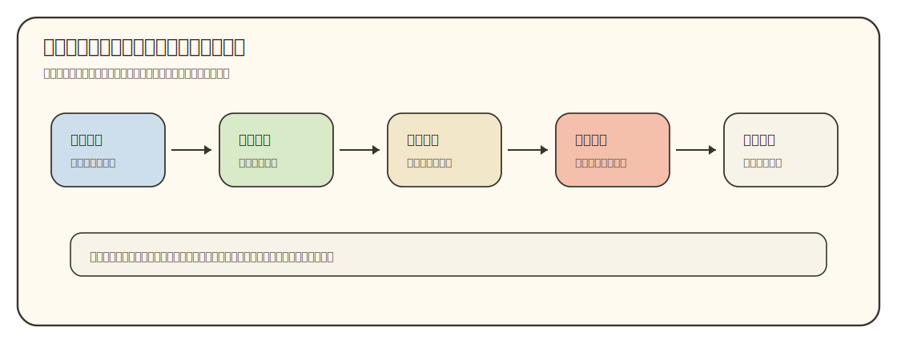
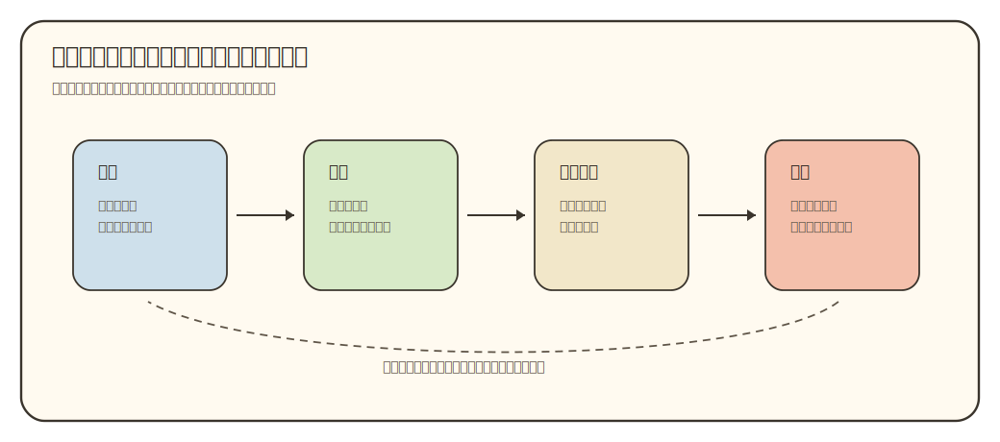
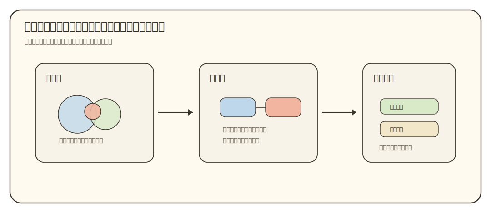

# 学术品味与文稿设计

状态：工作台标准稿。用于约束 `00-04` 五份导师文档、支撑方法文档和后续 Harness 产出的文稿质量。

## 目录

- [中心问题](#taste-main-question)
- [品味是什么](#taste-definition)
- [读者路径](#taste-reader-path)
- [章节接力](#taste-section-handoff)
- [图文节奏](#taste-visual-rhythm)
- [证据克制](#taste-evidence-restraint)
- [常见坏味道](#taste-smell-list)
- [执行流程](#taste-workflow)
- [质量检查](#taste-quality-check)
- [参考文献与资料](#taste-references)

<a id="taste-main-question"></a>

## 中心问题

这份文档解决一个反复出现的问题：内容看起来都有，读者读完却没有形成一条清楚的理解链。表现出来就是章节很多、信息也不少，可每一节都像单独站着；图放在开头能看，翻到后面又回到纯文字；表格能扫字段，却带不动理解。

导师材料的读者常常是新手。新手真正缺的是一个逐步成形的心理模型：先知道自己正在看什么，再知道它为什么重要，然后能把证据、概念、论文和学习任务接起来。学术品味就是把这条路径设计出来，并在每一小节里稳稳执行。



这张图给出本文主线。好文稿先判断读者起点，再建立主问题，随后用章节接力推进。图、表、引用和自检都嵌在推进过程中；它们服务读者理解，不能各自变成装饰。

<a id="taste-definition"></a>

## 品味是什么

这里说的品味指一组可执行的判断能力。漂亮词句和复杂排版都不能替代这些判断：

| 判断 | 好品味的表现 | 差品味的表现 |
|:---|:---|:---|
| 主线 | 全文围绕一个读者问题推进 | 每节都对，但拼起来像资料库 |
| 节奏 | 先搭框架，再填细节，最后让读者输出 | 开头就把术语、表格、分类全部倒出来 |
| 段落 | 一个段落只承担一个读者动作 | 一个段落里塞定义、原因、例子和结论 |
| 图文 | 图出现在读者需要卸载关系的位置 | 图只放在开头，后文继续让读者想象 |
| 证据 | 判断强弱和来源强弱相匹配 | 证据很弱，语气很满 |
| 克制 | 留下能推进理解的信息 | 为了显得完整，把边角料也写进去 |

Gopen 和 Swan 的科学写作研究强调，读者会根据句子位置、段落重心和逻辑流向来判断重点；作者脑子里的结构不会自动传给读者<sup><a href="#p1">[P1]</a></sup>。Mensh 和 Kording 也提醒，论文结构要围绕中心贡献展开，并且要写给真实读者<sup><a href="#p2">[P2]</a></sup>。本项目写的是导师材料，面对的仍是同一个问题：读者必须沿着作者设计的路径理解复杂材料。

<a id="taste-reader-path"></a>

## 读者路径

每份文档先写读者路径，再写目录。目录只是路径的外壳；路径没有设计好，目录越细，读者越容易迷路。

读者路径用四句话写：

```text
读者进来时知道什么：
他最容易卡在哪里：
本文怎样带他跨过去：
读完后他能做什么：
```

比如 `02_领域地图.md` 的路径不能只写“介绍导师研究领域”。更好的写法是：

```text
读者进来时知道老师的履历和论文集合，但不知道这些名词属于哪个大领域。
他最容易把材料名、方法名、问题名混成一团。
本文先建立领域地形，再收束到导师当前方向，最后指出相邻方向和证据边界。
读完后他能用一段话说出导师方向在大领域里的位置，并知道后续论文路线该从哪几个概念进入。
```

这四句话会反过来约束章节顺序。凡是接不上这条路径的段落，要么移到后文，要么进内部材料，要么删掉。

<a id="taste-section-handoff"></a>

## 章节接力

一篇文章要像接力，不像展柜。展柜式写法把很多有用东西并排摆出来；接力式写法让上一节的结果成为下一节的起点。读者读完每节，都应该知道“我现在多拿到一个什么东西，下一节会怎样使用它”。



每个主要章节都写清四个位置：

| 位置 | 写作任务 | 自检问题 |
|:---|:---|:---|
| 入口 | 承接上一节交给读者的东西 | 如果删掉上一节，本节是否突然失去前提 |
| 推进 | 让读者完成一个新的理解动作 | 本节是否只是在补资料，而没有推进 |
| 局部支撑 | 用图、表、例子或来源降低理解负担 | 这里是否让读者在脑子里硬扛关系 |
| 出口 | 产出一句判断、一个问题或一个检查动作 | 下一节能否拿这个出口继续走 |

这套接力也适用于小节。小节开头不要只说“本节介绍……”。更好的开头要告诉读者：上一段把我们带到了哪里，现在为什么需要看这一块。小节结尾也不要机械总结，要把读者交给下一步。

<a id="taste-visual-rhythm"></a>

## 图文节奏

图文配合要分两层：总览图负责让读者知道地图长什么样，局部图负责在具体段落里帮读者理解具体关系。Rougier、Droettboom 和 Bourne 提醒，科研图要服务读者、信息和媒介；图的存在理由来自读者任务，不来自装饰需求<sup><a href="#p4">[P4]</a></sup>。只在开头放一张大图，后文全靠文字解释，读者翻过总览图后仍然要靠记忆工作。



可视化文档尤其要遵守这条规则。`图形家族` 开头可以有总览图；进入每一类图形时，还要给出局部示意、适用场景、常见误用和学生输出。这样读者不需要回到总览图里找第几个小框，也不需要凭空想象“领域地形图”和“层级收束图”到底差在哪里。

写 `00-04` 成品时也一样：

- `00` 可以有整套材料的阅读图，但每个使用规则旁还要有小例子。
- `01` 可以有履历时间线，但论文集合部分仍需要矩阵或分组图帮助读者扫论文。
- `02` 可以先放领域地形总图，后面讲相邻方向、层级收束、二维定位时要给局部图。
- `03` 可以有论文角色地图，讲平台链路或方法分工时要再给局部图。
- `04` 可以有学习桥总图，讲核心图阅读和阶段输出时要给更小的读法图。

图的数量不按“越多越好”判断。判断标准是：这张图出现的位置，是否正好是读者需要同时抓住多个关系的位置。

<a id="taste-evidence-restraint"></a>

## 证据克制

学术品味还体现在语气和证据的匹配。来源能支撑事实，就写事实；来源只能支撑趋势，就写趋势；来源只是线索，就写线索。证据强弱不清时，顺滑文字会制造幻觉。

本项目的正文判断至少分四类：

| 判断类型 | 写法 | 例子 |
|:---|:---|:---|
| 直接事实 | 明确写出，并给来源 | 官网显示该教师任职于某机构 |
| 交叉判断 | 写出依据组合 | 近年论文和主页描述共同指向某方向 |
| 弱推断 | 保留限定词和复核标记 | 从论文题目看，可能靠近某相邻问题 |
| 未确认 | 不进入强结论 | 数据库记录冲突，暂留人工复核 |

Weinberger、Evans 和 Allesina 的经验规则提醒科研写作要短、紧、简单，避免不必要的修饰<sup><a href="#p3">[P3]</a></sup>。这里的“简单”指每句话只承担它能被证据支撑的任务。Schimel 把科学写作看成让研究进入读者意识的故事结构<sup><a href="#r1">[R1]</a></sup>；故事能推进，但不能替代证据。

<a id="taste-smell-list"></a>

## 常见坏味道

下面这些问题一出现，就说明文稿开始偏离读者路径。

| 坏味道 | 读者感受 | 修法 |
|:---|:---|:---|
| 报菜名 | “知道列了很多东西，但不知道为什么按这个顺序出现” | 先写章节接力，再删掉接不上主线的项 |
| 章节孤岛 | “每节都能懂一点，合起来没印象” | 给每节加入口和出口，让下一节消费上一节结果 |
| 总览图孤立 | “开头图挺好，后面又全靠想象” | 总览图后，每类关系配局部图或短例子 |
| 表格过密 | “扫得快，但脑子里没有链条” | 表格只放字段对比，主线解释改回短段落 |
| 术语先行 | “名词都出现了，但没有抓手” | 先讲读者问题，再给术语名称 |
| 证据漂浮 | “文末有来源，正文判断不知道靠哪条” | 在判断附近放引用或证据边界说明 |
| 模板腔 | “像所有主题都能套进去” | 每段加入本项目的具体对象、动作或风险 |
| 完整性冲动 | “什么都想讲，结果重点变平” | 把边角料放内部材料或待验证，不进正文主线 |

<a id="taste-workflow"></a>

## 执行流程

执行 AI 写任何 `quality-workbench/` 或 `00-04` 成品前，先按这个顺序做：

1. 写四句读者路径。
2. 写全文中心问题，不超过一句。
3. 写章节接力表：上一节给什么、本节做什么、下一节拿什么。
4. 标出每节的局部支撑形式：正文、表格、总览图、局部图、证据表、输出题。
5. 写正文草稿。
6. 检查每节是否有入口、推进、局部支撑、出口。
7. 检查证据强弱和语气是否匹配。
8. 删除不能接到主线的段落、表格和图。

如果一份文档已经写完，再用同一套流程回看。不要先改句子。先看主线，再看章节接力，再看图文节奏，最后才处理 AI 味和排版。

<a id="taste-quality-check"></a>

## 质量检查

每份文稿进入工作台基线前，至少过这组检查：

| 检查 | 通过标准 |
|:---|:---|
| 中心问题 | 读者能用一句话说出本文解决什么问题 |
| 章节接力 | 每节都能说明上一节交给它什么、下一节拿走什么 |
| 局部支撑 | 需要看关系的位置有图、表、例子或证据说明 |
| 图文配合 | 图和正文相邻，正文会解释和使用它 |
| 段落任务 | 每段只做一个主要动作 |
| 证据边界 | 判断语气和证据强度匹配 |
| 新手入口 | 术语在使用前有解释或上下文 |
| 读者出口 | 文末有读后自检、输出任务或下一步判断 |
| 文风 | 没有空泛开场、机械转折、堆砌式总结 |

这张表只做底线。真正的品味还要靠读者路径是否顺、局部图文是否及时、证据克制是否稳定。

<a id="taste-references"></a>

## 参考文献与资料

### 论文与专著

| 编号 | 文献或资料 | 支撑内容 | 链接 | 类型 |
|:---|:---|:---|:---|:---|
| <a id="p1"></a>[P1] | Gopen & Swan, *The Science of Scientific Writing* | 读者预期、句子位置、段落重心会影响科学文本理解 | https://cseweb.ucsd.edu/~swanson/papers/science-of-writing.pdf | 论文 |
| <a id="p2"></a>[P2] | Mensh & Kording, *Ten simple rules for structuring papers* | 论文结构应围绕中心贡献组织，并写给真实读者 | https://doi.org/10.1371/journal.pcbi.1005619 | 论文 |
| <a id="p3"></a>[P3] | Weinberger, Evans & Allesina, *Ten Simple (Empirical) Rules for Writing Science* | 科学写作要短、紧、简单，减少不必要修饰 | https://doi.org/10.1371/journal.pcbi.1004205 | 论文 |
| <a id="p4"></a>[P4] | Rougier, Droettboom & Bourne, *Ten Simple Rules for Better Figures* | 图形要服务读者、信息和媒介，不能只依赖默认样式 | https://doi.org/10.1371/journal.pcbi.1003833 | 论文 |

### 资料与工具

| 编号 | 文献或资料 | 支撑内容 | 链接 | 类型 |
|:---|:---|:---|:---|:---|
| <a id="r1"></a>[R1] | Joshua Schimel, *Writing Science* | 科学写作要让研究进入读者意识，并用故事结构组织复杂内容 | https://global.oup.com/academic/product/writing-science-9780199760244 | 专著 |
