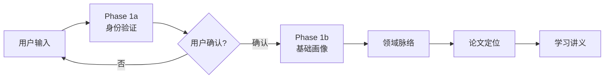

# 计划书

**版本**：v2.0（目录重整版）
**生成日期**：2026-06-30
**说明**：原 `需求确认.md` 升格为 `计划书.md`。结构按"已确定 / 待设计"二分组织，避免上下文腐烂。
**来源**：原需求确认文档 + 本轮三窗口沉淀（技术方案 v2.0、Skill 架构讨论、阶段 0/1 设计讨论）

---

## 目录

- [文件规范](#文件规范)
- [第1章: 需求背景](#第1章-需求背景)
  - [1.1 起因 / 工具目标](#11-起因--工具目标)
  - [1.2 目标用户画像](#12-目标用户画像)
  - [1.3 工具差异化与定位](#13-工具差异化与定位)
- [第2章: 工具设计](#第2章-工具设计)
- [第3章: 验收与当前状态](#第3章-验收与当前状态)
- [附录 A: 已沉淀的技术决策](#附录-a-已沉淀的技术决策)
- [附录 B: 待设计与开放问题](#附录-b-待设计与开放问题)
- [附录 C: 项目部署清单](#附录-c-项目部署清单)

---

## 文件规范

本计划书统一按以下规则组织。

**编号体系**：h2（##）用于章（第X章），h3（###）用于节（X.Y），h4（####）用于节内子段（X.Y.Z）。禁止 h5+。

**每节三段式**（仅工具设计章强制，h3 下三个 h4 子段）：
- 工作流程 — 做什么，自然语言描述
- 技术原理 — 方法、API、异常处理
- 输出规格 — 文件名、模板、格式

**h4 子段内只用正文段落**。不插入块引用、粗体伪标题、列表嵌套或其他制造新层级的格式。

**代码块限三类**：示例输出、API 请求/响应、模板/骨架。

**已沉淀 / 待设计二分**：所有"已确认"内容写进正文；所有"未决定 / 待研究"事项写进附录 B，不混进正文。

**目录只列到 h3**。

---

## 第1章: 需求背景

### 1.1 起因 / 工具目标

每年硕士/博士生选导师是刚需。每年研一 3-4 月学生面临报志愿和套磁，核心痛点在四个环节。官网信息粗糙：只有论文列表和标题，没有科普级解读。有论文看不懂：论文要求研究生以上知识，学生只有本科基础。资源散乱无索引：论文、教材、视频各在各处。调研易绕圈：不知道该读什么、按什么顺序。

工具用四段嵌套解决这些问题。每一段的输出为后一段提供认知上下文，范围逐段收窄，理解逐段加深。工具同时承担三个递进职能：调研（全面收集信息）、综述（分析串联知识）、教学（设计递进学习路线）。

| 段 | 做什么 | 做法（高层次） | 目的 |
|:---|:---|:---|:---|
| 第1段 | 老师基础信息调研 | 地毯式收集官网、学术平台、中文百科、采访稿等多维信息，多源交叉比对 | 输出基础画像，明确领域范围 |
| 第2段 | 领域发展调研 | 基于第1段的领域范围，追溯子领域发展脉络和当前阶段 | 输出认知地图，理解位置 |
| 第3段 | 论文串联与定位 | 以第2段认知框架重新审视论文序列 | 标注每篇论文在领域树上的位置 |
| 第4段 | 从零到前沿讲义 | 从高数+线代起步反向设计学习路线 | 输出递进式讲义（小字典） |

嵌套逻辑：大领域一>小领域一>老师定位一>学习路径。后一段建在前一段的认知之上。

技术实现细节在第2章和附录 A。

### 1.2 目标用户画像

工具的目标用户是大二/大三物理本科生，正在准备申请硕博选导师。核心场景是研一 3-4 月报志愿时，用工具判断与导师研究方向的匹配度。

工具假设用户从高数和线代起步。实际用户可能已有四大力学、固体物理等基础，但所有高阶知识（复变、数理方法、高量、群论、量子多体）本质上是高数和线代的逐步推广。从根推导才能零跳步建立真理解。

教材在 AI 时代不再是逐页通读的课本，而是字典。本科到研一的教材体系分三个层面：

| 层面 | 课程 | 定位 |
|:---|:---|:----|
| 数学基础 | 高数、线代、概率论、复变、数理方法 | 推导起点 |
| 物理基础 | 普物、四大力学、固体物理 | 物理直觉来源 |
| 高阶延伸 | 高量、群论、量子多体、量子场论、规范场论 | 大字典边界—领域触及的范围 |

教材从课本转向字典，有两个原因。第一，教材面向通用人才培养，覆盖完整体系，但具体方向只用其中部分知识点。逐页通读在无关内容上浪费大量时间。第二，学生可在 AI 辅助下按需读取字典条目，带着研究方向去学，既能深化具体知识点理解，又能强化整体框架认知。

第4段产出的讲义是个性化小字典。它从教材体系（大字典）中只提取第1-3段调研确认需要的知识点，串联成一条从高数+线代到前沿的逻辑链。小字典扎根于大字典，以教材体系为参照系，约束 AI 创作边界，防止偏离轨道。

一个可扩展的方向：工具可附带教用户如何配合 AI 递进学习。AI 的优势是能根据用户水平动态适配，但多数人不擅长用 AI 辅助学习。加入"如何用 AI 学"的引导可降低门槛。此方向未确定，作为后续讨论参考。

### 1.3 工具差异化与定位

18+ 同类工具调研后确认：市场无直接竞品。现有工具分三类，各占一个不重叠的位置。

| 类别 | 代表工具 | 做什么 | 与我们的重叠 |
|:-----|:---------|:-------|:-----------:|
| 导师评价 | 导师评价网、GradChoice、advisor-calculator | 口碑评分（人品、管理、毕业） | 不重叠——我们不碰评价 |
| 导师匹配 | PhdFit、StreamlinedAI、PhDuo | 从学生 CV 推荐导师 | 不重叠——我们不做推荐 |
| 学者画像 | supervisor、SciAtlas、ai-talent-graph | 论文+主页一>信息聚合报告 | 第1段部分重叠 |

学者画像工具停在"导师长什么样"的层面。我们继续往前推到领域发展、论文定位和教学讲义。

工具的准确定位包含四层含义。第一，通用模板引擎：对任何机构的任何老师适用，跨老师复用零边际成本，首个实例为张鹏举（IPHY 超快物质科学中心）。第二，开源方法论：Claude Code Skill + 项目级 scripts/config + Markdown 模板形态，不是网站/App，零部署。第三，从调研走到教学：调研+综述+教学三职能递进。第四，调研驱动设计：每项决策经同类工具验证，不凭空发明。

一条根本差异区分了我们和所有竞品：同类工具帮学生找谁合适（匹配引擎）或知道老师什么样（画像工具）；我们帮学生学懂一个方向。

工具六不做：不写教材正文；不替代主动学习；不点评老师或推荐方向；不捏造论文/教材链接；不评价导师口碑；不搭建网站。

---

## 第2章: 工具设计

**本章节为当前活跃章节**——阶段 0/1 优先，阶段 2/3/4 待后续。

**注**：原 `工具设计.md` 文件因混乱被拆分出去。当前内容以本计划书为准。

### 2.1 整体工作流

用户提供导师姓名、学校/机构、官网 URL（可选加方向关键词和论文列表）触发流水线。五份文档按两阶段执行：



| 阶段 | 输入 | 产出 | 核心任务 |
|:-----|:-----|:-----|:---------|
| 0 身份验证 | 姓名+机构+URL | `00_身份验证卡.md` | 浅调研锁定学术 ID，用户确认身份 |
| 1 基础画像 | 确认的 ID | `01_基础画像.md` | 全平台深调研，输出结构化画像 |
| 2 领域脉络 | 画像+论文列表 | `02_领域脉络.md` | 追溯子领域发展树和里程碑 |
| 3 论文定位 | 领域框架 | `03_论文定位.md` | 每篇论文在领域树上标注位置 |
| 4 学习讲义 | 前三段全部产出 | `04_学习讲义.md` | 从高数+线代到前沿的递进路线 |

每段产出是下一段的认知上下文，信息量逐段收窄、深度逐段加深。用户可在任意步骤后介入修正。每段产出后 AI 自检（来源可验证、信息一致），不通过不进入下一步。

六条设计原则贯穿全部阶段：来源必标 URL、缺失优于编造、双源才标已验证、冲突列出不仲裁、身份消歧不走全自动、每段自检。

### 2.2 阶段 0/1：身份验证与基础画像

#### 2.2.1 工作流程

阶段 0（身份验证）走五步：抓官网提取 email/论文/职称 → 自动识别学科 → 按学科并行查 6 个 ID 源 → 论文标题交叉比对 → 输出 00_身份验证卡.md。

阶段 1（基础画像）走四步：用确认 ID 拉 profile → 不需 ID 的并行采集 → 合并去重排序 → 输出 01_基础画像.md。

两阶段之间插人闸——阶段 0 产出后必须用户确认，才能进入阶段 1。

#### 2.2.2 技术原理

身份消歧用官网论文做 ground truth，选手直接用官网提取的论文标题比对 OpenAlex 候选人论文列表，命中率 ≥80% 算高置信。不走 ML 聚类。

学科自动识别从研究方向文本匹配预设关键词字典，匹配结果决定是否启用 INSPIRE-HEP（高能物理）或 NASA ADS（天文）。

| ID 源 | 查什么 | 依赖 |
|:------|:-------|:-----|
| ORCID | email | 注册才有 |
| OpenAlex | 姓名+机构 ROR | ML 聚类，中文不准 |
| ArXiv Author ID | 姓名 | 需 claim 论文 |
| Semantic Scholar | 姓名拼音 | 辅助 |
| INSPIRE-HEP | 姓名 | 仅高能物理 |
| NASA ADS | 姓名 | 仅天体物理 |

#### 2.2.3 输出规格

| 文件 | 内容 | 用途 |
|:-----|:-----|:-----|
| 00_身份验证卡.md | 姓名/机构/邮箱、各 ID 命中率、数据源清单 | 人闸确认 |
| 01_基础画像.md | YAML frontmatter + 9 节（身份标识/履历/方向/代表性论文/影响力/合作网络/公开信息/技术关键词/来源说明） | 结构化画像 |

工具由 Python 脚本和 SKILL.md 协作：脚本做调 API、去重、算命中率等机械工作；SKILL.md 做学科判断、路径选择、读用户反馈等判断工作。

### 2.3 阶段 2：领域脉络 `[待设计]`

预期：追溯子领域发展树，从历史起点到当前前沿；输出里程碑论文表。

### 2.4 阶段 3：论文串联定位 `[待设计]`

预期：在领域树框架内标注导师每篇论文的位置；识别转型节点。

### 2.5 阶段 4：学习讲义设计 `[待设计]`

预期：从高数+线代到前沿的递进学习路径；以"大字典做参照系、小字典做路径索引"为原则。

### 2.6 跨段公共设计 `[待设计]`

预期：交付形态、数据组织、贡献与迭代模式。

---

## 第3章: 验收与当前状态

[待设计]——本轮先把工具搭起来，验收标准待阶段 0/1 完整跑通后定。

---

## 附录 A: 已沉淀的技术决策

本附录收录本轮三窗口中已确定的技术决策。后续如有变更需走"用户拍板"流程。

### A.1 整体方向（已确认）

**A.1.1 信息源不是单一的**。早期讨论陷入"OpenAlex 是主源，其他补充"的死胡同。修正：物理学科按学科分层数据源优先级。

**A.1.2 身份消歧不走纯 ML**。OpenAlex 等 ML 聚类对中文名+跨机构不可靠（实测张鹏举 25 个同名候选）。我们的方法：官网论文做 ground truth，论文标题直接比对。

**A.1.3 必须有人闸**。身份消歧不允许全自动。任何 ID 锁定前用户确认，避免连锁错误。

**A.1.4 不报错退出**。所有 API/数据源失败时降级到其他源，不抛异常。

### A.2 数据源体系（已确认）

按学科+ID 类型分层：

**跨学科通用 ID 体系**：
- ORCID（by email，注册过就有，最可靠）
- OpenAlex Author ID（ML 聚类，覆盖广但中文不准）
- Semantic Scholar Author ID（ML 聚类，覆盖广，TLDR 资源）
- ArXiv Author ID（用户主动 claim 后生成，物理/数学/CS 常见）
- Google Scholar Profile（用户自建，无官方 API）
- CrossRef

**物理学科专用**：
- **INSPIRE-HEP** — 高能物理/粒子物理/核物理领域事实标准，API 全
- **NASA ADS** — 天体物理事实标准，需 API token

**网页抓取层**：
- 机构官网（HTTP fetch）
- Web Search（Serper/Exa/Tavily）
- 百度百科/知乎/B站（Web Search）

**不引入**：Scopus、Web of Science（付费）；CNKI/万方（需授权）；DBLP（CS 专用）；Neo4j（重）。

详见 `config/sources.json`（项目级共享配置）。

### A.3 架构形态（已确认）

工具不是"AI 在空白 Claude Code 里按文档操作"，而是：

```
pilot-test/
├── .claude/skills/research-advisor/   # Claude Code Skill（指令 + 模板）
│   ├── SKILL.md                       # 入口，渐进式披露
│   ├── assets/                        # 输出模板
│   └── references/                    # 按需加载的细节
├── config/
│   ├── sources.json                   # 数据源 + 学科字典
│   └── disciplines.json               # [TBD] 学科→关键词独立文件 [可选]
├── scripts/                           # 跨阶段共享 Python 脚本
│   ├── discipline_classifier.py       # [已写 v0.1]
│   └── identity_resolver.py           # [已写 v0.1，OpenAlex paper 匹配待测]
├── cache/                             # 临时缓存
└── 项目/导师/<姓名>/                  # 每位导师的产出
    ├── 00_身份验证卡.md
    ├── 01_基础画像.md
    ├── ...
```

**渐进式披露原则**：SKILL.md ≤500 行，只含路由 + 当前阶段入口。详细步骤进 `references/<phase>.md`。本原则来自 Trail of Bits `designing-workflow-skills`。

**Skill 不内嵌 scripts/config**——脚本和配置归项目根，SKILL.md 用相对路径引用。这是按 CLAUDE.md "隔离边界" 原则。

### A.4 阶段 0/1 详细设计（已沉淀）

**Phase 1a（身份验证）工作流**：
```
用户输入 → 抓官网 (HTTP fetch) → 提取 email/论文标题/职称
       → scripts/discipline_classifier.py 自动识别学科
       → 按学科启用数据源
       → scripts/identity_resolver.py 并行查 ORCID/OpenAlex/S2/INSPIRE
       → 论文标题交叉比对命中率
       → 输出 00_身份验证卡.md
       → STOP 等用户 yes/no
```

**人闸两次**：阶段 0 完成后一次（确认身份），阶段 1 完成后一次（确认产出）。其他阶段可只有一次（如阶段 1 末尾）。

**全降级模式**：若所有 ID 查不到，仍输出降级版卡片，列已尝试源，让用户补充信息。

### A.5 输出文件结构（已确认）

| 阶段 | 文件名 | 核心字段 |
|:-----|:-------|:--------|
| 0 | `00_身份验证卡.md` | 姓名/机构/邮箱、各 ID 匹配结果、命中率、数据源列表、用户决策点 |
| 1 | `01_基础画像.md` | YAML frontmatter（affiliation/department/tags/各 ID）+ 9 节结构 |
| 2-4 | `02-04_*.md` | 各阶段专用模板（待阶段 2 启动后设计） |

YAML frontmatter 统一键：`affiliation`、`department`、`tags`、`source_updated`、`orcid`、`openalex_id`、`arxiv_id`、`inspire_id`、`s2_id`、`google_scholar_url`。

### A.6 学科 → 数据源映射（已确认）

| 学科 | 关键词（部分） | 启用数据源 | ArXiv 分类 |
|:-----|:--------------|:----------|:-----------|
| 高能物理 | HEP, quark, higgs, ... | INSPIRE-HEP + arXiv + OpenAlex | hep-ph, hep-th, hep-ex, nucl-* |
| 天体物理 | astrophysics, cosmology, ... | NASA ADS + arXiv + OpenAlex | astro-ph |
| 凝聚态 | superconduct, topological, ... | OpenAlex + arXiv | cond-mat.* |
| 原子分子光 | attosecond, HHG, strong field, 阿秒, 强场, ... | OpenAlex + arXiv | physics.atom-ph, physics.optics |
| 量子信息 | qubit, quantum, 量子信息, ... | arXiv + OpenAlex | quant-ph |
| 通用物理 | physics | OpenAlex + arXiv + S2 | physics |

完整字典见 `config/sources.json` 的 `disciplines` 段。

### A.7 验证来源

- INSPIRE-HEP API 文档：https://github.com/inspirehep/rest-api-doc
- NASA ADS API：https://ui.adsabs.harvard.edu/help/api/
- OpenAlex 官方 Name Disambiguation（XGBoost 方法）：https://github.com/ourresearch/openalex-name-disambiguation/tree/main/V3
- ArXiv Author Identifiers（2005 authority records, 2009 公开 ID）：https://info.arxiv.org/help/author_identifiers.html
- ORCID Public API：https://info.orcid.org/documentation/api-tutorials
- WhoIsWho 学术消歧（清华）：https://github.com/THUDM/WhoIsWho
- CrossND 跨源消歧（人大）：https://github.com/zfjsail/CrossND
- Trail of Bits Designing Workflow Skills：https://github.com/trailofbits/skills/tree/main/plugins/workflow-skill-design
- Claude Code Skills 规范：https://code.claude.com/docs/en/skills
- Agent Skills Specification：https://agentskills.io/specification
- 项目内：原 `计划/技术方案概述.md` v2.0（已升级数据源认知）

---

## 附录 B: 待设计与开放问题

本附录追踪所有"未决定 / 待研究 / 搁置"的事项。每条都有归属——后续拍板时回到本附录划掉或移到附录 A。

### B.1 阶段 0/1 待细化

- [ ] OpenAlex filter URL encoding 问题——已在脚本中绕过（`safe=":/"`）。完整参数编码策略 [TBD]
- [ ] 脚本 `identity_resolver.py` 的 ORCID/S2/INSPIRE 字段提取标准化（当前字段映射不完整）
- [ ] `scripts/get_homepage.py` 待写——HTML 解析中文+英文版页面
- [ ] `scripts/profile_fetcher.py` 待写——用 OpenAlex ID 拉论文列表
- [ ] `scripts/web_discovery.py` 待写——Serper/Exa 调用集成
- [ ] `scripts/build_profile.py` 待写——合并各源数据 + 写 01_基础画像.md
- [ ] `scripts/build_verification_card.py` 待写——渲染 00_身份验证卡.md
- [ ] `scripts/deduplicate.py` 待写——论文去重（DOI → arXiv ID → 归一化标题）
- [ ] `scripts/rank_papers.py` 待写——多源共证 + 引用数排序

### B.2 Skill 设计待定

- [ ] `research-advisor` SKILL.md 的具体内容（路由、routing 决策树、错误处理）
- [ ] `references/00-phase.md`（阶段 0+1 详细步骤）
- [ ] `references/01-data-sources.md`（API 调用细节）
- [ ] `references/02-04-phase.md`（阶段 2/3/4 详细步骤，**等阶段 0/1 跑通再写**）
- [ ] `assets/00_身份验证卡.md`、`assets/01_基础画像.md` 模板精修

### B.3 阶段 2/3/4 [全部待设计]

本轮约定：阶段 0/1 跑通后立即开始阶段 2 设计。不提前搭骨架，避免空设计干扰。

### B.4 工程级问题

- [ ] 是否把 OpenAlex API key 设为可配置（当前无 key，polite pool 限速 10 req/s）
- [ ] Web Search 工具优先级（按全局 CLAUDE.md：Exa > Tavily > Serper）
- [ ] 是否分离 `config/disciplines.json` 独立于 `config/sources.json`
- [ ] `cache/` 是否定义清理策略
- [ ] 索引文件（按机构 + 按方向）何时引入

### B.5 跨学科扩展 [搁置]

- [ ] DBLP 在 CS 领域如何适配
- [ ] PubMed 在生物医学领域如何适配
- [ ] CNKI / 万方在中文社科领域如何适配（需授权问题）

---

## 附录 C: 项目部署清单

工具运行所需的非-Skill 基础设施：

### C.1 环境要求

- Python 3.12+
- 操作系统：Windows 11 / Linux / macOS（跨平台）
- 网络：可访问各 API（OpenAlex、S2、ORCID、arXiv、INSPIRE-HEP）

### C.2 配置文件

| 文件 | 用途 | 状态 |
|:-----|:-----|:-----|
| `config/sources.json` | 数据源 + 学科字典 | v1.0 已在 |
| `config/disciplines.json` | [可选] 独立学科字典 | 未决 |
| ADS_API_TOKEN（环境变量）| NASA ADS 认证（如启用天体物理）| 按需 |

### C.3 脚本清单

| 脚本 | 用途 | 状态 |
|:-----|:-----|:-----|
| `scripts/discipline_classifier.py` | 关键词→学科 | v0.1，已测 |
| `scripts/identity_resolver.py` | 多源 ID 查询 + 论文比对 | v0.1，部分测试 |
| `scripts/get_homepage.py` | 抓官网页面 | 未写 |
| `scripts/profile_fetcher.py` | 用 ID 拉完整 profile | 未写 |
| `scripts/web_discovery.py` | Web 搜索 + 中文信息 | 未写 |
| `scripts/build_verification_card.py` | 渲染 00 验证卡 | 未写 |
| `scripts/build_profile.py` | 渲染 01 基础画像 | 未写 |
| `scripts/deduplicate.py` | 论文去重 | 未写 |
| `scripts/rank_papers.py` | 论文排序 | 未写 |

### C.4 Skill 清单（单一 skill + 渐进式披露）

| 文件 | 用途 | 状态 |
|:-----|:-----|:-----|
| `.claude/skills/research-advisor/SKILL.md` | 总入口（路由+阶段 0/1 入口） | 未写 |
| `.claude/skills/research-advisor/references/00-phase.md` | 阶段 0+1 详细步骤 | 未写 |
| `.claude/skills/research-advisor/references/01-data-sources.md` | API 调用细节 | 未写 |
| `.claude/skills/research-advisor/assets/00_身份验证卡.md` | 验证卡模板 | 未写 |
| `.claude/skills/research-advisor/assets/01_基础画像.md` | 9 节画像模板 | 未写 |

### C.5 数据流向

```
用户输入 (姓名/机构/URL)
       │
       ▼
.research-advisor/SKILL.md 触发
       │
       ├→ Read references/00-phase.md
       │
       ├→ Read assets/00_身份验证卡.md
       │
       ├→ Bash: python scripts/discipline_classifier.py ...
       │
       ├→ Bash: python scripts/identity_resolver.py ...
       │
       └→ Write 项目/导师/<姓名>/00_身份验证卡.md
              │
              │ STOP，等用户 yes
              ▼
(用户确认后) Write 01_基础画像.md，continue
```

---

**版本**：v2.0
**生成日期**：2026-06-30
**下次更新**：阶段 0/1 跑通后，更新附录 B 的勾选状态；阶段 2 启动后移到第 2.3 节正文。
